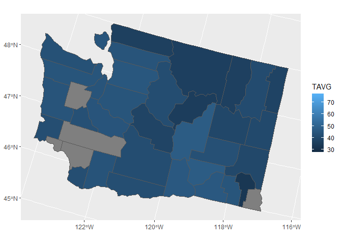

```r
library(tidyverse)
library(usmap)
library(lubridate)
library(sf)
WA_county <- read.csv("WA_county.csv")
```

### Recreate Graph 1

Insert any text here.


```r
# Insert code for Exercise 1 here
```

### Recreate Graph 2


### Data for Washington Graph


```r
us_county <- us_map(region = "counties",)
WA_county_map <- us_county |>
  filter(full == "Washington")

WA_county_map <- WA_county |>
  left_join(WA_county_map, by=c("COUNTY" = "county"))

WA_county_map1 <- WA_county_map |>
  filter(year(DATE) == 2017 & month(DATE) == 8)

WA_county_map1 <- st_as_sf(WA_county_map1)
ggplot(WA_county_map1)+
  geom_sf(aes(fill = TAVG))+
  labs(
    title = "Average temp by county in 2016",
    fill = "AVG Temp (F)"
  )
```

<!-- -->


...

