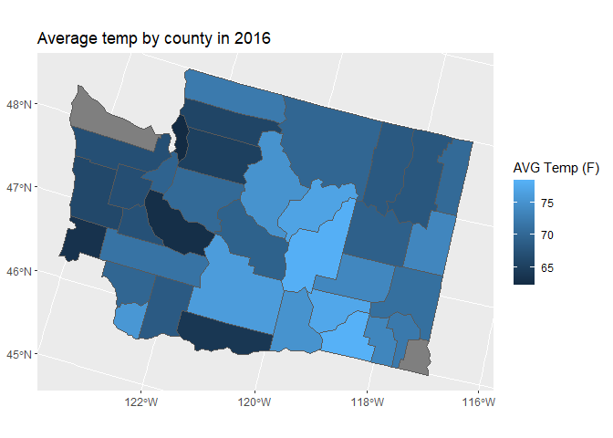

```r
library(tidyverse)
library(usmap)
library(lubridate)
library(sf)
WA_county <- read.csv("WA_county.csv")
```

### Recreate Graph 1

Insert any text here.


```r
# Insert code for Exercise 1 here
```

### Recreate Graph 2


### Data for Washington Graph


```r
us_states <- us_map()
us_county <- us_map(region = "counties",)
WA_county_map <- us_county |>
  filter(full == "Washington")

WA_county |>
  filter(COUNTY == "Douglas County")
```

```
##         STATION                                       NAME       DATE AWND CDSD
## 1   USW00094239 WENATCHEE PANGBORN MEMORIAL AIRPORT, WA US 1959-11-01   NA   NA
## 2   USW00094239 WENATCHEE PANGBORN MEMORIAL AIRPORT, WA US 1959-12-01   NA   NA
## 3   USW00094239 WENATCHEE PANGBORN MEMORIAL AIRPORT, WA US 1960-01-01   NA    0
## 4   USW00094239 WENATCHEE PANGBORN MEMORIAL AIRPORT, WA US 1960-02-01   NA    0
## 5   USW00094239 WENATCHEE PANGBORN MEMORIAL AIRPORT, WA US 1960-03-01   NA    0
## 6   USW00094239 WENATCHEE PANGBORN MEMORIAL AIRPORT, WA US 1960-04-01   NA    0
## 7   USW00094239 WENATCHEE PANGBORN MEMORIAL AIRPORT, WA US 1960-05-01   NA    5
## 8   USW00094239 WENATCHEE PANGBORN MEMORIAL AIRPORT, WA US 1960-06-01   NA  116
## 9   USW00094239 WENATCHEE PANGBORN MEMORIAL AIRPORT, WA US 1960-07-01   NA  564
## 10  USW00094239 WENATCHEE PANGBORN MEMORIAL AIRPORT, WA US 1960-08-01   NA  758
## 11  USW00094239 WENATCHEE PANGBORN MEMORIAL AIRPORT, WA US 1960-09-01   NA  826
## 12  USW00094239 WENATCHEE PANGBORN MEMORIAL AIRPORT, WA US 1960-10-01   NA  828
## 13  USW00094239 WENATCHEE PANGBORN MEMORIAL AIRPORT, WA US 1960-11-01   NA  828
## 14  USW00094239 WENATCHEE PANGBORN MEMORIAL AIRPORT, WA US 1960-12-01   NA  828
## 15  USW00094239 WENATCHEE PANGBORN MEMORIAL AIRPORT, WA US 1961-01-01   NA    0
## 16  USW00094239 WENATCHEE PANGBORN MEMORIAL AIRPORT, WA US 1961-02-01   NA    0
## 17  USW00094239 WENATCHEE PANGBORN MEMORIAL AIRPORT, WA US 1961-03-01   NA    0
## 18  USW00094239 WENATCHEE PANGBORN MEMORIAL AIRPORT, WA US 1961-04-01   NA    0
## 19  USW00094239 WENATCHEE PANGBORN MEMORIAL AIRPORT, WA US 1961-05-01   NA   13
## 20  USW00094239 WENATCHEE PANGBORN MEMORIAL AIRPORT, WA US 1961-06-01   NA  248
## 21  USW00094239 WENATCHEE PANGBORN MEMORIAL AIRPORT, WA US 1961-07-01   NA  627
## 22  USW00094239 WENATCHEE PANGBORN MEMORIAL AIRPORT, WA US 1961-08-01   NA 1043
## 23  USW00094239 WENATCHEE PANGBORN MEMORIAL AIRPORT, WA US 1961-09-01   NA 1083
## 24  USW00094239 WENATCHEE PANGBORN MEMORIAL AIRPORT, WA US 1961-10-01   NA 1083
## 25  USW00094239 WENATCHEE PANGBORN MEMORIAL AIRPORT, WA US 1961-11-01   NA 1083
## 26  USW00094239 WENATCHEE PANGBORN MEMORIAL AIRPORT, WA US 1961-12-01   NA 1083
## 27  USW00094239 WENATCHEE PANGBORN MEMORIAL AIRPORT, WA US 1962-01-01   NA    0
## 28  USW00094239 WENATCHEE PANGBORN MEMORIAL AIRPORT, WA US 1962-02-01   NA    0
## 29  USW00094239 WENATCHEE PANGBORN MEMORIAL AIRPORT, WA US 1962-03-01   NA    0
## 30  USW00094239 WENATCHEE PANGBORN MEMORIAL AIRPORT, WA US 1962-04-01   NA    0
## 31  USW00094239 WENATCHEE PANGBORN MEMORIAL AIRPORT, WA US 1962-05-01   NA    0
## 32  USW00094239 WENATCHEE PANGBORN MEMORIAL AIRPORT, WA US 1962-06-01   NA  111
## 33  USW00094239 WENATCHEE PANGBORN MEMORIAL AIRPORT, WA US 1962-07-01   NA  397
## 34  USW00094239 WENATCHEE PANGBORN MEMORIAL AIRPORT, WA US 1962-08-01   NA  566
## 35  USW00094239 WENATCHEE PANGBORN MEMORIAL AIRPORT, WA US 1962-09-01   NA  672
## 36  USW00094239 WENATCHEE PANGBORN MEMORIAL AIRPORT, WA US 1962-10-01   NA  672
## 37  USW00094239 WENATCHEE PANGBORN MEMORIAL AIRPORT, WA US 1962-11-01   NA  672
## 38  USW00094239 WENATCHEE PANGBORN MEMORIAL AIRPORT, WA US 1962-12-01   NA  672
## 39  USW00094239 WENATCHEE PANGBORN MEMORIAL AIRPORT, WA US 1963-01-01   NA    0
## 40  USW00094239 WENATCHEE PANGBORN MEMORIAL AIRPORT, WA US 1963-02-01   NA    0
## 41  USW00094239 WENATCHEE PANGBORN MEMORIAL AIRPORT, WA US 1963-03-01   NA    0
## 42  USW00094239 WENATCHEE PANGBORN MEMORIAL AIRPORT, WA US 1963-04-01   NA    0
## 43  USW00094239 WENATCHEE PANGBORN MEMORIAL AIRPORT, WA US 1963-05-01   NA   48
## 44  USW00094239 WENATCHEE PANGBORN MEMORIAL AIRPORT, WA US 1963-06-01   NA  164
## 45  USW00094239 WENATCHEE PANGBORN MEMORIAL AIRPORT, WA US 1963-07-01   NA  343
## 46  USW00094239 WENATCHEE PANGBORN MEMORIAL AIRPORT, WA US 1963-08-01   NA  629
## 47  USW00094239 WENATCHEE PANGBORN MEMORIAL AIRPORT, WA US 1963-09-01   NA  790
## 48  USW00094239 WENATCHEE PANGBORN MEMORIAL AIRPORT, WA US 1963-10-01   NA  792
## 49  USW00094239 WENATCHEE PANGBORN MEMORIAL AIRPORT, WA US 1963-11-01   NA  792
## 50  USW00094239 WENATCHEE PANGBORN MEMORIAL AIRPORT, WA US 1963-12-01   NA  792
## 51  USW00094239 WENATCHEE PANGBORN MEMORIAL AIRPORT, WA US 1964-01-01   NA    0
## 52  USW00094239 WENATCHEE PANGBORN MEMORIAL AIRPORT, WA US 1964-02-01   NA    0
## 53  USW00094239 WENATCHEE PANGBORN MEMORIAL AIRPORT, WA US 1964-03-01   NA    0
## 54  USW00094239 WENATCHEE PANGBORN MEMORIAL AIRPORT, WA US 1964-04-01   NA    0
## 55  USW00094239 WENATCHEE PANGBORN MEMORIAL AIRPORT, WA US 1964-05-01   NA   15
## 56  USW00094239 WENATCHEE PANGBORN MEMORIAL AIRPORT, WA US 1964-06-01   NA   76
## 57  USW00094239 WENATCHEE PANGBORN MEMORIAL AIRPORT, WA US 1964-07-01   NA  297
## 58  USW00094239 WENATCHEE PANGBORN MEMORIAL AIRPORT, WA US 1964-08-01   NA  425
## 59  USW00094239 WENATCHEE PANGBORN MEMORIAL AIRPORT, WA US 1964-09-01   NA  445
## 60  USW00094239 WENATCHEE PANGBORN MEMORIAL AIRPORT, WA US 1964-10-01   NA  445
## 61  USW00094239 WENATCHEE PANGBORN MEMORIAL AIRPORT, WA US 1964-11-01   NA  445
## 62  USW00094239 WENATCHEE PANGBORN MEMORIAL AIRPORT, WA US 1964-12-01   NA  445
## 63  USW00094239 WENATCHEE PANGBORN MEMORIAL AIRPORT, WA US 1965-01-01   NA    0
## 64  USW00094239 WENATCHEE PANGBORN MEMORIAL AIRPORT, WA US 1965-02-01   NA    0
## 65  USW00094239 WENATCHEE PANGBORN MEMORIAL AIRPORT, WA US 1965-03-01   NA    0
## 66  USW00094239 WENATCHEE PANGBORN MEMORIAL AIRPORT, WA US 1965-04-01   NA    0
## 67  USW00094239 WENATCHEE PANGBORN MEMORIAL AIRPORT, WA US 1965-05-01   NA   20
## 68  USW00094239 WENATCHEE PANGBORN MEMORIAL AIRPORT, WA US 1965-06-01   NA  122
## 69  USW00094239 WENATCHEE PANGBORN MEMORIAL AIRPORT, WA US 1965-07-01   NA  428
## 70  USW00094239 WENATCHEE PANGBORN MEMORIAL AIRPORT, WA US 1965-08-01   NA  676
## 71  USW00094239 WENATCHEE PANGBORN MEMORIAL AIRPORT, WA US 1965-09-01   NA  698
## 72  USW00094239 WENATCHEE PANGBORN MEMORIAL AIRPORT, WA US 1965-10-01   NA  698
## 73  USW00094239 WENATCHEE PANGBORN MEMORIAL AIRPORT, WA US 1965-11-01   NA  698
## 74  USW00094239 WENATCHEE PANGBORN MEMORIAL AIRPORT, WA US 1965-12-01   NA  698
## 75  USW00094239 WENATCHEE PANGBORN MEMORIAL AIRPORT, WA US 1966-01-01   NA    0
## 76  USW00094239 WENATCHEE PANGBORN MEMORIAL AIRPORT, WA US 1966-02-01   NA    0
## 77  USW00094239 WENATCHEE PANGBORN MEMORIAL AIRPORT, WA US 1966-03-01   NA    0
## 78  USW00094239 WENATCHEE PANGBORN MEMORIAL AIRPORT, WA US 1966-04-01   NA    0
## 79  USW00094239 WENATCHEE PANGBORN MEMORIAL AIRPORT, WA US 1966-05-01   NA   41
## 80  USW00094239 WENATCHEE PANGBORN MEMORIAL AIRPORT, WA US 1966-06-01   NA   89
## 81  USW00094239 WENATCHEE PANGBORN MEMORIAL AIRPORT, WA US 1966-07-01   NA  308
## 82  USW00094239 WENATCHEE PANGBORN MEMORIAL AIRPORT, WA US 1966-08-01   NA  552
## 83  USW00094239 WENATCHEE PANGBORN MEMORIAL AIRPORT, WA US 1966-09-01   NA  668
## 84  USW00094239 WENATCHEE PANGBORN MEMORIAL AIRPORT, WA US 1966-10-01   NA  668
## 85  USW00094239 WENATCHEE PANGBORN MEMORIAL AIRPORT, WA US 1966-11-01   NA  668
## 86  USW00094239 WENATCHEE PANGBORN MEMORIAL AIRPORT, WA US 1966-12-01   NA  668
## 87  USW00094239 WENATCHEE PANGBORN MEMORIAL AIRPORT, WA US 1967-01-01   NA    0
## 88  USW00094239 WENATCHEE PANGBORN MEMORIAL AIRPORT, WA US 1967-02-01   NA    0
## 89  USW00094239 WENATCHEE PANGBORN MEMORIAL AIRPORT, WA US 1967-03-01   NA    0
## 90  USW00094239 WENATCHEE PANGBORN MEMORIAL AIRPORT, WA US 1967-04-01   NA    0
## 91  USW00094239 WENATCHEE PANGBORN MEMORIAL AIRPORT, WA US 1967-05-01   NA   19
## 92  USW00094239 WENATCHEE PANGBORN MEMORIAL AIRPORT, WA US 1967-06-01   NA  189
## 93  USW00094239 WENATCHEE PANGBORN MEMORIAL AIRPORT, WA US 1967-07-01   NA  498
## 94  USW00094239 WENATCHEE PANGBORN MEMORIAL AIRPORT, WA US 1967-08-01   NA  930
## 95  USW00094239 WENATCHEE PANGBORN MEMORIAL AIRPORT, WA US 1967-09-01   NA 1090
## 96  USW00094239 WENATCHEE PANGBORN MEMORIAL AIRPORT, WA US 1967-10-01   NA 1090
## 97  USW00094239 WENATCHEE PANGBORN MEMORIAL AIRPORT, WA US 1967-11-01   NA 1090
## 98  USW00094239 WENATCHEE PANGBORN MEMORIAL AIRPORT, WA US 1967-12-01   NA 1090
## 99  USW00094239 WENATCHEE PANGBORN MEMORIAL AIRPORT, WA US 1968-01-01   NA    0
## 100 USW00094239 WENATCHEE PANGBORN MEMORIAL AIRPORT, WA US 1968-02-01   NA    0
## 101 USW00094239 WENATCHEE PANGBORN MEMORIAL AIRPORT, WA US 1968-03-01   NA    0
## 102 USW00094239 WENATCHEE PANGBORN MEMORIAL AIRPORT, WA US 1968-04-01   NA    1
## 103 USW00094239 WENATCHEE PANGBORN MEMORIAL AIRPORT, WA US 1968-05-01   NA   12
## 104 USW00094239 WENATCHEE PANGBORN MEMORIAL AIRPORT, WA US 1968-06-01   NA   84
## 105 USW00094239 WENATCHEE PANGBORN MEMORIAL AIRPORT, WA US 1968-07-01   NA  422
## 106 USW00094239 WENATCHEE PANGBORN MEMORIAL AIRPORT, WA US 1968-08-01   NA  580
## 107 USW00094239 WENATCHEE PANGBORN MEMORIAL AIRPORT, WA US 1968-09-01   NA  647
## 108 USW00094239 WENATCHEE PANGBORN MEMORIAL AIRPORT, WA US 1968-10-01   NA  647
## 109 USW00094239 WENATCHEE PANGBORN MEMORIAL AIRPORT, WA US 1968-11-01   NA  647
## 110 USW00094239 WENATCHEE PANGBORN MEMORIAL AIRPORT, WA US 1968-12-01   NA  647
## 111 USW00094239 WENATCHEE PANGBORN MEMORIAL AIRPORT, WA US 1969-01-01   NA    0
## 112 USW00094239 WENATCHEE PANGBORN MEMORIAL AIRPORT, WA US 1969-02-01   NA    0
## 113 USW00094239 WENATCHEE PANGBORN MEMORIAL AIRPORT, WA US 1969-03-01   NA    0
## 114 USW00094239 WENATCHEE PANGBORN MEMORIAL AIRPORT, WA US 1969-04-01   NA    0
## 115 USW00094239 WENATCHEE PANGBORN MEMORIAL AIRPORT, WA US 1969-05-01   NA   42
## 116 USW00094239 WENATCHEE PANGBORN MEMORIAL AIRPORT, WA US 1969-06-01   NA  275
## 117 USW00094239 WENATCHEE PANGBORN MEMORIAL AIRPORT, WA US 1969-07-01   NA  512
## 118 USW00094239 WENATCHEE PANGBORN MEMORIAL AIRPORT, WA US 1969-08-01   NA  681
## 119 USW00094239 WENATCHEE PANGBORN MEMORIAL AIRPORT, WA US 1969-09-01   NA  746
## 120 USW00094239 WENATCHEE PANGBORN MEMORIAL AIRPORT, WA US 1969-10-01   NA  746
## 121 USW00094239 WENATCHEE PANGBORN MEMORIAL AIRPORT, WA US 1969-11-01   NA  746
## 122 USW00094239 WENATCHEE PANGBORN MEMORIAL AIRPORT, WA US 1969-12-01   NA  746
## 123 USW00094239 WENATCHEE PANGBORN MEMORIAL AIRPORT, WA US 1970-01-01   NA    0
## 124 USW00094239 WENATCHEE PANGBORN MEMORIAL AIRPORT, WA US 1970-02-01   NA    0
## 125 USW00094239 WENATCHEE PANGBORN MEMORIAL AIRPORT, WA US 1970-03-01   NA    0
## 126 USW00094239 WENATCHEE PANGBORN MEMORIAL AIRPORT, WA US 1970-04-01   NA    0
## 127 USW00094239 WENATCHEE PANGBORN MEMORIAL AIRPORT, WA US 1970-05-01   NA   14
## 128 USW00094239 WENATCHEE PANGBORN MEMORIAL AIRPORT, WA US 1970-06-01   NA  227
## 129 USW00094239 WENATCHEE PANGBORN MEMORIAL AIRPORT, WA US 1970-07-01   NA  576
## 130 USW00094239 WENATCHEE PANGBORN MEMORIAL AIRPORT, WA US 1970-08-01   NA  857
## 131 USW00094239 WENATCHEE PANGBORN MEMORIAL AIRPORT, WA US 1970-09-01   NA  872
## 132 USW00094239 WENATCHEE PANGBORN MEMORIAL AIRPORT, WA US 1970-10-01   NA  876
## 133 USW00094239 WENATCHEE PANGBORN MEMORIAL AIRPORT, WA US 1970-11-01   NA  876
## 134 USW00094239 WENATCHEE PANGBORN MEMORIAL AIRPORT, WA US 1970-12-01   NA  876
## 135 USW00094239 WENATCHEE PANGBORN MEMORIAL AIRPORT, WA US 1971-01-01   NA    0
## 136 USW00094239 WENATCHEE PANGBORN MEMORIAL AIRPORT, WA US 1971-02-01   NA    0
## 137 USW00094239 WENATCHEE PANGBORN MEMORIAL AIRPORT, WA US 1971-03-01   NA    0
## 138 USW00094239 WENATCHEE PANGBORN MEMORIAL AIRPORT, WA US 1971-04-01   NA    0
## 139 USW00094239 WENATCHEE PANGBORN MEMORIAL AIRPORT, WA US 1971-05-01   NA   32
## 140 USW00094239 WENATCHEE PANGBORN MEMORIAL AIRPORT, WA US 1971-06-01   NA   61
## 141 USW00094239 WENATCHEE PANGBORN MEMORIAL AIRPORT, WA US 1971-07-01   NA  409
## 142 USW00094239 WENATCHEE PANGBORN MEMORIAL AIRPORT, WA US 1971-08-01   NA  823
## 143 USW00094239 WENATCHEE PANGBORN MEMORIAL AIRPORT, WA US 1971-09-01   NA  831
## 144 USW00094239 WENATCHEE PANGBORN MEMORIAL AIRPORT, WA US 1971-10-01   NA  835
## 145 USW00094239 WENATCHEE PANGBORN MEMORIAL AIRPORT, WA US 1971-11-01   NA  835
## 146 USW00094239 WENATCHEE PANGBORN MEMORIAL AIRPORT, WA US 1971-12-01   NA  835
## 147 USW00094239 WENATCHEE PANGBORN MEMORIAL AIRPORT, WA US 1972-01-01   NA    0
## 148 USW00094239 WENATCHEE PANGBORN MEMORIAL AIRPORT, WA US 1972-02-01   NA    0
## 149 USW00094239 WENATCHEE PANGBORN MEMORIAL AIRPORT, WA US 1972-03-01   NA    0
## 150 USW00094239 WENATCHEE PANGBORN MEMORIAL AIRPORT, WA US 1972-04-01   NA    0
## 151 USW00094239 WENATCHEE PANGBORN MEMORIAL AIRPORT, WA US 1972-05-01   NA   43
## 152 USW00094239 WENATCHEE PANGBORN MEMORIAL AIRPORT, WA US 1972-06-01   NA  126
## 153 USW00094239 WENATCHEE PANGBORN MEMORIAL AIRPORT, WA US 1972-07-01   NA  358
## 154 USW00094239 WENATCHEE PANGBORN MEMORIAL AIRPORT, WA US 1972-08-01   NA  661
## 155 USW00094239 WENATCHEE PANGBORN MEMORIAL AIRPORT, WA US 1972-09-01   NA  699
## 156 USW00094239 WENATCHEE PANGBORN MEMORIAL AIRPORT, WA US 1972-10-01   NA  700
## 157 USW00094239 WENATCHEE PANGBORN MEMORIAL AIRPORT, WA US 1972-11-01   NA  700
## 158 USW00094239 WENATCHEE PANGBORN MEMORIAL AIRPORT, WA US 1972-12-01   NA  700
## 159 USW00094239 WENATCHEE PANGBORN MEMORIAL AIRPORT, WA US 1973-01-01   NA    0
## 160 USW00094239 WENATCHEE PANGBORN MEMORIAL AIRPORT, WA US 1973-02-01   NA    0
## 161 USW00094239 WENATCHEE PANGBORN MEMORIAL AIRPORT, WA US 1973-03-01   NA    0
## 162 USW00094239 WENATCHEE PANGBORN MEMORIAL AIRPORT, WA US 1973-04-01   NA    0
## 163 USW00094239 WENATCHEE PANGBORN MEMORIAL AIRPORT, WA US 1973-05-01   NA   47
## 164 USW00094239 WENATCHEE PANGBORN MEMORIAL AIRPORT, WA US 1973-06-01   NA  135
## 165 USW00094239 WENATCHEE PANGBORN MEMORIAL AIRPORT, WA US 1973-07-01   NA  463
## 166 USW00094239 WENATCHEE PANGBORN MEMORIAL AIRPORT, WA US 1973-08-01   NA  722
## 167 USW00094239 WENATCHEE PANGBORN MEMORIAL AIRPORT, WA US 1973-09-01   NA  796
## 168 USW00094239 WENATCHEE PANGBORN MEMORIAL AIRPORT, WA US 1973-10-01   NA  796
## 169 USW00094239 WENATCHEE PANGBORN MEMORIAL AIRPORT, WA US 1973-11-01   NA  796
## 170 USW00094239 WENATCHEE PANGBORN MEMORIAL AIRPORT, WA US 1973-12-01   NA  796
## 171 USW00094239 WENATCHEE PANGBORN MEMORIAL AIRPORT, WA US 1974-01-01   NA    0
## 172 USW00094239 WENATCHEE PANGBORN MEMORIAL AIRPORT, WA US 1974-02-01   NA    0
## 173 USW00094239 WENATCHEE PANGBORN MEMORIAL AIRPORT, WA US 1974-03-01   NA    0
## 174 USW00094239 WENATCHEE PANGBORN MEMORIAL AIRPORT, WA US 1974-04-01   NA    0
## 175 USW00094239 WENATCHEE PANGBORN MEMORIAL AIRPORT, WA US 1974-05-01   NA    0
## 176 USW00094239 WENATCHEE PANGBORN MEMORIAL AIRPORT, WA US 1974-06-01   NA  183
## 177 USW00094239 WENATCHEE PANGBORN MEMORIAL AIRPORT, WA US 1974-07-01   NA  394
## 178 USW00094239 WENATCHEE PANGBORN MEMORIAL AIRPORT, WA US 1974-08-01   NA  668
## 179 USW00094239 WENATCHEE PANGBORN MEMORIAL AIRPORT, WA US 1974-09-01   NA  765
## 180 USW00094239 WENATCHEE PANGBORN MEMORIAL AIRPORT, WA US 1974-10-01   NA  765
## 181 USW00094239 WENATCHEE PANGBORN MEMORIAL AIRPORT, WA US 1974-11-01   NA  765
## 182 USW00094239 WENATCHEE PANGBORN MEMORIAL AIRPORT, WA US 1974-12-01   NA  765
## 183 USW00094239 WENATCHEE PANGBORN MEMORIAL AIRPORT, WA US 1975-01-01   NA    0
## 184 USW00094239 WENATCHEE PANGBORN MEMORIAL AIRPORT, WA US 1975-02-01   NA    0
## 185 USW00094239 WENATCHEE PANGBORN MEMORIAL AIRPORT, WA US 1975-03-01   NA    0
## 186 USW00094239 WENATCHEE PANGBORN MEMORIAL AIRPORT, WA US 1975-04-01   NA    0
## 187 USW00094239 WENATCHEE PANGBORN MEMORIAL AIRPORT, WA US 1975-05-01   NA   18
## 188 USW00094239 WENATCHEE PANGBORN MEMORIAL AIRPORT, WA US 1975-06-01   NA   65
## 189 USW00094239 WENATCHEE PANGBORN MEMORIAL AIRPORT, WA US 1975-07-01   NA  430
## 190 USW00094239 WENATCHEE PANGBORN MEMORIAL AIRPORT, WA US 1975-08-01   NA  571
## 191 USW00094239 WENATCHEE PANGBORN MEMORIAL AIRPORT, WA US 1975-09-01   NA  634
## 192 USW00094239 WENATCHEE PANGBORN MEMORIAL AIRPORT, WA US 1975-10-01   NA  634
## 193 USW00094239 WENATCHEE PANGBORN MEMORIAL AIRPORT, WA US 1975-11-01   NA  634
## 194 USW00094239 WENATCHEE PANGBORN MEMORIAL AIRPORT, WA US 1975-12-01   NA  634
## 195 USW00094239 WENATCHEE PANGBORN MEMORIAL AIRPORT, WA US 1976-01-01   NA    0
## 196 USW00094239 WENATCHEE PANGBORN MEMORIAL AIRPORT, WA US 1976-02-01   NA    0
## 197 USW00094239 WENATCHEE PANGBORN MEMORIAL AIRPORT, WA US 1976-03-01   NA    0
## 198 USW00094239 WENATCHEE PANGBORN MEMORIAL AIRPORT, WA US 1976-04-01   NA    0
## 199 USW00094239 WENATCHEE PANGBORN MEMORIAL AIRPORT, WA US 1976-05-01   NA    8
## 200 USW00094239 WENATCHEE PANGBORN MEMORIAL AIRPORT, WA US 1976-06-01   NA   48
## 201 USW00094239 WENATCHEE PANGBORN MEMORIAL AIRPORT, WA US 1976-07-01   NA  260
## 202 USW00094239 WENATCHEE PANGBORN MEMORIAL AIRPORT, WA US 1976-08-01   NA  391
## 203 USW00094239 WENATCHEE PANGBORN MEMORIAL AIRPORT, WA US 1976-09-01   NA  505
## 204 USW00094239 WENATCHEE PANGBORN MEMORIAL AIRPORT, WA US 1976-10-01   NA  506
## 205 USW00094239 WENATCHEE PANGBORN MEMORIAL AIRPORT, WA US 1976-11-01   NA  506
## 206 USW00094239 WENATCHEE PANGBORN MEMORIAL AIRPORT, WA US 1976-12-01   NA  506
## 207 USW00094239 WENATCHEE PANGBORN MEMORIAL AIRPORT, WA US 1977-01-01   NA    0
## 208 USW00094239 WENATCHEE PANGBORN MEMORIAL AIRPORT, WA US 1977-02-01   NA    0
## 209 USW00094239 WENATCHEE PANGBORN MEMORIAL AIRPORT, WA US 1977-03-01   NA    0
## 210 USW00094239 WENATCHEE PANGBORN MEMORIAL AIRPORT, WA US 1977-04-01   NA   15
## 211 USW00094239 WENATCHEE PANGBORN MEMORIAL AIRPORT, WA US 1977-05-01   NA   15
## 212 USW00094239 WENATCHEE PANGBORN MEMORIAL AIRPORT, WA US 1977-06-01   NA  212
## 213 USW00094239 WENATCHEE PANGBORN MEMORIAL AIRPORT, WA US 1977-07-01   NA  428
## 214 USW00094239 WENATCHEE PANGBORN MEMORIAL AIRPORT, WA US 1977-08-01   NA  814
## 215 USW00094239 WENATCHEE PANGBORN MEMORIAL AIRPORT, WA US 1977-09-01   NA  841
## 216 USW00094239 WENATCHEE PANGBORN MEMORIAL AIRPORT, WA US 1977-10-01   NA  841
## 217 USW00094239 WENATCHEE PANGBORN MEMORIAL AIRPORT, WA US 1977-11-01   NA  841
## 218 USW00094239 WENATCHEE PANGBORN MEMORIAL AIRPORT, WA US 1977-12-01   NA  841
## 219 USW00094239 WENATCHEE PANGBORN MEMORIAL AIRPORT, WA US 1978-01-01   NA    0
## 220 USW00094239 WENATCHEE PANGBORN MEMORIAL AIRPORT, WA US 1978-02-01   NA    0
## 221 USW00094239 WENATCHEE PANGBORN MEMORIAL AIRPORT, WA US 1978-03-01   NA    0
## 222 USW00094239 WENATCHEE PANGBORN MEMORIAL AIRPORT, WA US 1978-04-01   NA    0
## 223 USW00094239 WENATCHEE PANGBORN MEMORIAL AIRPORT, WA US 1978-05-01   NA    3
## 224 USW00094239 WENATCHEE PANGBORN MEMORIAL AIRPORT, WA US 1978-06-01   NA  158
## 225 USW00094239 WENATCHEE PANGBORN MEMORIAL AIRPORT, WA US 1978-07-01   NA  453
## 226 USW00094239 WENATCHEE PANGBORN MEMORIAL AIRPORT, WA US 1978-08-01   NA  664
## 227 USW00094239 WENATCHEE PANGBORN MEMORIAL AIRPORT, WA US 1978-09-01   NA  672
## 228 USW00094239 WENATCHEE PANGBORN MEMORIAL AIRPORT, WA US 1978-10-01   NA  672
## 229 USW00094239 WENATCHEE PANGBORN MEMORIAL AIRPORT, WA US 1978-11-01   NA  672
## 230 USW00094239 WENATCHEE PANGBORN MEMORIAL AIRPORT, WA US 1978-12-01   NA  672
## 231 USW00094239 WENATCHEE PANGBORN MEMORIAL AIRPORT, WA US 1979-01-01   NA    0
## 232 USW00094239 WENATCHEE PANGBORN MEMORIAL AIRPORT, WA US 1979-02-01   NA    0
## 233 USW00094239 WENATCHEE PANGBORN MEMORIAL AIRPORT, WA US 1979-03-01   NA    0
## 234 USW00094239 WENATCHEE PANGBORN MEMORIAL AIRPORT, WA US 1979-04-01   NA    5
## 235 USW00094239 WENATCHEE PANGBORN MEMORIAL AIRPORT, WA US 1979-05-01   NA   38
## 236 USW00094239 WENATCHEE PANGBORN MEMORIAL AIRPORT, WA US 1979-06-01   NA  194
## 237 USW00094239 WENATCHEE PANGBORN MEMORIAL AIRPORT, WA US 1979-07-01   NA  536
## 238 USW00094239 WENATCHEE PANGBORN MEMORIAL AIRPORT, WA US 1979-08-01   NA  805
## 239 USW00094239 WENATCHEE PANGBORN MEMORIAL AIRPORT, WA US 1979-09-01   NA  893
## 240 USW00094239 WENATCHEE PANGBORN MEMORIAL AIRPORT, WA US 1979-10-01   NA  900
## 241 USW00094239 WENATCHEE PANGBORN MEMORIAL AIRPORT, WA US 1979-11-01   NA  900
## 242 USW00094239 WENATCHEE PANGBORN MEMORIAL AIRPORT, WA US 1979-12-01   NA  900
## 243 USW00094239 WENATCHEE PANGBORN MEMORIAL AIRPORT, WA US 1980-01-01   NA    0
## 244 USW00094239 WENATCHEE PANGBORN MEMORIAL AIRPORT, WA US 1980-02-01   NA    0
## 245 USW00094239 WENATCHEE PANGBORN MEMORIAL AIRPORT, WA US 1980-03-01   NA    0
## 246 USW00094239 WENATCHEE PANGBORN MEMORIAL AIRPORT, WA US 1980-04-01   NA    2
## 247 USW00094239 WENATCHEE PANGBORN MEMORIAL AIRPORT, WA US 1980-05-01   NA    6
## 248 USW00094239 WENATCHEE PANGBORN MEMORIAL AIRPORT, WA US 1980-06-01   NA   37
## 249 USW00094239 WENATCHEE PANGBORN MEMORIAL AIRPORT, WA US 1980-07-01   NA  283
## 250 USW00094239 WENATCHEE PANGBORN MEMORIAL AIRPORT, WA US 1980-08-01   NA  427
## 251 USW00094239 WENATCHEE PANGBORN MEMORIAL AIRPORT, WA US 1980-09-01   NA  472
## 252 USW00094239 WENATCHEE PANGBORN MEMORIAL AIRPORT, WA US 1980-10-01   NA  475
## 253 USW00094239 WENATCHEE PANGBORN MEMORIAL AIRPORT, WA US 1980-11-01   NA  475
## 254 USW00094239 WENATCHEE PANGBORN MEMORIAL AIRPORT, WA US 1980-12-01   NA  475
## 255 USW00094239 WENATCHEE PANGBORN MEMORIAL AIRPORT, WA US 1981-01-01   NA    0
## 256 USW00094239 WENATCHEE PANGBORN MEMORIAL AIRPORT, WA US 1981-02-01   NA    0
## 257 USW00094239 WENATCHEE PANGBORN MEMORIAL AIRPORT, WA US 1981-03-01   NA    0
## 258 USW00094239 WENATCHEE PANGBORN MEMORIAL AIRPORT, WA US 1981-04-01   NA    4
## 259 USW00094239 WENATCHEE PANGBORN MEMORIAL AIRPORT, WA US 1981-05-01   NA    6
## 260 USW00094239 WENATCHEE PANGBORN MEMORIAL AIRPORT, WA US 1981-06-01   NA   33
## 261 USW00094239 WENATCHEE PANGBORN MEMORIAL AIRPORT, WA US 1981-07-01   NA  217
## 262 USW00094239 WENATCHEE PANGBORN MEMORIAL AIRPORT, WA US 1981-08-01   NA  555
## 263 USW00094239 WENATCHEE PANGBORN MEMORIAL AIRPORT, WA US 1981-09-01   NA  654
## 264 USW00094239 WENATCHEE PANGBORN MEMORIAL AIRPORT, WA US 1981-10-01   NA  654
## 265 USW00094239 WENATCHEE PANGBORN MEMORIAL AIRPORT, WA US 1981-11-01   NA  654
## 266 USW00094239 WENATCHEE PANGBORN MEMORIAL AIRPORT, WA US 1981-12-01   NA  654
## 267 USW00094239 WENATCHEE PANGBORN MEMORIAL AIRPORT, WA US 1982-01-01   NA    0
## 268 USW00094239 WENATCHEE PANGBORN MEMORIAL AIRPORT, WA US 1982-02-01   NA    0
## 269 USW00094239 WENATCHEE PANGBORN MEMORIAL AIRPORT, WA US 1982-03-01   NA    0
## 270 USW00094239 WENATCHEE PANGBORN MEMORIAL AIRPORT, WA US 1982-04-01   NA    0
## 271 USW00094239 WENATCHEE PANGBORN MEMORIAL AIRPORT, WA US 1982-05-01   NA    5
## 272 USW00094239 WENATCHEE PANGBORN MEMORIAL AIRPORT, WA US 1982-06-01   NA  173
## 273 USW00094239 WENATCHEE PANGBORN MEMORIAL AIRPORT, WA US 1982-07-01   NA  378
## 274 USW00094239 WENATCHEE PANGBORN MEMORIAL AIRPORT, WA US 1982-08-01   NA  584
## 275 USW00094239 WENATCHEE PANGBORN MEMORIAL AIRPORT, WA US 1982-09-01   NA  633
## 276 USW00094239 WENATCHEE PANGBORN MEMORIAL AIRPORT, WA US 1982-10-01   NA  633
## 277 USW00094239 WENATCHEE PANGBORN MEMORIAL AIRPORT, WA US 1982-11-01   NA  633
## 278 USW00094239 WENATCHEE PANGBORN MEMORIAL AIRPORT, WA US 1982-12-01   NA  633
## 279 USW00094239 WENATCHEE PANGBORN MEMORIAL AIRPORT, WA US 1983-01-01   NA    0
## 280 USW00094239 WENATCHEE PANGBORN MEMORIAL AIRPORT, WA US 1983-02-01   NA    0
## 281 USW00094239 WENATCHEE PANGBORN MEMORIAL AIRPORT, WA US 1983-03-01   NA    0
## 282 USW00094239 WENATCHEE PANGBORN MEMORIAL AIRPORT, WA US 1983-04-01   NA    0
## 283 USW00094239 WENATCHEE PANGBORN MEMORIAL AIRPORT, WA US 1983-05-01   NA   90
## 284 USW00094239 WENATCHEE PANGBORN MEMORIAL AIRPORT, WA US 1983-06-01   NA  132
## 285 USW00094239 WENATCHEE PANGBORN MEMORIAL AIRPORT, WA US 1983-07-01   NA  257
## 286 USW00094239 WENATCHEE PANGBORN MEMORIAL AIRPORT, WA US 1983-08-01   NA  511
## 287 USW00094239 WENATCHEE PANGBORN MEMORIAL AIRPORT, WA US 1983-09-01   NA  517
## 288 USW00094239 WENATCHEE PANGBORN MEMORIAL AIRPORT, WA US 1983-10-01   NA  517
## 289 USW00094239 WENATCHEE PANGBORN MEMORIAL AIRPORT, WA US 1983-11-01   NA  517
## 290 USW00094239 WENATCHEE PANGBORN MEMORIAL AIRPORT, WA US 1983-12-01   NA  517
## 291 USW00094239 WENATCHEE PANGBORN MEMORIAL AIRPORT, WA US 1984-01-01   NA    0
## 292 USW00094239 WENATCHEE PANGBORN MEMORIAL AIRPORT, WA US 1984-02-01   NA    0
## 293 USW00094239 WENATCHEE PANGBORN MEMORIAL AIRPORT, WA US 1984-03-01   NA    0
## 294 USW00094239 WENATCHEE PANGBORN MEMORIAL AIRPORT, WA US 1984-04-01   NA    0
## 295 USW00094239 WENATCHEE PANGBORN MEMORIAL AIRPORT, WA US 1984-05-01   NA    4
## 296 USW00094239 WENATCHEE PANGBORN MEMORIAL AIRPORT, WA US 1984-06-01   NA   54
## 297 USW00094239 WENATCHEE PANGBORN MEMORIAL AIRPORT, WA US 1984-07-01   NA  316
## 298 USW00094239 WENATCHEE PANGBORN MEMORIAL AIRPORT, WA US 1984-08-01   NA  538
## 299 USW00094239 WENATCHEE PANGBORN MEMORIAL AIRPORT, WA US 1984-09-01   NA  578
## 300 USW00094239 WENATCHEE PANGBORN MEMORIAL AIRPORT, WA US 1984-10-01   NA  578
## 301 USW00094239 WENATCHEE PANGBORN MEMORIAL AIRPORT, WA US 1984-11-01   NA  578
## 302 USW00094239 WENATCHEE PANGBORN MEMORIAL AIRPORT, WA US 1984-12-01   NA  578
## 303 USW00094239 WENATCHEE PANGBORN MEMORIAL AIRPORT, WA US 1985-01-01   NA    0
## 304 USW00094239 WENATCHEE PANGBORN MEMORIAL AIRPORT, WA US 1985-02-01   NA    0
## 305 USW00094239 WENATCHEE PANGBORN MEMORIAL AIRPORT, WA US 1985-03-01   NA    0
## 306 USW00094239 WENATCHEE PANGBORN MEMORIAL AIRPORT, WA US 1985-04-01   NA    0
## 307 USW00094239 WENATCHEE PANGBORN MEMORIAL AIRPORT, WA US 1985-05-01   NA   42
## 308 USW00094239 WENATCHEE PANGBORN MEMORIAL AIRPORT, WA US 1985-06-01   NA  142
## 309 USW00094239 WENATCHEE PANGBORN MEMORIAL AIRPORT, WA US 1985-07-01   NA  585
## 310 USW00094239 WENATCHEE PANGBORN MEMORIAL AIRPORT, WA US 1985-08-01   NA  753
## 311 USW00094239 WENATCHEE PANGBORN MEMORIAL AIRPORT, WA US 1985-09-01   NA  764
## 312 USW00094239 WENATCHEE PANGBORN MEMORIAL AIRPORT, WA US 1985-10-01   NA  764
## 313 USW00094239 WENATCHEE PANGBORN MEMORIAL AIRPORT, WA US 1985-11-01   NA  764
## 314 USW00094239 WENATCHEE PANGBORN MEMORIAL AIRPORT, WA US 1985-12-01   NA  764
## 315 USW00094239 WENATCHEE PANGBORN MEMORIAL AIRPORT, WA US 1986-01-01   NA    0
## 316 USW00094239 WENATCHEE PANGBORN MEMORIAL AIRPORT, WA US 1986-02-01   NA    0
## 317 USW00094239 WENATCHEE PANGBORN MEMORIAL AIRPORT, WA US 1986-03-01   NA    0
## 318 USW00094239 WENATCHEE PANGBORN MEMORIAL AIRPORT, WA US 1986-04-01   NA    0
## 319 USW00094239 WENATCHEE PANGBORN MEMORIAL AIRPORT, WA US 1986-05-01   NA   88
## 320 USW00094239 WENATCHEE PANGBORN MEMORIAL AIRPORT, WA US 1986-06-01   NA  268
## 321 USW00094239 WENATCHEE PANGBORN MEMORIAL AIRPORT, WA US 1986-07-01   NA  413
## 322 USW00094239 WENATCHEE PANGBORN MEMORIAL AIRPORT, WA US 1986-08-01   NA  792
## 323 USW00094239 WENATCHEE PANGBORN MEMORIAL AIRPORT, WA US 1986-09-01   NA  838
## 324 USW00094239 WENATCHEE PANGBORN MEMORIAL AIRPORT, WA US 1986-10-01   NA  838
## 325 USW00094239 WENATCHEE PANGBORN MEMORIAL AIRPORT, WA US 1986-11-01   NA  838
## 326 USW00094239 WENATCHEE PANGBORN MEMORIAL AIRPORT, WA US 1986-12-01   NA  838
## 327 USW00094239 WENATCHEE PANGBORN MEMORIAL AIRPORT, WA US 1987-01-01   NA    0
## 328 USW00094239 WENATCHEE PANGBORN MEMORIAL AIRPORT, WA US 1987-02-01   NA    0
## 329 USW00094239 WENATCHEE PANGBORN MEMORIAL AIRPORT, WA US 1987-03-01   NA    0
## 330 USW00094239 WENATCHEE PANGBORN MEMORIAL AIRPORT, WA US 1987-04-01   NA    6
## 331 USW00094239 WENATCHEE PANGBORN MEMORIAL AIRPORT, WA US 1987-05-01   NA   61
## 332 USW00094239 WENATCHEE PANGBORN MEMORIAL AIRPORT, WA US 1987-06-01   NA  236
## 333 USW00094239 WENATCHEE PANGBORN MEMORIAL AIRPORT, WA US 1987-07-01   NA  434
## 334 USW00094239 WENATCHEE PANGBORN MEMORIAL AIRPORT, WA US 1987-08-01   NA  674
## 335 USW00094239 WENATCHEE PANGBORN MEMORIAL AIRPORT, WA US 1987-09-01   NA  808
## 336 USW00094239 WENATCHEE PANGBORN MEMORIAL AIRPORT, WA US 1987-10-01   NA  810
## 337 USW00094239 WENATCHEE PANGBORN MEMORIAL AIRPORT, WA US 1987-11-01   NA  810
## 338 USW00094239 WENATCHEE PANGBORN MEMORIAL AIRPORT, WA US 1987-12-01   NA  810
## 339 USW00094239 WENATCHEE PANGBORN MEMORIAL AIRPORT, WA US 1988-01-01   NA    0
## 340 USW00094239 WENATCHEE PANGBORN MEMORIAL AIRPORT, WA US 1988-02-01   NA    0
## 341 USW00094239 WENATCHEE PANGBORN MEMORIAL AIRPORT, WA US 1988-03-01   NA    0
## 342 USW00094239 WENATCHEE PANGBORN MEMORIAL AIRPORT, WA US 1988-04-01   NA    3
## 343 USW00094239 WENATCHEE PANGBORN MEMORIAL AIRPORT, WA US 1988-05-01   NA   14
## 344 USW00094239 WENATCHEE PANGBORN MEMORIAL AIRPORT, WA US 1988-06-01   NA  116
## 345 USW00094239 WENATCHEE PANGBORN MEMORIAL AIRPORT, WA US 1988-07-01   NA  389
## 346 USW00094239 WENATCHEE PANGBORN MEMORIAL AIRPORT, WA US 1988-08-01   NA  612
## 347 USW00094239 WENATCHEE PANGBORN MEMORIAL AIRPORT, WA US 1988-09-01   NA  694
## 348 USW00094239 WENATCHEE PANGBORN MEMORIAL AIRPORT, WA US 1988-10-01   NA  704
## 349 USW00094239 WENATCHEE PANGBORN MEMORIAL AIRPORT, WA US 1988-11-01   NA  704
## 350 USW00094239 WENATCHEE PANGBORN MEMORIAL AIRPORT, WA US 1988-12-01   NA  704
## 351 USW00094239 WENATCHEE PANGBORN MEMORIAL AIRPORT, WA US 1989-01-01   NA    0
## 352 USW00094239 WENATCHEE PANGBORN MEMORIAL AIRPORT, WA US 1989-02-01   NA    0
## 353 USW00094239 WENATCHEE PANGBORN MEMORIAL AIRPORT, WA US 1989-03-01   NA    0
## 354 USW00094239 WENATCHEE PANGBORN MEMORIAL AIRPORT, WA US 1989-04-01   NA    0
## 355 USW00094239 WENATCHEE PANGBORN MEMORIAL AIRPORT, WA US 1989-05-01   NA    7
## 356 USW00094239 WENATCHEE PANGBORN MEMORIAL AIRPORT, WA US 1989-06-01   NA  149
## 357 USW00094239 WENATCHEE PANGBORN MEMORIAL AIRPORT, WA US 1989-07-01   NA  376
## 358 USW00094239 WENATCHEE PANGBORN MEMORIAL AIRPORT, WA US 1989-08-01   NA  549
## 359 USW00094239 WENATCHEE PANGBORN MEMORIAL AIRPORT, WA US 1989-09-01   NA  584
## 360 USW00094239 WENATCHEE PANGBORN MEMORIAL AIRPORT, WA US 1989-10-01   NA  584
## 361 USW00094239 WENATCHEE PANGBORN MEMORIAL AIRPORT, WA US 1989-11-01   NA  584
## 362 USW00094239 WENATCHEE PANGBORN MEMORIAL AIRPORT, WA US 1989-12-01   NA  584
## 363 USW00094239 WENATCHEE PANGBORN MEMORIAL AIRPORT, WA US 1990-01-01   NA    0
## 364 USW00094239 WENATCHEE PANGBORN MEMORIAL AIRPORT, WA US 1990-02-01   NA    0
## 365 USW00094239 WENATCHEE PANGBORN MEMORIAL AIRPORT, WA US 1990-03-01   NA    0
## 366 USW00094239 WENATCHEE PANGBORN MEMORIAL AIRPORT, WA US 1990-04-01   NA    0
## 367 USW00094239 WENATCHEE PANGBORN MEMORIAL AIRPORT, WA US 1990-05-01   NA    4
## 368 USW00094239 WENATCHEE PANGBORN MEMORIAL AIRPORT, WA US 1990-06-01   NA  107
## 369 USW00094239 WENATCHEE PANGBORN MEMORIAL AIRPORT, WA US 1990-07-01   NA  466
## 370 USW00094239 WENATCHEE PANGBORN MEMORIAL AIRPORT, WA US 1990-08-01   NA  721
## 371 USW00094239 WENATCHEE PANGBORN MEMORIAL AIRPORT, WA US 1990-09-01   NA  857
## 372 USW00094239 WENATCHEE PANGBORN MEMORIAL AIRPORT, WA US 1990-10-01   NA  857
## 373 USW00094239 WENATCHEE PANGBORN MEMORIAL AIRPORT, WA US 1990-11-01   NA  857
## 374 USW00094239 WENATCHEE PANGBORN MEMORIAL AIRPORT, WA US 1990-12-01   NA  857
## 375 USW00094239 WENATCHEE PANGBORN MEMORIAL AIRPORT, WA US 1991-01-01   NA    0
## 376 USW00094239 WENATCHEE PANGBORN MEMORIAL AIRPORT, WA US 1991-02-01   NA    0
## 377 USW00094239 WENATCHEE PANGBORN MEMORIAL AIRPORT, WA US 1991-03-01   NA    0
## 378 USW00094239 WENATCHEE PANGBORN MEMORIAL AIRPORT, WA US 1991-04-01   NA    0
## 379 USW00094239 WENATCHEE PANGBORN MEMORIAL AIRPORT, WA US 1991-05-01   NA    0
## 380 USW00094239 WENATCHEE PANGBORN MEMORIAL AIRPORT, WA US 1991-06-01   NA   37
## 381 USW00094239 WENATCHEE PANGBORN MEMORIAL AIRPORT, WA US 1991-07-01   NA  329
## 382 USW00094239 WENATCHEE PANGBORN MEMORIAL AIRPORT, WA US 1991-08-01   NA  628
## 383 USW00094239 WENATCHEE PANGBORN MEMORIAL AIRPORT, WA US 1991-09-01   NA  728
## 384 USW00094239 WENATCHEE PANGBORN MEMORIAL AIRPORT, WA US 1991-10-01   NA  735
## 385 USW00094239 WENATCHEE PANGBORN MEMORIAL AIRPORT, WA US 1991-11-01   NA  735
## 386 USW00094239 WENATCHEE PANGBORN MEMORIAL AIRPORT, WA US 1991-12-01   NA  735
## 387 USW00094239 WENATCHEE PANGBORN MEMORIAL AIRPORT, WA US 1992-01-01   NA    0
## 388 USW00094239 WENATCHEE PANGBORN MEMORIAL AIRPORT, WA US 1992-02-01   NA    0
## 389 USW00094239 WENATCHEE PANGBORN MEMORIAL AIRPORT, WA US 1992-03-01   NA    0
## 390 USW00094239 WENATCHEE PANGBORN MEMORIAL AIRPORT, WA US 1992-04-01   NA    2
## 391 USW00094239 WENATCHEE PANGBORN MEMORIAL AIRPORT, WA US 1992-05-01   NA   83
## 392 USW00094239 WENATCHEE PANGBORN MEMORIAL AIRPORT, WA US 1992-06-01   NA  354
## 393 USW00094239 WENATCHEE PANGBORN MEMORIAL AIRPORT, WA US 1992-07-01   NA  625
## 394 USW00094239 WENATCHEE PANGBORN MEMORIAL AIRPORT, WA US 1992-08-01   NA  940
## 395 USW00094239 WENATCHEE PANGBORN MEMORIAL AIRPORT, WA US 1992-09-01   NA  988
## 396 USW00094239 WENATCHEE PANGBORN MEMORIAL AIRPORT, WA US 1992-10-01   NA  996
## 397 USW00094239 WENATCHEE PANGBORN MEMORIAL AIRPORT, WA US 1992-11-01   NA  996
## 398 USW00094239 WENATCHEE PANGBORN MEMORIAL AIRPORT, WA US 1992-12-01   NA  996
## 399 USW00094239 WENATCHEE PANGBORN MEMORIAL AIRPORT, WA US 1993-01-01   NA    0
## 400 USW00094239 WENATCHEE PANGBORN MEMORIAL AIRPORT, WA US 1993-02-01   NA    0
## 401 USW00094239 WENATCHEE PANGBORN MEMORIAL AIRPORT, WA US 1993-03-01   NA    0
## 402 USW00094239 WENATCHEE PANGBORN MEMORIAL AIRPORT, WA US 1993-04-01   NA    0
## 403 USW00094239 WENATCHEE PANGBORN MEMORIAL AIRPORT, WA US 1993-05-01   NA  103
## 404 USW00094239 WENATCHEE PANGBORN MEMORIAL AIRPORT, WA US 1993-06-01   NA  175
## 405 USW00094239 WENATCHEE PANGBORN MEMORIAL AIRPORT, WA US 1993-07-01   NA  268
## 406 USW00094239 WENATCHEE PANGBORN MEMORIAL AIRPORT, WA US 1993-08-01   NA  472
## 407 USW00094239 WENATCHEE PANGBORN MEMORIAL AIRPORT, WA US 1993-09-01   NA  587
## 408 USW00094239 WENATCHEE PANGBORN MEMORIAL AIRPORT, WA US 1993-10-01   NA  589
## 409 USW00094239 WENATCHEE PANGBORN MEMORIAL AIRPORT, WA US 1993-11-01   NA  589
## 410 USW00094239 WENATCHEE PANGBORN MEMORIAL AIRPORT, WA US 1993-12-01   NA  589
## 411 USW00094239 WENATCHEE PANGBORN MEMORIAL AIRPORT, WA US 1994-01-01   NA    0
## 412 USW00094239 WENATCHEE PANGBORN MEMORIAL AIRPORT, WA US 1994-02-01   NA    0
## 413 USW00094239 WENATCHEE PANGBORN MEMORIAL AIRPORT, WA US 1994-03-01   NA    0
## 414 USW00094239 WENATCHEE PANGBORN MEMORIAL AIRPORT, WA US 1994-04-01   NA    9
## 415 USW00094239 WENATCHEE PANGBORN MEMORIAL AIRPORT, WA US 1994-05-01   NA   69
## 416 USW00094239 WENATCHEE PANGBORN MEMORIAL AIRPORT, WA US 1994-06-01   NA  172
## 417 USW00094239 WENATCHEE PANGBORN MEMORIAL AIRPORT, WA US 1994-07-01   NA  569
## 418 USW00094239 WENATCHEE PANGBORN MEMORIAL AIRPORT, WA US 1994-08-01   NA  846
## 419 USW00094239 WENATCHEE PANGBORN MEMORIAL AIRPORT, WA US 1994-09-01   NA  974
## 420 USW00094239 WENATCHEE PANGBORN MEMORIAL AIRPORT, WA US 1994-10-01   NA  974
## 421 USW00094239 WENATCHEE PANGBORN MEMORIAL AIRPORT, WA US 1994-11-01   NA  974
## 422 USW00094239 WENATCHEE PANGBORN MEMORIAL AIRPORT, WA US 1994-12-01   NA  974
## 423 USW00094239 WENATCHEE PANGBORN MEMORIAL AIRPORT, WA US 1995-01-01   NA    0
## 424 USW00094239 WENATCHEE PANGBORN MEMORIAL AIRPORT, WA US 1995-02-01   NA    0
## 425 USW00094239 WENATCHEE PANGBORN MEMORIAL AIRPORT, WA US 1995-03-01   NA    0
## 426 USW00094239 WENATCHEE PANGBORN MEMORIAL AIRPORT, WA US 1995-04-01   NA    0
## 427 USW00094239 WENATCHEE PANGBORN MEMORIAL AIRPORT, WA US 1995-05-01   NA   55
## 428 USW00094239 WENATCHEE PANGBORN MEMORIAL AIRPORT, WA US 1995-06-01   NA  162
## 429 USW00094239 WENATCHEE PANGBORN MEMORIAL AIRPORT, WA US 1995-07-01   NA  429
## 430 USW00094239 WENATCHEE PANGBORN MEMORIAL AIRPORT, WA US 1995-08-01   NA  549
## 431 USW00094239 WENATCHEE PANGBORN MEMORIAL AIRPORT, WA US 1995-09-01   NA  680
## 432 USW00094239 WENATCHEE PANGBORN MEMORIAL AIRPORT, WA US 1995-10-01   NA  680
## 433 USW00094239 WENATCHEE PANGBORN MEMORIAL AIRPORT, WA US 1995-11-01   NA  680
## 434 USW00094239 WENATCHEE PANGBORN MEMORIAL AIRPORT, WA US 1995-12-01   NA  680
## 435 USW00094239 WENATCHEE PANGBORN MEMORIAL AIRPORT, WA US 1996-01-01   NA    0
## 436 USW00094239 WENATCHEE PANGBORN MEMORIAL AIRPORT, WA US 1996-02-01   NA    0
## 437 USW00094239 WENATCHEE PANGBORN MEMORIAL AIRPORT, WA US 1996-03-01   NA    0
## 438 USW00094239 WENATCHEE PANGBORN MEMORIAL AIRPORT, WA US 1996-04-01   NA    0
## 439 USW00094239 WENATCHEE PANGBORN MEMORIAL AIRPORT, WA US 1996-05-01   NA    6
## 440 USW00094239 WENATCHEE PANGBORN MEMORIAL AIRPORT, WA US 1996-06-01   NA   87
## 441 USW00094239 WENATCHEE PANGBORN MEMORIAL AIRPORT, WA US 1996-07-01   NA  426
## 442 USW00094239 WENATCHEE PANGBORN MEMORIAL AIRPORT, WA US 1996-08-01   NA  650
## 443 USW00094239 WENATCHEE PANGBORN MEMORIAL AIRPORT, WA US 1996-09-01   NA  690
## 444 USW00094239 WENATCHEE PANGBORN MEMORIAL AIRPORT, WA US 1996-10-01   NA  691
## 445 USW00094239 WENATCHEE PANGBORN MEMORIAL AIRPORT, WA US 1996-11-01   NA  691
## 446 USW00094239 WENATCHEE PANGBORN MEMORIAL AIRPORT, WA US 1996-12-01   NA  691
## 447 USW00094239 WENATCHEE PANGBORN MEMORIAL AIRPORT, WA US 1997-01-01   NA    0
## 448 USW00094239 WENATCHEE PANGBORN MEMORIAL AIRPORT, WA US 1997-02-01   NA    0
## 449 USW00094239 WENATCHEE PANGBORN MEMORIAL AIRPORT, WA US 1997-03-01   NA    0
## 450 USW00094239 WENATCHEE PANGBORN MEMORIAL AIRPORT, WA US 1997-04-01   NA    0
## 451 USW00094239 WENATCHEE PANGBORN MEMORIAL AIRPORT, WA US 1997-05-01   NA   50
## 452 USW00094239 WENATCHEE PANGBORN MEMORIAL AIRPORT, WA US 1997-06-01   NA  113
## 453 USW00094239 WENATCHEE PANGBORN MEMORIAL AIRPORT, WA US 1997-07-01   NA  339
## 454 USW00094239 WENATCHEE PANGBORN MEMORIAL AIRPORT, WA US 1997-08-01   NA  644
## 455 USW00094239 WENATCHEE PANGBORN MEMORIAL AIRPORT, WA US 1997-09-01   NA  693
## 456 USW00094239 WENATCHEE PANGBORN MEMORIAL AIRPORT, WA US 1997-10-01   NA  693
## 457 USW00094239 WENATCHEE PANGBORN MEMORIAL AIRPORT, WA US 1997-11-01   NA  693
## 458 USW00094239 WENATCHEE PANGBORN MEMORIAL AIRPORT, WA US 1997-12-01   NA  693
## 459 USW00094239 WENATCHEE PANGBORN MEMORIAL AIRPORT, WA US 1998-01-01   NA    0
## 460 USW00094239 WENATCHEE PANGBORN MEMORIAL AIRPORT, WA US 1998-02-01   NA    0
## 461 USW00094239 WENATCHEE PANGBORN MEMORIAL AIRPORT, WA US 1998-03-01   NA    0
## 462 USW00094239 WENATCHEE PANGBORN MEMORIAL AIRPORT, WA US 1998-04-01   NA    6
## 463 USW00094239 WENATCHEE PANGBORN MEMORIAL AIRPORT, WA US 1998-05-01   NA   44
## 464 USW00094239 WENATCHEE PANGBORN MEMORIAL AIRPORT, WA US 1998-06-01   NA  151
## 465 USW00094239 WENATCHEE PANGBORN MEMORIAL AIRPORT, WA US 1998-07-01   NA  584
## 466 USW00094239 WENATCHEE PANGBORN MEMORIAL AIRPORT, WA US 1998-08-01   NA  915
## 467 USW00094239 WENATCHEE PANGBORN MEMORIAL AIRPORT, WA US 1998-09-01   NA 1083
## 468 USW00094239 WENATCHEE PANGBORN MEMORIAL AIRPORT, WA US 1998-10-01   NA 1083
## 469 USW00094239 WENATCHEE PANGBORN MEMORIAL AIRPORT, WA US 1998-11-01   NA 1083
## 470 USW00094239 WENATCHEE PANGBORN MEMORIAL AIRPORT, WA US 1998-12-01   NA 1083
## 471 USW00094239 WENATCHEE PANGBORN MEMORIAL AIRPORT, WA US 1999-01-01   NA    0
## 472 USW00094239 WENATCHEE PANGBORN MEMORIAL AIRPORT, WA US 1999-02-01   NA    0
## 473 USW00094239 WENATCHEE PANGBORN MEMORIAL AIRPORT, WA US 1999-03-01   NA    0
## 474 USW00094239 WENATCHEE PANGBORN MEMORIAL AIRPORT, WA US 1999-04-01   NA    0
## 475 USW00094239 WENATCHEE PANGBORN MEMORIAL AIRPORT, WA US 1999-05-01   NA   19
## 476 USW00094239 WENATCHEE PANGBORN MEMORIAL AIRPORT, WA US 1999-06-01   NA   88
## 477 USW00094239 WENATCHEE PANGBORN MEMORIAL AIRPORT, WA US 1999-07-01   NA  312
## 478 USW00094239 WENATCHEE PANGBORN MEMORIAL AIRPORT, WA US 1999-08-01   NA  611
## 479 USW00094239 WENATCHEE PANGBORN MEMORIAL AIRPORT, WA US 1999-09-01   NA  675
## 480 USW00094239 WENATCHEE PANGBORN MEMORIAL AIRPORT, WA US 1999-10-01   NA  675
## 481 USW00094239 WENATCHEE PANGBORN MEMORIAL AIRPORT, WA US 1999-11-01   NA  675
## 482 USW00094239 WENATCHEE PANGBORN MEMORIAL AIRPORT, WA US 1999-12-01   NA  675
## 483 USW00094239 WENATCHEE PANGBORN MEMORIAL AIRPORT, WA US 2000-01-01   NA    0
## 484 USW00094239 WENATCHEE PANGBORN MEMORIAL AIRPORT, WA US 2000-02-01   NA    0
## 485 USW00094239 WENATCHEE PANGBORN MEMORIAL AIRPORT, WA US 2000-03-01   NA    0
## 486 USW00094239 WENATCHEE PANGBORN MEMORIAL AIRPORT, WA US 2000-04-01   NA    0
## 487 USW00094239 WENATCHEE PANGBORN MEMORIAL AIRPORT, WA US 2000-05-01   NA    8
## 488 USW00094239 WENATCHEE PANGBORN MEMORIAL AIRPORT, WA US 2000-06-01   NA  133
## 489 USW00094239 WENATCHEE PANGBORN MEMORIAL AIRPORT, WA US 2000-07-01   NA  408
## 490 USW00094239 WENATCHEE PANGBORN MEMORIAL AIRPORT, WA US 2000-08-01   NA  665
## 491 USW00094239 WENATCHEE PANGBORN MEMORIAL AIRPORT, WA US 2000-09-01   NA  719
## 492 USW00094239 WENATCHEE PANGBORN MEMORIAL AIRPORT, WA US 2000-10-01   NA  719
## 493 USW00094239 WENATCHEE PANGBORN MEMORIAL AIRPORT, WA US 2000-11-01  3.8  719
## 494 USW00094239 WENATCHEE PANGBORN MEMORIAL AIRPORT, WA US 2000-12-01  2.9  719
## 495 USW00094239 WENATCHEE PANGBORN MEMORIAL AIRPORT, WA US 2001-01-01  2.9    0
## 496 USW00094239 WENATCHEE PANGBORN MEMORIAL AIRPORT, WA US 2001-02-01  3.4    0
## 497 USW00094239 WENATCHEE PANGBORN MEMORIAL AIRPORT, WA US 2001-03-01  7.6    0
## 498 USW00094239 WENATCHEE PANGBORN MEMORIAL AIRPORT, WA US 2001-04-01  8.5    1
## 499 USW00094239 WENATCHEE PANGBORN MEMORIAL AIRPORT, WA US 2001-05-01 10.3   53
## 500 USW00094239 WENATCHEE PANGBORN MEMORIAL AIRPORT, WA US 2001-06-01  9.6   91
## 501 USW00094239 WENATCHEE PANGBORN MEMORIAL AIRPORT, WA US 2001-07-01 10.3  351
## 502 USW00094239 WENATCHEE PANGBORN MEMORIAL AIRPORT, WA US 2001-08-01  8.7  654
## 503 USW00094239 WENATCHEE PANGBORN MEMORIAL AIRPORT, WA US 2001-09-01  8.1  753
## 504 USW00094239 WENATCHEE PANGBORN MEMORIAL AIRPORT, WA US 2001-10-01  7.4  753
## 505 USW00094239 WENATCHEE PANGBORN MEMORIAL AIRPORT, WA US 2001-11-01  4.3  753
## 506 USW00094239 WENATCHEE PANGBORN MEMORIAL AIRPORT, WA US 2001-12-01  4.0  753
## 507 USW00094239 WENATCHEE PANGBORN MEMORIAL AIRPORT, WA US 2002-01-01  4.0    0
## 508 USW00094239 WENATCHEE PANGBORN MEMORIAL AIRPORT, WA US 2002-02-01  4.3    0
## 509 USW00094239 WENATCHEE PANGBORN MEMORIAL AIRPORT, WA US 2002-03-01  6.9    0
## 510 USW00094239 WENATCHEE PANGBORN MEMORIAL AIRPORT, WA US 2002-04-01  8.9    0
## 511 USW00094239 WENATCHEE PANGBORN MEMORIAL AIRPORT, WA US 2002-05-01 10.1    1
## 512 USW00094239 WENATCHEE PANGBORN MEMORIAL AIRPORT, WA US 2002-06-01 10.7  139
## 513 USW00094239 WENATCHEE PANGBORN MEMORIAL AIRPORT, WA US 2002-07-01 11.4  469
## 514 USW00094239 WENATCHEE PANGBORN MEMORIAL AIRPORT, WA US 2002-08-01 10.1  715
## 515 USW00094239 WENATCHEE PANGBORN MEMORIAL AIRPORT, WA US 2002-09-01  8.1  775
## 516 USW00094239 WENATCHEE PANGBORN MEMORIAL AIRPORT, WA US 2002-10-01  6.3  776
## 517 USW00094239 WENATCHEE PANGBORN MEMORIAL AIRPORT, WA US 2002-11-01  3.1  776
## 518 USW00094239 WENATCHEE PANGBORN MEMORIAL AIRPORT, WA US 2002-12-01  3.4  776
## 519 USW00094239 WENATCHEE PANGBORN MEMORIAL AIRPORT, WA US 2003-01-01  2.9    0
## 520 USW00094239 WENATCHEE PANGBORN MEMORIAL AIRPORT, WA US 2003-02-01  5.1    0
## 521 USW00094239 WENATCHEE PANGBORN MEMORIAL AIRPORT, WA US 2003-03-01  7.6    0
## 522 USW00094239 WENATCHEE PANGBORN MEMORIAL AIRPORT, WA US 2003-04-01  7.4    0
## 523 USW00094239 WENATCHEE PANGBORN MEMORIAL AIRPORT, WA US 2003-05-01  9.2   28
## 524 USW00094239 WENATCHEE PANGBORN MEMORIAL AIRPORT, WA US 2003-06-01 11.0  197
## 525 USW00094239 WENATCHEE PANGBORN MEMORIAL AIRPORT, WA US 2003-07-01 10.3  575
## 526 USW00094239 WENATCHEE PANGBORN MEMORIAL AIRPORT, WA US 2003-08-01  9.2  868
## 527 USW00094239 WENATCHEE PANGBORN MEMORIAL AIRPORT, WA US 2003-09-01  7.6  985
## 528 USW00094239 WENATCHEE PANGBORN MEMORIAL AIRPORT, WA US 2003-10-01  6.0  989
## 529 USW00094239 WENATCHEE PANGBORN MEMORIAL AIRPORT, WA US 2003-11-01  5.1  989
## 530 USW00094239 WENATCHEE PANGBORN MEMORIAL AIRPORT, WA US 2003-12-01  2.9  989
## 531 USW00094239 WENATCHEE PANGBORN MEMORIAL AIRPORT, WA US 2004-01-01  3.6    0
## 532 USW00094239 WENATCHEE PANGBORN MEMORIAL AIRPORT, WA US 2004-02-01  3.4    0
## 533 USW00094239 WENATCHEE PANGBORN MEMORIAL AIRPORT, WA US 2004-03-01  7.4    0
## 534 USW00094239 WENATCHEE PANGBORN MEMORIAL AIRPORT, WA US 2004-04-01  8.3    0
## 535 USW00094239 WENATCHEE PANGBORN MEMORIAL AIRPORT, WA US 2004-05-01  9.6    5
## 536 USW00094239 WENATCHEE PANGBORN MEMORIAL AIRPORT, WA US 2004-06-01  9.2  188
## 537 USW00094239 WENATCHEE PANGBORN MEMORIAL AIRPORT, WA US 2004-07-01 10.3  551
## 538 USW00094239 WENATCHEE PANGBORN MEMORIAL AIRPORT, WA US 2004-08-01  8.5  888
## 539 USW00094239 WENATCHEE PANGBORN MEMORIAL AIRPORT, WA US 2004-09-01  8.5  911
## 540 USW00094239 WENATCHEE PANGBORN MEMORIAL AIRPORT, WA US 2004-10-01  6.0  911
## 541 USW00094239 WENATCHEE PANGBORN MEMORIAL AIRPORT, WA US 2004-11-01  4.0  911
## 542 USW00094239 WENATCHEE PANGBORN MEMORIAL AIRPORT, WA US 2004-12-01  3.6  911
## 543 USW00094239 WENATCHEE PANGBORN MEMORIAL AIRPORT, WA US 2005-01-01  2.7    0
## 544 USW00094239 WENATCHEE PANGBORN MEMORIAL AIRPORT, WA US 2005-02-01  4.9    0
## 545 USW00094239 WENATCHEE PANGBORN MEMORIAL AIRPORT, WA US 2005-03-01  7.6    0
## 546 USW00094239 WENATCHEE PANGBORN MEMORIAL AIRPORT, WA US 2005-04-01  8.3    2
## 547 USW00094239 WENATCHEE PANGBORN MEMORIAL AIRPORT, WA US 2005-05-01  8.1   46
## 548 USW00094239 WENATCHEE PANGBORN MEMORIAL AIRPORT, WA US 2005-06-01 10.5  126
## 549 USW00094239 WENATCHEE PANGBORN MEMORIAL AIRPORT, WA US 2005-07-01 10.1  430
## 550 USW00094239 WENATCHEE PANGBORN MEMORIAL AIRPORT, WA US 2005-08-01  9.4  751
## 551 USW00094239 WENATCHEE PANGBORN MEMORIAL AIRPORT, WA US 2005-09-01  8.3  787
## 552 USW00094239 WENATCHEE PANGBORN MEMORIAL AIRPORT, WA US 2005-10-01  5.6  787
## 553 USW00094239 WENATCHEE PANGBORN MEMORIAL AIRPORT, WA US 2005-11-01  4.0  787
## 554 USW00094239 WENATCHEE PANGBORN MEMORIAL AIRPORT, WA US 2005-12-01  2.5  787
## 555 USW00094239 WENATCHEE PANGBORN MEMORIAL AIRPORT, WA US 2006-01-01  3.6    0
## 556 USW00094239 WENATCHEE PANGBORN MEMORIAL AIRPORT, WA US 2006-02-01  5.6    0
## 557 USW00094239 WENATCHEE PANGBORN MEMORIAL AIRPORT, WA US 2006-03-01  5.6    0
## 558 USW00094239 WENATCHEE PANGBORN MEMORIAL AIRPORT, WA US 2006-04-01  8.5    0
## 559 USW00094239 WENATCHEE PANGBORN MEMORIAL AIRPORT, WA US 2006-05-01  8.5   58
## 560 USW00094239 WENATCHEE PANGBORN MEMORIAL AIRPORT, WA US 2006-06-01  9.2  172
## 561 USW00094239 WENATCHEE PANGBORN MEMORIAL AIRPORT, WA US 2006-07-01 10.1  570
## 562 USW00094239 WENATCHEE PANGBORN MEMORIAL AIRPORT, WA US 2006-08-01  9.6  861
## 563 USW00094239 WENATCHEE PANGBORN MEMORIAL AIRPORT, WA US 2006-09-01  7.2  972
## 564 USW00094239 WENATCHEE PANGBORN MEMORIAL AIRPORT, WA US 2006-10-01  5.4  972
## 565 USW00094239 WENATCHEE PANGBORN MEMORIAL AIRPORT, WA US 2006-11-01  4.0  972
## 566 USW00094239 WENATCHEE PANGBORN MEMORIAL AIRPORT, WA US 2006-12-01  3.6  972
## 567 USW00094239 WENATCHEE PANGBORN MEMORIAL AIRPORT, WA US 2007-01-01  3.8    0
## 568 USW00094239 WENATCHEE PANGBORN MEMORIAL AIRPORT, WA US 2007-02-01  3.8    0
## 569 USW00094239 WENATCHEE PANGBORN MEMORIAL AIRPORT, WA US 2007-03-01  6.9    0
## 570 USW00094239 WENATCHEE PANGBORN MEMORIAL AIRPORT, WA US 2007-04-01  8.5    0
## 571 USW00094239 WENATCHEE PANGBORN MEMORIAL AIRPORT, WA US 2007-05-01  9.6   25
## 572 USW00094239 WENATCHEE PANGBORN MEMORIAL AIRPORT, WA US 2007-06-01  9.8  111
## 573 USW00094239 WENATCHEE PANGBORN MEMORIAL AIRPORT, WA US 2007-07-01  9.6  521
## 574 USW00094239 WENATCHEE PANGBORN MEMORIAL AIRPORT, WA US 2007-08-01  9.4  744
## 575 USW00094239 WENATCHEE PANGBORN MEMORIAL AIRPORT, WA US 2007-09-01  8.7  828
## 576 USW00094239 WENATCHEE PANGBORN MEMORIAL AIRPORT, WA US 2007-10-01  5.1  828
## 577 USW00094239 WENATCHEE PANGBORN MEMORIAL AIRPORT, WA US 2007-11-01  3.8  828
## 578 USW00094239 WENATCHEE PANGBORN MEMORIAL AIRPORT, WA US 2007-12-01  3.6  828
## 579 USW00094239 WENATCHEE PANGBORN MEMORIAL AIRPORT, WA US 2008-01-01  2.7    0
## 580 USW00094239 WENATCHEE PANGBORN MEMORIAL AIRPORT, WA US 2008-02-01  4.7    0
## 581 USW00094239 WENATCHEE PANGBORN MEMORIAL AIRPORT, WA US 2008-03-01  6.3    0
## 582 USW00094239 WENATCHEE PANGBORN MEMORIAL AIRPORT, WA US 2008-04-01  8.3    0
## 583 USW00094239 WENATCHEE PANGBORN MEMORIAL AIRPORT, WA US 2008-05-01 10.3   55
## 584 USW00094239 WENATCHEE PANGBORN MEMORIAL AIRPORT, WA US 2008-06-01 11.2  160
## 585 USW00094239 WENATCHEE PANGBORN MEMORIAL AIRPORT, WA US 2008-07-01 10.7  462
## 586 USW00094239 WENATCHEE PANGBORN MEMORIAL AIRPORT, WA US 2008-08-01  8.5  697
## 587 USW00094239 WENATCHEE PANGBORN MEMORIAL AIRPORT, WA US 2008-09-01  7.4  754
## 588 USW00094239 WENATCHEE PANGBORN MEMORIAL AIRPORT, WA US 2008-10-01  6.0  755
## 589 USW00094239 WENATCHEE PANGBORN MEMORIAL AIRPORT, WA US 2008-11-01  3.8  755
## 590 USW00094239 WENATCHEE PANGBORN MEMORIAL AIRPORT, WA US 2008-12-01  3.8  755
## 591 USW00094239 WENATCHEE PANGBORN MEMORIAL AIRPORT, WA US 2009-01-01  3.8    0
## 592 USW00094239 WENATCHEE PANGBORN MEMORIAL AIRPORT, WA US 2009-02-01  3.1    0
## 593 USW00094239 WENATCHEE PANGBORN MEMORIAL AIRPORT, WA US 2009-03-01  6.7    0
## 594 USW00094239 WENATCHEE PANGBORN MEMORIAL AIRPORT, WA US 2009-04-01  8.3    3
## 595 USW00094239 WENATCHEE PANGBORN MEMORIAL AIRPORT, WA US 2009-05-01  8.9   69
## 596 USW00094239 WENATCHEE PANGBORN MEMORIAL AIRPORT, WA US 2009-06-01  9.8  207
## 597 USW00094239 WENATCHEE PANGBORN MEMORIAL AIRPORT, WA US 2009-07-01  8.3  593
## 598 USW00094239 WENATCHEE PANGBORN MEMORIAL AIRPORT, WA US 2009-08-01  9.2  923
## 599 USW00094239 WENATCHEE PANGBORN MEMORIAL AIRPORT, WA US 2009-09-01  8.3 1049
## 600 USW00094239 WENATCHEE PANGBORN MEMORIAL AIRPORT, WA US 2009-10-01  6.7 1049
## 601 USW00094239 WENATCHEE PANGBORN MEMORIAL AIRPORT, WA US 2009-11-01  4.5 1049
## 602 USW00094239 WENATCHEE PANGBORN MEMORIAL AIRPORT, WA US 2009-12-01  2.7 1049
## 603 USW00094239 WENATCHEE PANGBORN MEMORIAL AIRPORT, WA US 2010-01-01  2.2    0
## 604 USW00094239 WENATCHEE PANGBORN MEMORIAL AIRPORT, WA US 2010-02-01  2.7    0
## 605 USW00094239 WENATCHEE PANGBORN MEMORIAL AIRPORT, WA US 2010-03-01  6.3    0
## 606 USW00094239 WENATCHEE PANGBORN MEMORIAL AIRPORT, WA US 2010-04-01  9.6    0
## 607 USW00094239 WENATCHEE PANGBORN MEMORIAL AIRPORT, WA US 2010-05-01  8.5    5
## 608 USW00094239 WENATCHEE PANGBORN MEMORIAL AIRPORT, WA US 2010-06-01  9.6   64
## 609 USW00094239 WENATCHEE PANGBORN MEMORIAL AIRPORT, WA US 2010-07-01 10.1  357
## 610 USW00094239 WENATCHEE PANGBORN MEMORIAL AIRPORT, WA US 2010-08-01  9.2  590
## 611 USW00094239 WENATCHEE PANGBORN MEMORIAL AIRPORT, WA US 2010-09-01  6.7  615
## 612 USW00094239 WENATCHEE PANGBORN MEMORIAL AIRPORT, WA US 2010-10-01  5.4  619
## 613 USW00094239 WENATCHEE PANGBORN MEMORIAL AIRPORT, WA US 2010-11-01  4.5  619
## 614 USW00094239 WENATCHEE PANGBORN MEMORIAL AIRPORT, WA US 2010-12-01  2.9  619
## 615 USW00094239 WENATCHEE PANGBORN MEMORIAL AIRPORT, WA US 2011-01-01  3.1    0
## 616 USW00094239 WENATCHEE PANGBORN MEMORIAL AIRPORT, WA US 2011-02-01  4.5    0
## 617 USW00094239 WENATCHEE PANGBORN MEMORIAL AIRPORT, WA US 2011-03-01  5.8    0
## 618 USW00094239 WENATCHEE PANGBORN MEMORIAL AIRPORT, WA US 2011-04-01  9.4    0
## 619 USW00094239 WENATCHEE PANGBORN MEMORIAL AIRPORT, WA US 2011-05-01  9.4    0
## 620 USW00094239 WENATCHEE PANGBORN MEMORIAL AIRPORT, WA US 2011-06-01 11.0   32
## 621 USW00094239 WENATCHEE PANGBORN MEMORIAL AIRPORT, WA US 2011-07-01  9.6  177
## 622 USW00094239 WENATCHEE PANGBORN MEMORIAL AIRPORT, WA US 2011-08-01  9.8  478
## 623 USW00094239 WENATCHEE PANGBORN MEMORIAL AIRPORT, WA US 2011-09-01  6.5  609
## 624 USW00094239 WENATCHEE PANGBORN MEMORIAL AIRPORT, WA US 2011-10-01  6.0  609
## 625 USW00094239 WENATCHEE PANGBORN MEMORIAL AIRPORT, WA US 2011-11-01  4.7  609
## 626 USW00094239 WENATCHEE PANGBORN MEMORIAL AIRPORT, WA US 2011-12-01  3.4  609
## 627 USW00094239 WENATCHEE PANGBORN MEMORIAL AIRPORT, WA US 2012-01-01  3.8    0
## 628 USW00094239 WENATCHEE PANGBORN MEMORIAL AIRPORT, WA US 2012-02-01  4.5    0
## 629 USW00094239 WENATCHEE PANGBORN MEMORIAL AIRPORT, WA US 2012-03-01  6.5    0
## 630 USW00094239 WENATCHEE PANGBORN MEMORIAL AIRPORT, WA US 2012-04-01  7.8    6
## 631 USW00094239 WENATCHEE PANGBORN MEMORIAL AIRPORT, WA US 2012-05-01 10.1   25
## 632 USW00094239 WENATCHEE PANGBORN MEMORIAL AIRPORT, WA US 2012-06-01 10.5   76
## 633 USW00094239 WENATCHEE PANGBORN MEMORIAL AIRPORT, WA US 2012-07-01  9.2  427
## 634 USW00094239 WENATCHEE PANGBORN MEMORIAL AIRPORT, WA US 2012-08-01  8.7  790
## 635 USW00094239 WENATCHEE PANGBORN MEMORIAL AIRPORT, WA US 2012-09-01  6.7  866
## 636 USW00094239 WENATCHEE PANGBORN MEMORIAL AIRPORT, WA US 2012-10-01  4.9  866
## 637 USW00094239 WENATCHEE PANGBORN MEMORIAL AIRPORT, WA US 2012-11-01  3.8  866
## 638 USW00094239 WENATCHEE PANGBORN MEMORIAL AIRPORT, WA US 2012-12-01  3.6  866
## 639 USW00094239 WENATCHEE PANGBORN MEMORIAL AIRPORT, WA US 2013-01-01  2.7    0
## 640 USW00094239 WENATCHEE PANGBORN MEMORIAL AIRPORT, WA US 2013-02-01  4.7    0
## 641 USW00094239 WENATCHEE PANGBORN MEMORIAL AIRPORT, WA US 2013-03-01  6.3    0
## 642 USW00094239 WENATCHEE PANGBORN MEMORIAL AIRPORT, WA US 2013-04-01  9.4    2
## 643 USW00094239 WENATCHEE PANGBORN MEMORIAL AIRPORT, WA US 2013-05-01  7.6   58
## 644 USW00094239 WENATCHEE PANGBORN MEMORIAL AIRPORT, WA US 2013-06-01  8.7  158
## 645 USW00094239 WENATCHEE PANGBORN MEMORIAL AIRPORT, WA US 2013-07-01 10.3  571
## 646 USW00094239 WENATCHEE PANGBORN MEMORIAL AIRPORT, WA US 2013-08-01  7.6  859
## 647 USW00094239 WENATCHEE PANGBORN MEMORIAL AIRPORT, WA US 2013-09-01  7.4 1003
## 648 USW00094239 WENATCHEE PANGBORN MEMORIAL AIRPORT, WA US 2013-10-01  5.8 1003
## 649 USW00094239 WENATCHEE PANGBORN MEMORIAL AIRPORT, WA US 2013-11-01  3.6 1003
## 650 USW00094239 WENATCHEE PANGBORN MEMORIAL AIRPORT, WA US 2013-12-01  3.1 1003
## 651 USW00094239 WENATCHEE PANGBORN MEMORIAL AIRPORT, WA US 2014-01-01  3.8    0
## 652 USW00094239 WENATCHEE PANGBORN MEMORIAL AIRPORT, WA US 2014-02-01  5.4    0
## 653 USW00094239 WENATCHEE PANGBORN MEMORIAL AIRPORT, WA US 2014-03-01  6.9    0
## 654 USW00094239 WENATCHEE PANGBORN MEMORIAL AIRPORT, WA US 2014-04-01  9.8    0
## 655 USW00094239 WENATCHEE PANGBORN MEMORIAL AIRPORT, WA US 2014-05-01  9.8   54
## 656 USW00094239 WENATCHEE PANGBORN MEMORIAL AIRPORT, WA US 2014-06-01 11.9  202
## 657 USW00094239 WENATCHEE PANGBORN MEMORIAL AIRPORT, WA US 2014-07-01 10.1  687
## 658 USW00094239 WENATCHEE PANGBORN MEMORIAL AIRPORT, WA US 2014-08-01  9.4 1065
## 659 USW00094239 WENATCHEE PANGBORN MEMORIAL AIRPORT, WA US 2014-09-01  7.8 1170
## 660 USW00094239 WENATCHEE PANGBORN MEMORIAL AIRPORT, WA US 2014-10-01  5.8 1187
## 661 USW00094239 WENATCHEE PANGBORN MEMORIAL AIRPORT, WA US 2014-11-01  5.4 1187
## 662 USW00094239 WENATCHEE PANGBORN MEMORIAL AIRPORT, WA US 2014-12-01  4.3 1187
## 663 USW00094239 WENATCHEE PANGBORN MEMORIAL AIRPORT, WA US 2015-01-01  2.7    0
## 664 USW00094239 WENATCHEE PANGBORN MEMORIAL AIRPORT, WA US 2015-02-01  4.5    0
## 665 USW00094239 WENATCHEE PANGBORN MEMORIAL AIRPORT, WA US 2015-03-01  6.0    0
## 666 USW00094239 WENATCHEE PANGBORN MEMORIAL AIRPORT, WA US 2015-04-01  8.7    0
## 667 USW00094239 WENATCHEE PANGBORN MEMORIAL AIRPORT, WA US 2015-05-01  8.1   94
## 668 USW00094239 WENATCHEE PANGBORN MEMORIAL AIRPORT, WA US 2015-06-01 10.1  471
## 669 USW00094239 WENATCHEE PANGBORN MEMORIAL AIRPORT, WA US 2015-07-01 10.5  944
## 670 USW00094239 WENATCHEE PANGBORN MEMORIAL AIRPORT, WA US 2015-08-01  9.2 1313
## 671 USW00094239 WENATCHEE PANGBORN MEMORIAL AIRPORT, WA US 2015-09-01  7.6 1361
## 672 USW00094239 WENATCHEE PANGBORN MEMORIAL AIRPORT, WA US 2015-10-01  5.4 1370
## 673 USW00094239 WENATCHEE PANGBORN MEMORIAL AIRPORT, WA US 2015-11-01  5.1 1370
## 674 USW00094239 WENATCHEE PANGBORN MEMORIAL AIRPORT, WA US 2015-12-01  3.4 1370
## 675 USW00094239 WENATCHEE PANGBORN MEMORIAL AIRPORT, WA US 2016-01-01  3.1    0
## 676 USW00094239 WENATCHEE PANGBORN MEMORIAL AIRPORT, WA US 2016-02-01  3.8    0
## 677 USW00094239 WENATCHEE PANGBORN MEMORIAL AIRPORT, WA US 2016-03-01  6.9    0
## 678 USW00094239 WENATCHEE PANGBORN MEMORIAL AIRPORT, WA US 2016-04-01  9.8   12
## 679 USW00094239 WENATCHEE PANGBORN MEMORIAL AIRPORT, WA US 2016-05-01  9.8   38
## 680 USW00094239 WENATCHEE PANGBORN MEMORIAL AIRPORT, WA US 2016-06-01  9.4  215
## 681 USW00094239 WENATCHEE PANGBORN MEMORIAL AIRPORT, WA US 2016-07-01 10.7  451
## 682 USW00094239 WENATCHEE PANGBORN MEMORIAL AIRPORT, WA US 2016-08-01  9.2  753
## 683 USW00094239 WENATCHEE PANGBORN MEMORIAL AIRPORT, WA US 2016-09-01  7.8  779
## 684 USW00094239 WENATCHEE PANGBORN MEMORIAL AIRPORT, WA US 2016-10-01  4.9  779
## 685 USW00094239 WENATCHEE PANGBORN MEMORIAL AIRPORT, WA US 2016-11-01  4.7  779
## 686 USW00094239 WENATCHEE PANGBORN MEMORIAL AIRPORT, WA US 2016-12-01  3.8  779
## 687 USW00094239 WENATCHEE PANGBORN MEMORIAL AIRPORT, WA US 2017-01-01  4.3    0
## 688 USW00094239 WENATCHEE PANGBORN MEMORIAL AIRPORT, WA US 2017-02-01  3.8    0
## 689 USW00094239 WENATCHEE PANGBORN MEMORIAL AIRPORT, WA US 2017-03-01  5.8    0
## 690 USW00094239 WENATCHEE PANGBORN MEMORIAL AIRPORT, WA US 2017-04-01  8.9    0
## 691 USW00094239 WENATCHEE PANGBORN MEMORIAL AIRPORT, WA US 2017-05-01  8.5   54
## 692 USW00094239 WENATCHEE PANGBORN MEMORIAL AIRPORT, WA US 2017-06-01 10.3  173
## 693 USW00094239 WENATCHEE PANGBORN MEMORIAL AIRPORT, WA US 2017-07-01 10.3  557
## 694 USW00094239 WENATCHEE PANGBORN MEMORIAL AIRPORT, WA US 2017-08-01  8.5  926
## 695 USW00094239 WENATCHEE PANGBORN MEMORIAL AIRPORT, WA US 2017-09-01  6.3 1036
## 696 USW00094239 WENATCHEE PANGBORN MEMORIAL AIRPORT, WA US 2017-10-01  6.3 1036
## 697 USW00094239 WENATCHEE PANGBORN MEMORIAL AIRPORT, WA US 2017-11-01  4.0 1036
## 698 USW00094239 WENATCHEE PANGBORN MEMORIAL AIRPORT, WA US 2017-12-01  2.7 1036
## 699 USW00094239 WENATCHEE PANGBORN MEMORIAL AIRPORT, WA US 2018-01-01  3.4    0
## 700 USW00094239 WENATCHEE PANGBORN MEMORIAL AIRPORT, WA US 2018-02-01  6.0    0
## 701 USW00094239 WENATCHEE PANGBORN MEMORIAL AIRPORT, WA US 2018-03-01  6.9    0
## 702 USW00094239 WENATCHEE PANGBORN MEMORIAL AIRPORT, WA US 2018-04-01  8.3    0
## 703 USW00094239 WENATCHEE PANGBORN MEMORIAL AIRPORT, WA US 2018-05-01 10.5   92
## 704 USW00094239 WENATCHEE PANGBORN MEMORIAL AIRPORT, WA US 2018-06-01 11.2  180
## 705 USW00094239 WENATCHEE PANGBORN MEMORIAL AIRPORT, WA US 2018-07-01  9.6  555
## 706 USW00094239 WENATCHEE PANGBORN MEMORIAL AIRPORT, WA US 2018-08-01  8.9  840
## 707 USW00094239 WENATCHEE PANGBORN MEMORIAL AIRPORT, WA US 2018-09-01  7.6  874
## 708 USW00094239 WENATCHEE PANGBORN MEMORIAL AIRPORT, WA US 2018-10-01  4.7  874
## 709 USW00094239 WENATCHEE PANGBORN MEMORIAL AIRPORT, WA US 2018-11-01  4.7  874
## 710 USW00094239 WENATCHEE PANGBORN MEMORIAL AIRPORT, WA US 2018-12-01  4.3  874
## 711 USW00094239 WENATCHEE PANGBORN MEMORIAL AIRPORT, WA US 2019-01-01  3.4    0
## 712 USW00094239 WENATCHEE PANGBORN MEMORIAL AIRPORT, WA US 2019-02-01  4.0    0
## 713 USW00094239 WENATCHEE PANGBORN MEMORIAL AIRPORT, WA US 2019-03-01  4.9    0
## 714 USW00094239 WENATCHEE PANGBORN MEMORIAL AIRPORT, WA US 2019-04-01  8.9    0
## 715 USW00094239 WENATCHEE PANGBORN MEMORIAL AIRPORT, WA US 2019-05-01  8.7   57
## 716 USW00094239 WENATCHEE PANGBORN MEMORIAL AIRPORT, WA US 2019-06-01 11.2  191
## 717 USW00094239 WENATCHEE PANGBORN MEMORIAL AIRPORT, WA US 2019-07-01 10.3  425
## 718 USW00094239 WENATCHEE PANGBORN MEMORIAL AIRPORT, WA US 2019-08-01  9.2  743
## 719 USW00094239 WENATCHEE PANGBORN MEMORIAL AIRPORT, WA US 2019-09-01  7.2  805
## 720 USW00094239 WENATCHEE PANGBORN MEMORIAL AIRPORT, WA US 2019-10-01  6.3  805
## 721 USW00094239 WENATCHEE PANGBORN MEMORIAL AIRPORT, WA US 2019-11-01  3.8  805
## 722 USW00094239 WENATCHEE PANGBORN MEMORIAL AIRPORT, WA US 2019-12-01  2.9  805
## 723 USW00094239 WENATCHEE PANGBORN MEMORIAL AIRPORT, WA US 2020-01-01  4.5    0
## 724 USW00094239 WENATCHEE PANGBORN MEMORIAL AIRPORT, WA US 2020-02-01  6.7    0
## 725 USW00094239 WENATCHEE PANGBORN MEMORIAL AIRPORT, WA US 2020-03-01  7.8    0
## 726 USW00094239 WENATCHEE PANGBORN MEMORIAL AIRPORT, WA US 2020-04-01  8.9    0
## 727 USW00094239 WENATCHEE PANGBORN MEMORIAL AIRPORT, WA US 2020-05-01  9.4   25
## 728 USW00094239 WENATCHEE PANGBORN MEMORIAL AIRPORT, WA US 2020-06-01 12.5  139
## 729 USW00094239 WENATCHEE PANGBORN MEMORIAL AIRPORT, WA US 2020-07-01 11.2  456
## 730 USW00094239 WENATCHEE PANGBORN MEMORIAL AIRPORT, WA US 2020-08-01 10.7  763
## 731 USW00094239 WENATCHEE PANGBORN MEMORIAL AIRPORT, WA US 2020-09-01  7.2  870
## 732 USW00094239 WENATCHEE PANGBORN MEMORIAL AIRPORT, WA US 2020-10-01  7.4  885
## 733 USW00094239 WENATCHEE PANGBORN MEMORIAL AIRPORT, WA US 2020-11-01  4.7  885
## 734 USW00094239 WENATCHEE PANGBORN MEMORIAL AIRPORT, WA US 2020-12-01  3.8  885
## 735 USW00094239 WENATCHEE PANGBORN MEMORIAL AIRPORT, WA US 2021-01-01  3.4    0
## 736 USW00094239 WENATCHEE PANGBORN MEMORIAL AIRPORT, WA US 2021-02-01  5.8    0
## 737 USW00094239 WENATCHEE PANGBORN MEMORIAL AIRPORT, WA US 2021-03-01  7.8    0
## 738 USW00094239 WENATCHEE PANGBORN MEMORIAL AIRPORT, WA US 2021-04-01  9.6    2
## 739 USW00094239 WENATCHEE PANGBORN MEMORIAL AIRPORT, WA US 2021-05-01 11.2   27
## 740 USW00094239 WENATCHEE PANGBORN MEMORIAL AIRPORT, WA US 2021-06-01 10.3  335
## 741 USW00094239 WENATCHEE PANGBORN MEMORIAL AIRPORT, WA US 2021-07-01 11.9  824
## 742 USW00094239 WENATCHEE PANGBORN MEMORIAL AIRPORT, WA US 2021-08-01 10.3 1140
## 743 USW00094239 WENATCHEE PANGBORN MEMORIAL AIRPORT, WA US 2021-09-01  7.6 1202
## 744 USW00094239 WENATCHEE PANGBORN MEMORIAL AIRPORT, WA US 2021-10-01  6.5 1202
## 745 USW00094239 WENATCHEE PANGBORN MEMORIAL AIRPORT, WA US 2021-11-01  4.7 1202
## 746 USW00094239 WENATCHEE PANGBORN MEMORIAL AIRPORT, WA US 2021-12-01  3.8 1202
## 747 USW00094239 WENATCHEE PANGBORN MEMORIAL AIRPORT, WA US 2022-01-01  3.4    0
## 748 USW00094239 WENATCHEE PANGBORN MEMORIAL AIRPORT, WA US 2022-02-01  5.6    0
## 749 USW00094239 WENATCHEE PANGBORN MEMORIAL AIRPORT, WA US 2022-03-01  7.2    0
## 750 USW00094239 WENATCHEE PANGBORN MEMORIAL AIRPORT, WA US 2022-04-01  8.5    0
## 751 USW00094239 WENATCHEE PANGBORN MEMORIAL AIRPORT, WA US 2022-05-01 10.5    0
## 752 USW00094239 WENATCHEE PANGBORN MEMORIAL AIRPORT, WA US 2022-06-01  9.8   68
## 753 USW00094239 WENATCHEE PANGBORN MEMORIAL AIRPORT, WA US 2022-07-01  9.8  460
## 754 USW00094239 WENATCHEE PANGBORN MEMORIAL AIRPORT, WA US 2022-08-01  9.6  886
## 755 USW00094239 WENATCHEE PANGBORN MEMORIAL AIRPORT, WA US 2022-09-01  7.6  990
## 756 USW00094239 WENATCHEE PANGBORN MEMORIAL AIRPORT, WA US 2022-10-01  5.6  999
## 757 USW00094239 WENATCHEE PANGBORN MEMORIAL AIRPORT, WA US 2022-11-01  4.7  999
## 758 USW00094239 WENATCHEE PANGBORN MEMORIAL AIRPORT, WA US 2022-12-01  3.6  999
## 759 USW00094239 WENATCHEE PANGBORN MEMORIAL AIRPORT, WA US 2023-01-01  3.4    0
## 760 USW00094239 WENATCHEE PANGBORN MEMORIAL AIRPORT, WA US 2023-02-01  5.6    0
## 761 USW00094239 WENATCHEE PANGBORN MEMORIAL AIRPORT, WA US 2023-03-01  6.7    0
## 762 USW00094239 WENATCHEE PANGBORN MEMORIAL AIRPORT, WA US 2023-04-01  8.3    4
## 763 USW00094239 WENATCHEE PANGBORN MEMORIAL AIRPORT, WA US 2023-05-01 10.1  108
## 764 USW00094239 WENATCHEE PANGBORN MEMORIAL AIRPORT, WA US 2023-06-01 10.7  281
## 765 USW00094239 WENATCHEE PANGBORN MEMORIAL AIRPORT, WA US 2023-07-01 10.1  649
## 766 USW00094239 WENATCHEE PANGBORN MEMORIAL AIRPORT, WA US 2023-08-01  9.2  970
## 767 USW00094239 WENATCHEE PANGBORN MEMORIAL AIRPORT, WA US 2023-09-01  8.5 1060
## 768 USW00094239 WENATCHEE PANGBORN MEMORIAL AIRPORT, WA US 2023-10-01  5.4 1065
## 769 USW00094239 WENATCHEE PANGBORN MEMORIAL AIRPORT, WA US 2023-11-01  4.3 1065
## 770 USW00094239 WENATCHEE PANGBORN MEMORIAL AIRPORT, WA US 2023-12-01  3.6 1065
## 771 USW00094239 WENATCHEE PANGBORN MEMORIAL AIRPORT, WA US 2024-01-01  4.0    0
## 772 USW00094239 WENATCHEE PANGBORN MEMORIAL AIRPORT, WA US 2024-02-01  5.1    0
## 773 USW00094239 WENATCHEE PANGBORN MEMORIAL AIRPORT, WA US 2024-03-01  7.2    0
## 774 USW00094239 WENATCHEE PANGBORN MEMORIAL AIRPORT, WA US 2024-04-01   NA    0
## 775 USW00094239 WENATCHEE PANGBORN MEMORIAL AIRPORT, WA US 2024-05-01 11.6   26
## 776 USW00094239 WENATCHEE PANGBORN MEMORIAL AIRPORT, WA US 2024-06-01 10.7  126
## 777 USW00094239 WENATCHEE PANGBORN MEMORIAL AIRPORT, WA US 2024-07-01 11.2  597
## 778 USW00094239 WENATCHEE PANGBORN MEMORIAL AIRPORT, WA US 2024-08-01  9.2  890
## 779 USW00094239 WENATCHEE PANGBORN MEMORIAL AIRPORT, WA US 2024-09-01  9.2 1064
## 780 USW00094239 WENATCHEE PANGBORN MEMORIAL AIRPORT, WA US 2024-10-01  6.3 1064
## 781 USW00094239 WENATCHEE PANGBORN MEMORIAL AIRPORT, WA US 2024-11-01  4.9 1064
## 782 USW00094239 WENATCHEE PANGBORN MEMORIAL AIRPORT, WA US 2024-12-01  4.3 1064
## 783 USW00094239 WENATCHEE PANGBORN MEMORIAL AIRPORT, WA US 2025-01-01  3.4    0
## 784 USW00094239 WENATCHEE PANGBORN MEMORIAL AIRPORT, WA US 2025-02-01  4.3    0
## 785 USW00094239 WENATCHEE PANGBORN MEMORIAL AIRPORT, WA US 2025-03-01   NA   NA
##     CLDD DP01 DP10 DSND DSNW DT00 DT32 DX32 DX70 DX90 EMNT EMSD EMSN EMXP EMXT
## 1     NA   NA   NA   NA   NA   NA   NA   NA   NA   NA   NA   NA   NA   NA   NA
## 2      0    5    1    8    3    0   27    8    0    0   18    3  2.4 0.24   46
## 3      0    9    2   31    5    0   31   23    0    0    5    5  3.0 0.16   43
## 4      0    9    5   29    4    0   28    2    0    0   11   14 11.0 1.12   48
## 5      0    7    3    8    1    0   13    5    5    0    6    7  5.0 0.15   75
## 6      0    7    5    0    0    0    2    0    7    0   30    0  0.0 0.84   79
## 7      5    9    3    0    0    0    0    0   10    0   37    0  0.0 0.35   85
## 8    110    1    0    0    0    0    0    0   26    3   44    0  0.0 0.02   94
## 9    448    1    0    0    0    0    0    0   31   24   53    0  0.0 0.05  106
## 10   194    5    2    0    0    0    0    0   29    9   43    0  0.0 0.16  102
## 11    67    2    1    0    0    0    0    0   28    3   42    0  0.0 0.14   94
## 12     2    4    0    0    0    0    3    0    7    0   30    0  0.0 0.02   80
## 13     0   11    3    3    2    0   22    0    0    0   17    4  3.8 0.38   59
## 14     0    6    5   15    4    0   31   20    0    0   13    5  4.0 0.36   50
## 15     0    8    3   15    1    0   29   11    0    0   15    3  1.5 0.46   51
## 16     0   13    7    0    0    0   16    0    0    0   25    0  0.0 0.57   62
## 17     0   11    5    2    1    0   11    0    0    0   21    2  2.0 0.34   69
## 18     0    8    2    0    0    0    2    0    2    0   27    0  0.0 0.65   74
## 19    13    8    2    0    0    0    0    0   15    0   36    0  0.0 0.43   88
## 20   235    3    2    0    0    0    0    0   29   13   47    0  0.0 0.24  105
## 21   379    2    1    0    0    0    0    0   31   18   51    0  0.0 0.10  105
## 22   416    1    1    0    0    0    0    0   31   23   57    0  0.0 0.43  109
## 23    40    1    0    0    0    0    0    0   21    0   40    0  0.0 0.03   89
## 24     0    2    1    0    0    0    6    0    7    0   29    0  0.0 0.11   77
## 25     0    8    3    9    4    0   28    5    0    0   12    5  3.0 0.38   55
## 26     0   12    3   23    4    0   31   11    0    0    9    8  6.0 0.54   47
## 27     0    5    1   25    1    3   29   16    0    0   -2    4  1.0 0.14   54
## 28     0   10    6    1    2    0   19    6    0    0   11    2  4.0 0.54   57
## 29     0    5    2    7    3    0   20    1    0    0   14    4  3.5 0.30   68
## 30     0    2    1    0    0    0    0    0    9    0   33    0  0.0 0.46   82
## 31     0    7    5    0    0    0    1    0   11    0   32    0  0.0 0.50   78
## 32   110    2    2    0    0    0    0    0   25    3   40    0  0.0 0.75   93
## 33   286    1    1    0    0    0    0    0   31   13   43    0  0.0 0.12  101
## 34   169    3    2    0    0    0    0    0   31    6   51    0  0.0 0.76   97
## 35   106    1    0    0    0    0    0    0   25    3   40    0  0.0 0.02   93
## 36     0    7    4    0    0    0    1    0    2    0   31    0  0.0 0.86   77
## 37     0   11    3    0    0    0   16    1    0    0   25    0  0.5 0.39   65
## 38     0   10    1    0    0    0   19    4    0    0   14    0  0.5 0.15   49
## 39     0    4    1    0    1    0   29   15    0    0    1    0  3.0 0.50   51
## 40     0    5    2    5    0    0   18    1    0    0    8    3  0.1 0.53   61
## 41     0    3    2    0    0    0   10    0    0    0   26    0  0.0 0.41   67
## 42     0   14    6    0    0    0    1    0    1    0   30    0  0.0 0.48   70
## 43    48    5    0    0    0    0    0    0   18    0   34    0  0.0 0.04   89
## 44   116    6    2    0    0    0    0    0   27    6   48    0  0.0 0.12   99
## 45   180    4    1    0    0    0    0    0   31    5   49    0  0.0 0.17   94
## 46   286    1    0    0    0    0    0    0   31   15   50    0  0.0 0.01   98
## 47   161    1    0    0    0    0    0    0   28    7   45    0  0.0 0.01   95
## 48     2    2    1    0    0    0    4    0   10    0   31    0  0.0 0.54   79
## 49     0    9    4    0    0    0   12    1    0    0   20    0  0.0 0.21   57
## 50     0   14    5   25    6    0   31   15    0    0    6    8  8.0 0.84   50
## 51     0   12    5   31    4    0   31    8    0    0   13   11  5.0 0.38   47
## 52     0    1    0   16    1    0   26    3    0    0   15    7  1.0 0.07   53
## 53     0    2    0    0    0    0   16    0    1    0   18    0  0.0 0.08   70
## 54     0    2    1    0    0    0    5    0    0    0   31    0  0.0 0.33   69
## 55    15    3    1    0    0    0    0    0   16    0   37    0  0.0 0.26   84
## 56    61    8    3    0    0    0    0    0   26    1   43    0  0.0 0.65   90
## 57   221    2    1    0    0    0    0    0   31   11   51    0  0.0 0.34  103
## 58   128    3    1    0    0    0    0    0   29    5   47    0  0.0 0.37   94
## 59    20    0    0    0    0    0    0    0   22    0   42    0  0.0 0.00   85
## 60     0    2    2    0    0    0    2    0    6    0   32    0  0.0 0.10   78
## 61     0   12    3    1    1    0   16    0    0    0   25    2  2.0 0.35   56
## 62     0   12    7   17   10    4   27   16    0    0  -12   16  7.0 0.71   46
## 63     0    9    4   31    2    0   28   13    0    0    6   16  6.0 0.58   52
## 64     0    5    0   18    1    0   23    3    0    0   19    5  1.0 0.05   58
## 65     0    2    1    0    1    0   20    0    0    0   19    0  1.2 0.12   66
## 66     0    5    3    0    0    0    0    0    8    0   33    0  0.0 0.23   77
## 67    20    2    1    0    0    0    0    0   16    0   37    0  0.0 0.18   87
## 68   103    3    1    0    0    0    0    0   28    1   49    0  0.0 0.15   93
## 69   306    2    2    0    0    0    0    0   30   18   50    0  0.0 0.75  103
## 70   247    6    1    0    0    0    0    0   29   11   45    0  0.0 0.90  103
## 71    22    1    0    0    0    0    0    0   25    0   39    0  0.0 0.04   85
## 72     0    1    1    0    0    0    0    0    8    0   35    0  0.0 0.12   80
## 73     0    8    3    7    1    0    8    4    0    0   20    9 10.0 1.32   62
## 74     0    8    3   13    2    0   28   12    0    0   13   14  4.0 0.65   45
## 75     0    9    3   31    2    0   31   17    0    0   10   17  5.0 0.47   44
## 76     0    2    0   25    0    0   24    1    0    0   18   11  0.0 0.06   50
## 77     0   11    3    2    3    0   17    0    2    0   20    6  3.0 0.44   72
## 78     0    0    0    0    0    0    3    0    5    0   31    0  0.0 0.00   75
## 79    41    2    1    0    0    0    0    0   21    1   38    0  0.0 0.21   91
## 80    48    5    4    0    0    0    0    0   26    1   41    0  0.0 0.44   91
## 81   219    5    2    0    0    0    0    0   28    9   50    0  0.0 0.66   96
## 82   244    1    1    0    0    0    0    0   31    7   46    0  0.0 0.32   98
## 83   116    4    2    0    0    0    0    0   27    3   44    0  0.0 0.37   95
## 84     0    4    2    0    0    0    0    0    7    0   33    0  0.0 0.18   74
## 85     0   12    5    1    0    0   11    0    0    0   26    1  0.7 0.49   60
## 86     0    8    2    3    2    0   18    4    0    0   23    3  2.0 0.41   49
## 87     0    5    3    0    0    0   25    1    0    0   22    0  0.0 0.39   52
## 88     0    1    0    0    0    0   18    0    0    0   23    0  0.0 0.03   58
## 89     0    6    1    0    0    0   17    0    0    0   23    0  0.1 0.13   60
## 90     0    8    7    0    0    0    1    0    0    0   31    0  0.0 1.43   68
## 91    19    3    2    0    0    0    0    0   18    0   40    0  0.0 0.42   87
## 92   170    6    1    0    0    0    0    0   28    9   44    0  0.0 0.24   96
## 93   308    0    0    0    0    0    0    0   31   17   51    0  0.0 0.00  100
## 94   433    0    0    0    0    0    0    0   31   23   54    0  0.0 0.00  104
## 95   159    1    0    0    0    0    0    0   28    8   46    0  0.0 0.01   95
## 96     0    9    3    0    0    0    1    0    3    0   32    0  0.0 0.47   74
## 97     0    9    0    1    0    0   16    0    0    0   18    1  0.6 0.08   60
## 98     0    9    3   17    6    0   28   13    0    0    7    6  4.0 0.34   56
## 99     0   15    7   19    8    0   28   10    0    0    1   13  7.0 0.52   50
## 100    0    7    4    5    1    0   19    1    0    0   20    7  2.0 0.24   63
## 101    0    3    1    0    0    0    7    0    0    0   28    0  0.0 0.11   65
## 102    1    5    2    0    0    0    4    0    5    0   29    0  0.1 0.21   83
## 103   11    4    1    0    0    0    1    0   20    0   32    0  0.0 0.18   86
## 104   72    3    1    0    0    0    0    0   26    3   44    0  0.0 0.23   94
## 105  337    1    0    0    0    0    0    0   31   16   51    0  0.0 0.01  104
## 106  158    9    6    0    0    0    0    0   26    8   46    0  0.0 0.39   98
## 107   68    1    0    0    0    0    0    0   23    1   39    0  0.0 0.01   90
## 108    0    5    3    0    0    0    0    0    1    0   33    0  0.0 0.34   70
## 109    0   12    4    0    0    0   18    0    0    0   24    0  0.3 0.50   55
## 110    0   17    6   17    5    4   31   12    0    0  -21   11  7.0 0.52   53
## 111    0   22    7   31   10   10   31   28    0    0   -9   20  7.0 0.24   40
## 112    0    9    6   26    5    2   28   12    0    0   -3   24  5.0 0.32   41
## 113    0    3    0   20    0    0   19    0    1    0   17   18  0.1 0.06   71
## 114    0    6    2    0    0    0    1    0    2    0   32    0  0.0 0.41   75
## 115   42    0    0    0    0    0    0    0   24    0   35    0  0.0 0.00   89
## 116  233    4    1    0    0    0    0    0   29   13   50    0  0.0 0.23   98
## 117  236    0    0    0    0    0    0    0   31   12   50    0  0.0 0.00   96
## 118  169    0    0    0    0    0    0    0   31    6   45    0  0.0 0.00   97
## 119   65    5    1    0    0    0    0    0   17    5   40    0  0.0 0.17   92
## 120    0    2    1    0    0    0    4    0    0    0   25    0  0.0 0.15   68
## 121    0    1    0    0    0    0   17    4    0    0   22    0  0.0 0.09   58
## 122    0   15    6   21    5    0   30   13    0    0   18    7  7.0 0.52   46
## 123    0   14    8   31   10    0   31   18    0    0    8   20  9.0 0.67   44
## 124    0    3    1   28    0    0   22    0    0    0   22   14  0.0 0.20   53
## 125    0    3    1    7    0    0   16    0    0    0   21    1  0.0 0.17   63
## 126    0    1    1    0    0    0    6    0    0    0   28    0  0.0 0.34   69
## 127   14    3    1    0    0    0    0    0   20    0   35    0  0.0 0.16   89
## 128  213    4    0    0    0    0    0    0   29   13   44    0  0.0 0.06   98
## 129  349    0    0    0    0    0    0    0   31   16   52    0  0.0 0.00  101
## 130  281    1    0    0    0    0    0    0   31   13   50    0  0.0 0.01  101
## 131   15    0    0    0    0    0    0    0   17    0   38    0  0.0 0.00   85
## 132    4    4    0    0    0    0    7    0    4    0   26    0  0.0 0.04   83
## 133    0   12    7    8    5    0   16    6    0    0    9    6  4.0 0.36   58
## 134    0   11    6   31    7    0   31   20    0    0    7   18  8.0 0.70   48
## 135    0   10    5   31    6    0   28   13    0    0    1   19  4.0 0.52   60
## 136    0    5    0    2    0    0   19    0    0    0   18    1  0.0 0.08   59
## 137    0   10    5    2    6    0   23    0    0    0   18    4  2.0 0.27   62
## 138    0    3    2    0    0    0    6    0    3    0   29    0  0.0 0.37   73
## 139   32    6    1    0    0    0    0    0   20    0   35    0  0.0 0.35   87
## 140   29    5    2    0    0    0    0    0   25    2   45    0  0.0 0.20   93
## 141  347    1    0    0    0    0    0    0   29   18   43    0  0.0 0.04  105
## 142  414    3    1    0    0    0    0    0   31   21   50    0  0.0 0.12  104
## 143    8    5    1    0    0    0    0    0   21    0   38    0  0.0 0.31   84
## 144    4    4    1    0    0    0    6    0    8    0   20    0  0.0 0.15   80
## 145    0   12    4    2    3    0   20    0    0    0   22    2  2.4 0.28   56
## 146    0   14    7   28   10    0   31   21    0    0    5   19  8.1 0.67   39
## 147    0    9    4   31    5    3   30   16    0    0   -8   13  4.0 0.23   49
## 148    0    6    4   18    2    1   24    9    0    0    0   10  2.0 0.71   62
## 149    0    7    5    2    2    0   11    0    2    0   22    4  4.0 0.34   72
## 150    0    3    1    0    0    0    9    0    1    0   28    0  0.0 0.10   75
## 151   43    7    5    0    0    0    0    0   19    2   36    0  0.0 0.44   92
## 152   83    7    2    0    0    0    0    0   25    1   45    0  0.0 1.26   92
## 153  233    2    0    0    0    0    0    0   30   11   47    0  0.0 0.04   96
## 154  302    1    1    0    0    0    0    0   31   14   50    0  0.0 0.38  103
## 155   38    3    1    0    0    0    1    0   16    2   32    0  0.0 0.12   92
## 156    1    0    0    0    0    0    5    0    7    0   22    0  0.0 0.00   77
## 157    0   11    6    0    0    0   10    0    0    0   25    0  0.0 0.31   55
## 158    0   15    5   20    3    1   28   15    0    0   -1    5  3.5 0.28   62
## 159    0    9    3   21    3    0   31   14    0    0    1    4  3.4 0.36   43
## 160    0    3    0   13    0    0   24    2    0    0   14    1  0.0 0.05   54
## 161    0    2    0    0    0    0    9    0    0    0   30    0  0.0 0.02   65
## 162    0    1    1    0    0    0    2    0    8    0   28    0  0.0 0.11   75
## 163   47    3    0    0    0    0    0    0   16    3   37    0  0.0 0.02   91
## 164   88    1    1    0    0    0    0    0   24    3   42    0  0.0 0.11   95
## 165  328    0    0    0    0    0    0    0   31   17   49    0  0.0 0.00  100
## 166  259    0    0    0    0    0    0    0   29   13   48    0  0.0 0.00   99
## 167   73    4    2    0    0    0    0    0   21    4   39    0  0.0 0.83   94
## 168    0    7    4    0    1    0    0    0    1    0   33    0  2.4 0.68   72
## 169    0   18    7   13    5    0   25    4    0    0   14    7  5.0 0.60   52
## 170    0   16    7    7    5    0   24    6    0    0    8    7  3.5 0.37   51
## 171    0    8    5   23    2    6   26   12    0    0   -3    5  5.4 0.58   54
## 172    0    6    4    3    0    0   22    0    0    0   21    5  0.0 0.29   53
## 173    0    9    5    1    1    0   17    0    0    0   21    2  2.0 0.43   66
## 174    0    6    2    0    0    0    2    0    2    0   32    0  0.0 0.19   72
## 175    0    3    2    0    0    0    0    0   15    0   37    0  0.0 0.36   79
## 176  182    1    1    0    0    0    0    0   26   10   42    0  0.0 0.30   98
## 177  211    3    2    0    0    0    0    0   31    9   48    0  0.0 0.17   99
## 178  273    0    0    0    0    0    0    0   31   14   53    0  0.0 0.00   99
## 179   97    0    0    0    0    0    0    0   29    1   40    0  0.0 0.00   90
## 180    0    2    1    0    0    0    0    0    5    0   34    0  0.0 0.42   72
## 181    0    8    0    0    0    0    8    0    0    0   26    0  0.0 0.09   58
## 182    0   14    4    7    1    0   21    3    0    0   15    2  2.9 0.27   55
## 183    0   15    6   29    9    0   30   15    0    0   10   12  6.0 0.29   52
## 184    0   11    4   28    4    0   28    9    0    0   14   14  5.2 0.34   52
## 185    0    6    2    2    0    0   22    0    0    0   24    2  0.0 0.39   60
## 186    0    3    3    0    0    0    5    0    1    0   27    0  0.0 0.41   70
## 187   18    4    2    0    0    0    0    0   19    0   34    0  0.0 0.50   88
## 188   46    2    0    0    0    0    0    0   27    1   45    0  0.0 0.08   90
## 189  365    1    1    0    0    0    0    0   31   14   55    0  0.0 0.27  105
## 190  142    8    3    0    0    0    0    0   26    4   49    0  0.0 1.51   93
## 191   62    0    0    0    0    0    0    0   30    0   44    0  0.0 0.00   87
## 192    0   10    1    0    0    0    3    0    3    0   31    0  0.0 0.43   79
## 193    0    3    2    0    0    0   23    3    1    0   17    0  0.9 0.64   70
## 194    0    9    0    4    2    0   29    4    0    0   17    5  1.0 0.08   58
## 195    0    6    3   20    2    0   31   16    0    0   15    5  4.0 0.25   50
## 196    0    6    3    3    2    0   24    2    0    0   12    4  5.0 0.36   55
## 197    0    5    0    4    0    0   15    1    0    0   12    2  0.0 0.05   62
## 198    0    3    1    0    0    0    1    0    4    0   32    0  0.0 0.10   76
## 199    8    3    0    0    0    0    0    0   15    0   40    0  0.0 0.09   84
## 200   40    3    1    0    0    0    0    0   20    1   38    0  0.0 0.14   93
## 201  212    2    1    0    0    0    0    0   31    9   47    0  0.0 0.14   97
## 202  131    7    4    0    0    0    0    0   31    2   47    0  0.0 0.96   94
## 203  114    1    0    0    0    0    0    0   28    1   45    0  0.0 0.02   94
## 204    0    3    0    0    0    0    6    0   12    0   29    0  0.0 0.04   78
## 205    0    1    0    0    0    0   16    0    0    0   15    0  0.0 0.02   62
## 206    0    3    0    1    0    0   29   13    0    0   19    1  0.5 0.04   52
## 207    0    1    0    6    1    0   31   24    0    0    7    1  1.0 0.01   44
## 208    0    2    1    0    0    0   20    5    0    0   23    0  0.0 0.53   63
## 209    0    4    1    0    0    0   10    0    0    0   29    0  0.4 0.15   64
## 210   15    0    0    0    0    0    0    0   13    1   33    0  0.0 0.00   93
## 211    0    6    2    0    0    0    0    0   10    0   38    0  0.0 0.39   80
## 212  197    4    3    0    0    0    0    0   26    8   43    0  0.0 0.49   97
## 213  215    0    0    0    0    0    0    0   31   11   45    0  0.0 0.00   98
## 214  387    4    2    0    0    0    0    0   29   20   49    0  0.0 0.42  104
## 215   27    5    3    0    0    0    0    0   14    0   40    0  0.0 0.36   86
## 216    0    2    0    0    0    0    1    0    2    0   32    0  0.0 0.06   73
## 217    0    6    2    2    1    0   17    6    0    0    7    2  2.0 0.16   60
## 218    0   15    8   16    3    0   26   14    0    0    9    4  2.7 0.56   54
## 219    0   14    4   20    4    0   29    9    0    0    4    4  2.4 0.36   45
## 220    0   11    6    6    2    0   22    2    0    0   16    6  3.3 0.33   49
## 221    0    3    2    0    0    0   10    0    2    0   23    0  0.0 0.38   71
## 222    0    9    6    0    0    0    1    0    0    0   32    0  0.0 0.36   69
## 223    3    4    1    0    0    0    0    0   13    0   38    0  0.0 0.13   83
## 224  155    2    1    0    0    0    0    0   29    6   47    0  0.0 0.18   97
## 225  295    4    1    0    0    0    0    0   31   15   52    0  0.0 0.65  100
## 226  210    4    1    0    0    0    0    0   29    9   47    0  0.0 0.10  101
## 227    9    7    3    0    0    0    0    0   18    0   41    0  0.0 0.21   84
## 228    0    0    0    0    0    0    4    0   11    0   26    0  0.0 0.00   74
## 229    0    8    2   12    3    0   25   10    0    0   15    6  4.2 0.42   58
## 230    0    6    2   18    2    3   31   16    0    0  -12    4  5.3 0.25   48
## 231    0   10    2   31    2    5   31   29    0    0  -10    8  6.8 0.48   37
## 232    0    9    4   23    1    3   26    5    0    0   -2    6  1.5 0.15   56
## 233    0    3    1    0    0    0   10    0    1    0   25    0  0.0 0.21   70
## 234    5    2    1    0    0    0    2    0    6    0   30    0  0.0 0.16   80
## 235   33    3    0    0    0    0    0    0   22    1   43    0  0.0 0.08   90
## 236  156    2    0    0    0    0    0    0   25    7   47    0  0.0 0.09   96
## 237  342    3    1    0    0    0    0    0   30   16   44    0  0.0 0.18  107
## 238  269    2    1    0    0    0    0    0   31    7   56    0  0.0 0.28   97
## 239   88    3    0    0    0    0    0    0   30    0   45    0  0.0 0.05   89
## 240    7    6    1    0    0    0    0    0   12    0   34    0  0.0 0.49   82
## 241    0    7    5    7    1    0   20    4    0    0   15    3  2.6 0.31   51
## 242    0    8    5   16    6    0   24    5    0    0   17    7  5.0 0.49   58
## 243    0   13    7   31    9    4   30   25    0    0   -7   13  4.5 0.39   48
## 244    0   14    6   29    4    0   25    8    0    0   15   17  5.5 0.33   48
## 245    0    2    0    2    0    0   13    0    0    0   21    2  0.0 0.08   64
## 246    2    5    4    0    0    0    1    0   10    0   30    0  0.0 0.24   84
## 247    4    8    3    0    0    0    0    0   17    0   42    0  0.0 0.22   85
## 248   31    6    3    0    0    0    0    0   21    0   43    0  0.0 0.18   85
## 249  246    0    0    0    0    0    0    0   29   11   47    0  0.0 0.00   99
## 250  144    2    0    0    0    0    0    0   30    3   45    0  0.0 0.06   94
## 251   45    1    1    0    0    0    0    0   22    0   45    0  0.0 1.13   87
## 252    3    4    1    0    0    0    3    0    8    0   29    0  0.0 0.12   82
## 253    0    9    3    0    0    0   15    0    0    0   23    0  0.0 0.48   59
## 254    0   10    7   25    2    0   25    8    0    0    5   10  8.9 0.78   57
## 255    0    8    4    2    2    0   15    5    0    0   28    3  2.6 0.50   53
## 256    0   12    3    3    1    0   16    7    0    0    9    3  3.0 0.37   62
## 257    0    4    0    0    0    0   11    0    0    0   27    0  0.0 0.05   65
## 258    4    2    1    0    0    0    7    0    6    0   28    0  0.0 0.41   83
## 259    2    5    4    0    0    0    0    0   11    0   33    0  0.0 0.91   80
## 260   27    6    2    0    0    0    0    0   16    1   43    0  0.0 0.62   91
## 261  184    3    2    0    0    0    0    0   29    6   45    0  0.0 0.20   98
## 262  338    3    1    0    0    0    0    0   31   15   51    0  0.0 0.49  102
## 263   99    4    1    0    0    0    0    0   18    6   38    0  0.0 0.32   93
## 264    0    5    2    0    0    0    2    0    1    0   31    0  0.0 0.30   75
## 265    0   10    4    0    0    0   10    2    0    0   24    0  0.0 0.37   62
## 266    0   13    7   19    6    0   26   15    0    0    9    8  4.9 0.44   49
## 267    0   13    4   29    4    3   28   15    0    0  -10   12  3.0 0.29   50
## 268    0    9    2    4    0    0   22    7    0    0   10    2  0.2 0.33   59
## 269    0    8    4    0    1    0   16    0    0    0   25    0  2.0 0.23   64
## 270    0    4    0    0    0    0    8    0    1    0   29    0  0.0 0.07   76
## 271    5    5    3    0    0    0    0    0   17    0   36    0  0.0 0.33   85
## 272  168    5    3    0    0    0    0    0   27    7   45    0  0.0 0.30   97
## 273  205    7    1    0    0    0    0    0   28    8   46    0  0.0 0.30  102
## 274  206    5    0    0    0    0    0    0   30   11   49    0  0.0 0.07   97
## 275   49    3    1    0    0    0    0    0   16    1   41    0  0.0 0.33   90
## 276    0    5    2    0    0    0    3    0    0    0   26    0  0.0 0.46   69
## 277    0    9    3   13    3    0   25    5    0    0    8    4  5.4 0.62   57
## 278    0   12    5   29    6    0   31   17    0    0    8    7  4.9 0.32   46
## 279    0   13    6   11    2    0   22    6    0    0   10    7  2.5 0.55   54
## 280    0   14    5    4    1    0   17    3    0    0   20    2  1.0 0.46   50
## 281    0   14    9    0    0    0    2    0    0    0   30    0  0.0 0.57   59
## 282    0    6    3    0    0    0    5    0    4    0   30    0  0.0 0.27   76
## 283   90    2    1    0    0    0    0    0   18    5   36    0  0.0 0.11   98
## 284   42    3    2    0    0    0    0    0   24    0   42    0  0.0 0.22   88
## 285  124    6    3    0    0    0    0    0   30    5   48    0  0.0 0.20   99
## 286  254    5    2    0    0    0    0    0   30   10   54    0  0.0 0.47   97
## 287    6    3    3    0    0    0    0    0   19    0   33    0  0.0 0.30   80
## 288    0    4    0    0    0    0    3    0    1    0   29    0  0.0 0.02   72
## 289    0   19    7    7    2    0   14    0    0    0   20    5  6.0 1.27   57
## 290    0   15    7   31    7    4   31   29    0    0  -15   15  5.0 0.37   37
## 291    0    4    1   27    0    0   27   12    0    0    5   12  0.7 0.37   57
## 292    0    9    2    1    1    0   25    2    0    0   25    2  1.8 0.21   52
## 293    0    9    4    0    0    0    9    0    0    0   30    0  0.0 0.65   64
## 294    0   10    3    0    0    0    1    0    2    0   30    0  0.0 0.42   73
## 295    4    6    1    0    0    0    0    0    6    0   35    0  0.0 0.21   89
## 296   50    5    3    0    0    0    0    0   19    1   40    0  0.0 0.92   90
## 297  262    0    0    0    0    0    0    0   31   12   48    0  0.0 0.00  101
## 298  222    1    0    0    0    0    0    0   31   11   45    0  0.0 0.03  101
## 299   39    3    2    0    0    0    0    0   20    1   35    0  0.0 1.36   90
## 300    0    4    0    0    0    0   16    1    6    0   16    0  0.0 0.03   75
## 301    0   14    8    6    4    0   23    3    0    0   20    6  7.0 0.87   55
## 302    0    4    2   31    3    6   31   28    0    0   -4   10  3.6 0.15   35
## 303    0    3    1   31    0    0   31   26    0    0    1   10  0.0 0.10   33
## 304    0    7    3   26    3    3   28   12    0    0   -2   14  2.9 0.24   51
## 305    0    6    3    1    1    0   22    0    0    0   24    2  1.6 0.22   64
## 306    0    1    0    0    0    0    4    0    8    0   28    0  0.0 0.02   76
## 307   42    6    0    0    0    0    2    0   19    0   32    0  0.0 0.08   87
## 308  100    4    2    0    0    0    0    0   28    2   44    0  0.0 0.21   96
## 309  443    1    0    0    0    0    0    0   31   27   52    0  0.0 0.04  103
## 310  169    0    0    0    0    0    0    0   31    3   51    0  0.0 0.00   93
## 311   10    5    2    0    0    0    1    0   16    0   31    0  0.0 0.23   83
## 312    0    3    1    0    0    0    5    0    3    0   27    0  0.0 0.65   71
## 313    0   15    3   14    3    5   27   18    0    0   -5   10  4.0 0.26   58
## 314    0    4    3   29    3    1   31   29    0    0   -4   15  5.2 0.60   33
## 315    0   14    7   31    6    0   31   15    0    0   15   16  4.2 0.40   48
## 316    0   10    4   21    4    0   23    7    0    0    4    7  4.1 0.37   58
## 317    0    7    2    0    0    0    6    0    0    0   29    0  0.0 0.17   68
## 318    0    1    1    0    0    0    2    0    4    0   30    0  0.0 0.10   77
## 319   88    3    0    0    0    0    0    0   13    4   36    0  0.0 0.04  103
## 320  179    2    0    0    0    0    0    0   30    8   45    0  0.0 0.01   98
## 321  145    2    1    0    0    0    0    0   29    3   47    0  0.0 0.11   96
## 322  379    1    0    0    0    0    0    0   31   22   56    0  0.0 0.09  101
## 323   46    8    6    0    0    0    0    0   12    1   39    0  0.0 0.81   91
## 324    0    3    1    0    0    0    0    0    6    0   34    0  0.0 0.15   80
## 325    0   11    2    0    0    0   17    2    0    0   15    0  0.0 0.29   57
## 326    0    9    3   20    3    0   31   19    0    0   17    3  2.5 0.20   44
## 327    0   10    7   31    7    0   31   18    0    0    9    8  4.7 0.42   45
## 328    0    4    1   11    0    0   21    0    0    0   22    8  0.5 0.19   51
## 329    0    6    2    0    0    0    9    0    0    0   26    0  0.0 0.21   65
## 330    6    3    1    0    0    0    1    0   11    0   31    0  0.0 0.23   86
## 331   55    3    1    0    0    0    0    0   20    4   37    0  0.0 0.12   93
## 332  175    3    2    0    0    0    0    0   27    9   42    0  0.0 0.23  102
## 333  197    4    2    0    0    0    0    0   29    6   52    0  0.0 0.28  101
## 334  241    1    0    0    0    0    0    0   31    9   49    0  0.0 0.05  102
## 335  134    0    0    0    0    0    0    0   26    8   39    0  0.0 0.00  101
## 336    2    1    0    0    0    0    4    0    8    0   32    0  0.0 0.01   80
## 337    0    7    2    0    1    0   13    2    0    0   21    0  3.2 0.32   63
## 338    0   14    7   19    6    0   27   19    0    0    6    6  4.1 1.12   48
## 339    0    7    3   31    3    0   31   20    0    0    6    9  1.7 0.15   45
## 340    0    0    0   11    0    0   23    5    0    0    3    4  0.0 0.00   65
## 341    0    2    0    0    0    0   14    0    0    0   28    0  0.0 0.08   66
## 342    3    5    2    0    0    0    5    0    7    0   29    0  0.0 0.35   83
## 343   11    4    0    0    0    0    0    0   15    0   36    0  0.0 0.05   85
## 344  102    4    3    0    0    0    0    0   21    2   40    0  0.0 0.64   96
## 345  273    0    0    0    0    0    0    0   31   15   49    0  0.0 0.00  102
## 346  223    1    0    0    0    0    0    0   31    9   50    0  0.0 0.01   97
## 347   83    3    0    0    0    0    0    0   21    5   41    0  0.0 0.07   98
## 348    9    1    0    0    0    0    3    0   13    0   28    0  0.0 0.02   83
## 349    0   14    5    1    0    0   16    0    0    0   24    1  0.6 0.24   62
## 350    0    7    3   11    2    0   26   16    0    0    8    7  4.8 0.44   49
## 351    0    3    1   15    2    0   30   15    0    0   13    5  3.8 0.44   58
## 352    0    8    4   12    4    1   27   13    0    0   -2    9  4.8 0.38   46
## 353    0    9    3    2    1    0   17    5    0    0   10    2  1.2 0.30   57
## 354    0    6    3    0    0    0    0    0    9    0   33    0  0.0 0.38   76
## 355    7    5    2    0    0    0    0    0   18    0   37    0  0.0 0.27   83
## 356  141    1    0    0    0    0    0    0   28    5   48    0  0.0 0.06   92
## 357  228    1    1    0    0    0    0    0   30   11   50    0  0.0 0.23   98
## 358  173    2    1    0    0    0    0    0   31    4   51    0  0.0 0.15  100
## 359   34    0    0    0    0    0    0    0   29    0   47    0  0.0 0.00   88
## 360    0    3    1    0    0    0    5    0    6    0   29    0  0.0 0.80   75
## 361    0    7    5    1    0    0   16    0    1    0   27    1  0.1 0.31   70
## 362    0    3    1    0    0    0   27   12    0    0   21    0  0.0 0.16   48
## 363    0   11    5    2    2    0   26    3    0    0   21    2  1.7 0.51   52
## 364    0    6    0    3    2    0   27    8    0    0    8    2  2.0 0.06   60
## 365    0    5    0    0    0    0   16    0    2    0   26    0  0.0 0.08   70
## 366    0    4    0    0    0    0    0    0   10    0   37    0  0.0 0.08   76
## 367    4   10    6    0    0    0    0    0    9    0   40    0  0.0 0.35   88
## 368  102    7    4    0    0    0    0    0   20    1   40    0  0.0 0.36   90
## 369  359    3    1    0    0    0    0    0   29   18   47    0  0.0 0.11  104
## 370  255    5    3    0    0    0    0    0   31   11   49    0  0.0 0.34  100
## 371  136    0    0    0    0    0    0    0   30    6   44    0  0.0 0.00   97
## 372    0    9    3    0    0    0    1    0    1    0   32    0  0.0 0.20   74
## 373    0    6    1    0    0    0   15    0    0    0   24    0  0.4 0.42   67
## 374    0   11    3    7    2    8   29   16    0    0  -13    3  3.0 0.16   51
## 375    0    5    0   13    1    0   28   16    0    0    5    4  1.0 0.07   55
## 376    0    3    1    0    0    0   14    1    0    0   26    0  0.0 0.10   62
## 377    0    8    2    1    1    0   17    1    0    0   23    1  1.0 1.35   67
## 378    0    7    2    0    0    0    1    0    8    0   30    0  0.0 0.28   81
## 379    0    7    4    0    0    0    0    0   15    0   40    0  0.0 0.59   80
## 380   37    8    3    0    0    0    0    0   22    0   42    0  0.0 0.44   87
## 381  292    4    1    0    0    0    0    0   31   11   55    0  0.0 0.16   99
## 382  299    3    2    0    0    0    0    0   31   14   51    0  0.0 0.27   99
## 383  100    1    0    0    0    0    0    0   30    3   39    0  0.0 0.04   91
## 384    6    4    3    1    1    0    6    0   14    0   21    3  3.0 0.30   81
## 385    0   10    4    4    1    0   15    0    0    0   18    3  2.1 0.45   56
## 386    0    8    2    4    1    0   16    5    0    0   19    2  2.0 0.15   52
## 387    0   11    1   10    2    0   23    5    0    0   19    2  2.6 0.11   56
## 388    0   10    3    0    0    0   12    0    0    0   25    0  0.0 0.28   57
## 389    0    5    1    0    0    0    3    0    4    0   30    0  0.0 0.13   78
## 390    2    6    5    0    0    0    2    0    6    0   32    0  0.0 0.36   82
## 391   81    0    0    0    0    0    0    0   24    5   36    0  0.0 0.00   93
## 392  271    4    3    0    0    0    0    0   27   10   50    0  0.0 0.81  105
## 393  270    3    1    0    0    0    0    0   29   10   55    0  0.0 0.63  103
## 394  316    2    0    0    0    0    0    0   30   15   42    0  0.0 0.05  102
## 395   47    1    1    0    0    0    0    0   20    0   39    0  0.0 0.13   86
## 396    9    5    1    0    0    0    1    0    9    0   28    0  0.0 0.22   87
## 397    0    9    3    1    1    0   13    1    0    0   19    1  2.0 0.34   59
## 398    0   13    9   24   11    0   31   21    0    0    8   19  8.0 0.64   46
## 399    0   15    5   31    6    3   31   21    0    0  -10   24  6.5 0.19   44
## 400    0    5    3   28    3    0   25   10    0    0    5   13  6.0 0.50   45
## 401    0    6    0   12    2    0   19    2    0    0   14    9  1.5 0.09   62
## 402    0    9    2    0    0    0    0    0    2    0   33    0  0.0 0.26   70
## 403  103    6    1    0    0    0    0    0   23    4   40    0  0.0 0.77   98
## 404   72   10    4    0    0    0    0    0   26    1   44    0  0.0 0.58   91
## 405   94    8    4    0    0    0    0    0   31    1   47    0  0.0 0.27   93
## 406  203    2    1    0    0    0    0    0   31    9   48    0  0.0 0.31   96
## 407  116    0    0    0    0    0    0    0   25    8   40    0  0.0 0.00   93
## 408    2    2    0    0    0    0    1    0    7    0   29    0  0.0 0.05   82
## 409    0    0    0    0    0    0   26    6    0    0    2    0  0.0 0.00   58
## 410    0   10    4    6    2    0   27   14    0    0   20    7  4.0 0.30   46
## 411    0    6    2    2    1    0   26    2    0    0   21    1  1.0 0.13   55
## 412    0    5    1    0    0    0   23    8    0    0    5    0  0.0 0.47   55
## 413    0    1    0    0    0    0   11    0    6    0   25    0  0.0 0.02   78
## 414    9    8    3    0    0    0    0    0   13    0   33    0  0.0 0.16   85
## 415   60    5    1    0    0    0    0    0   19    2   38    0  0.0 0.11   91
## 416  103    6    1    0    0    0    0    0   27    4   44    0  0.0 0.46   96
## 417  398    3    2    0    0    0    0    0   31   22   45    0  0.0 0.67  107
## 418  277    3    1    0    0    0    0    0   31   10   52    0  0.0 0.33  100
## 419  127    2    0    0    0    0    0    0   30    3   47    0  0.0 0.03   90
## 420    0    6    4    0    0    0    2    0    5    0   31    0  0.0 0.55   78
## 421    0    8    5    6    3    0   24    0    0    0   18    6  5.0 0.38   59
## 422    0   12    4   11    4    0   27    8    0    0   10    5  2.0 0.38   52
## 423    0   15   11   24    5    0   29   11    0    0    7    6  3.5 0.49   42
## 424    0    4    1    1    1    0   19    3    0    0   10    1  1.0 0.22   62
## 425    0    8    4    0    0    0   13    0    0    0   20    0  0.0 0.44   66
## 426    0    7    1    0    0    0    1    0    5    0   30    0  0.0 0.42   75
## 427   55    6    3    0    0    0    0    0   22    1   41    0  0.0 0.64   92
## 428  107    5    2    0    0    0    0    0   26    4   48    0  0.0 0.45   94
## 429  267    2    1    0    0    0    0    0   31   11   52    0  0.0 0.23  100
## 430  120    3    0    0    0    0    0    0   29    7   47    0  0.0 0.09   96
## 431  132    4    2    0    0    0    0    0   27    8   42    0  0.0 0.59   96
## 432    0    5    1    0    0    0    5    0    1    0   22    0  0.0 0.22   70
## 433    0   11    3    4    2    0   12    0    0    0   19    4  6.5 0.85   63
## 434    0   13    5    7    4    0   28   11    0    0   12    4  3.7 0.53   56
## 435    0   14    5   29    6    3   30   22    0    0  -12    9  4.3 0.20   48
## 436    0    8    5   18    1    3   24    5    0    0  -15   10  1.5 0.41   54
## 437    0    6    1    1    1    0   11    0    0    0   21    2  2.0 0.25   66
## 438    0    7    0    0    0    0    1    0    6    0   32    0  0.0 0.09   80
## 439    6    7    1    0    0    0    0    0   11    0   34    0  0.0 0.21   84
## 440   81    2    0    0    0    0    0    0   26    3   42    0  0.0 0.07   90
## 441  339    3    0    0    0    0    0    0   30   21   47    0  0.0 0.02  103
## 442  224    0    0    0    0    0    0    0   31   16   47    0  0.0 0.00  101
## 443   40    4    1    0    0    0    0    0   23    0   36    0  0.0 0.14   89
## 444    1    8    2    0    0    0    9    0    9    0   25    0  0.0 0.11   78
## 445    0    9    4   12    2    0   23   10    0    0   14   12 13.0 1.03   59
## 446    0   20   12   31    9    1   30   18    0    0   -6   29  8.0 0.96   44
## 447    0   10    3   29    1    0   29   11    0    0    2   25  2.1 0.37   50
## 448    0    4    2   26    1    0   26    4    0    0    8   14  4.3 0.34   54
## 449    0    8    4    3    2    0   15    0    0    0   25    2  2.5 0.25   69
## 450    0    6    0    0    0    0    5    0    2    0   29    0  0.0 0.07   70
## 451   50    7    0    0    0    0    0    0   21    3   35    0  0.0 0.07   93
## 452   63   11    6    0    0    0    0    0   29    1   43    0  0.0 0.35   96
## 453  226    3    2    0    0    0    0    0   31    8   48    0  0.0 0.30   96
## 454  304    4    1    0    0    0    0    0   31   15   50    0  0.0 0.15  102
## 455   49    8    1    0    0    0    0    0   26    1   44    0  0.0 0.22   91
## 456    0    7    3    0    0    0    3    0    3    0   30    0  0.0 0.90   72
## 457    0    9    2    0    0    0   16    0    0    0   23    0  0.0 0.55   64
## 458    0    4    2    6    3    0   30    7    0    0   17    2  2.0 0.16   53
## 459    0   14    7   28    7    0   30    7    0    0    8   11 10.0 0.76   47
## 460    0   14    7    4    0    0   17    0    0    0   24    3  0.0 0.70   55
## 461    0    7    3    0    0    0   11    0    1    0   22    0  0.0 0.27   71
## 462    6    4    2    0    0    0    3    0   10    0   27    0  0.0 0.36   88
## 463   38   11    7    0    0    0    0    0   19    1   38    0  0.0 0.48   90
## 464  108    4    3    0    0    0    0    0   30    2   48    0  0.0 0.30   96
## 465  433    6    2    0    0    0    0    0   31   20   55    0  0.0 0.46  108
## 466  331    0    0    0    0    0    0    0   31   19   48    0  0.0 0.00  102
## 467  168    2    1    0    0    0    0    0   30   10   46    0  0.0 0.11  100
## 468    0    3    1    0    0    0    5    0    5    0   25    0  0.0 0.10   77
## 469    0   16    5    0    0    0   16    0    0    0   25    0  0.5 0.43   63
## 470    0   11    4    7    3    1   27    9    0    0    0    5  4.5 0.50   52
## 471    0   10    5    9    1    0   25    1    0    0   17    4  1.9 0.47   53
## 472    0   10    4    4    3    0   20    0    0    0   20    4  5.2 0.46   60
## 473    0    7    2    1    1    0   13    0    0    0   27    2  1.7 0.23   69
## 474    0    2    0    0    0    0    2    0    8    0   30    0  0.0 0.06   84
## 475   19    6    1    0    0    0    0    0   12    1   35    0  0.0 0.15   94
## 476   69    1    0    0    0    0    0    0   25    2   44    0  0.0 0.01  100
## 477  224    3    0    0    0    0    0    0   29   12   49    0  0.0 0.06  100
## 478  299    5    1    0    0    0    0    0   29   16   45    0  0.0 0.14   98
## 479   63    0    0    0    0    0    0    0   24    0   34    0  0.0 0.00   89
## 480    0    3    1    1    1    0    4    0    5    0   31    1  1.0 0.35   74
## 481    0   12    3    0    0    0   10    0    0    0   25    0  0.0 0.31   59
## 482    0    7    3    4    2    0   24    5    0    0   26    3  2.0 0.18   58
## 483    0   12    8   22    6    0   31   10    0    0    9    7  4.3 0.37   47
## 484    0   14    6   23    4    0   25    0    0    0   16   13  4.2 0.30   51
## 485    0    9    3    0    0    0    8    0    0    0   27    0  0.0 0.23   68
## 486    0    4    1    0    0    0    1    0   14    0   32    0  0.0 0.12   79
## 487    8    5    0    0    0    0    0    0   18    0   37    0  0.0 0.07   83
## 488  125    4    0    0    0    0    0    0   28    4   45    0  0.0 0.09   96
## 489  274    1    0    0    0    0    0    0   30   14   48    0  0.0 0.07  102
## 490  257    0    0    0    0    0    0    0   31   12   49    0  0.0 0.00   99
## 491   54    5    0    0    0    0    0    0   22    1   33    0  0.0 0.06   92
## 492    0    4    0    0    0    0    2    0    5    0   31    0  0.0 0.03   73
## 493    0    4    1   NA   NA    0   26    8    0    0   19   NA   NA 0.40   52
## 494    0   10    5   NA   NA    0   31   24    0    0    6   NA   NA 0.32   43
## 495    0    8    2   NA   NA    0   31   14    0    0   13   NA   NA 0.12   44
## 496    0    9    4   NA   NA    0   28    8    0    0   15   NA   NA 0.21   45
## 497    0    8    3   NA   NA    0   10    0    0    0   24   NA   NA 0.18   64
## 498    1    4    1   NA   NA    0    1    0    5    0   32   NA   NA 0.43   79
## 499   52    2    0   NA   NA    0    0    0   18    2   34   NA   NA 0.01   93
## 500   38    9    4   NA   NA    0    0    0   20    1   43   NA   NA 0.42   92
## 501  260    3    0   NA   NA    0    0    0   31   11   51   NA   NA 0.05  100
## 502  303    2    1   NA   NA    0    0    0   30   14   50   NA   NA 0.22   99
## 503   98    1    0   NA   NA    0    0    0   27    2   42   NA   NA 0.08   91
## 504    0    3    1   NA   NA    0    2    0    4    0   30   NA   NA 0.14   78
## 505    0   11    4   NA   NA    0   12    0    0    0   24   NA   NA 0.27   62
## 506    0   15    5   NA   NA    0   31    7    0    0   18   NA   NA 0.33   51
## 507    0    8    3   NA   NA    0   29    4    0    0   16   NA   NA 0.21   52
## 508    0    2    2   NA   NA    0   24    0    0    0   22   NA   NA 0.44   63
## 509    0    6    2   NA   NA    0   20    0    0    0   21   NA   NA 0.10   64
## 510    0    6    2   NA   NA    0    3    0    3    0   29   NA   NA 0.45   77
## 511    1    7    0   NA   NA    0    0    0   15    0   33   NA   NA 0.06   79
## 512  137    4    0   NA   NA    0    0    0   25    7   42   NA   NA 0.09   98
## 513  330    2    1   NA   NA    0    0    0   31   15   48   NA   NA 0.21  104
## 514  245    0    0   NA   NA    0    0    0   31    8   50   NA   NA 0.00  100
## 515   60    2    0   NA   NA    0    0    0   27    1   43   NA   NA 0.06   90
## 516    1    1    0   NA   NA    0   10    0    7    0   15   NA   NA 0.07   80
## 517    0    7    2   NA   NA    0   15    1    0    0   15   NA   NA 0.38   57
## 518    0   20   12   NA   NA    0   18    1    0    0   22   NA   NA 0.48   51
## 519    0   14    5   NA   NA    0   23    4    0    0   20   NA   NA 0.46   47
## 520    0    3    1   NA   NA    0   19    0    0    0   17   NA   NA 0.10   54
## 521    0    6    2   NA   NA    0    9    0    1    0   27   NA   NA 0.13   73
## 522    0    8    4   NA   NA    0    2    0    1    0   29   NA   NA 0.43   72
## 523   28    3    0   NA   NA    0    0    0   16    0   37   NA   NA 0.03   86
## 524  169    1    1   NA   NA    0    0    0   28    9   49   NA   NA 0.19   94
## 525  378    0    0   NA   NA    0    0    0   31   18   51   NA   NA 0.00  103
## 526  293    4    0   NA   NA    0    0    0   31   10   56   NA   NA 0.05   99
## 527  116    0    0   NA   NA    0    0    0   25    6   45   NA   NA 0.00   95
## 528    4    5    1   NA   NA    0    2    0   12    0   23   NA   NA 0.20   82
## 529    0    5    2   NA   NA    0   27    3    0    0   13   NA   NA 0.14   60
## 530    0   17    5   NA   NA    0   31   16    0    0    9   NA   NA 0.28   44
## 531    0    7    3   NA   NA    2   31    9    0    0   -8   NA   NA 0.25   52
## 532    0   10    4   NA   NA    0   26    2    0    0   19   NA   NA 0.67   51
## 533    0    3    2   NA   NA    0    7    0    0    0   26   NA   NA 0.40   69
## 534    0    2    1   NA   NA    0    0    0   12    0   34   NA   NA 0.13   78
## 535    5   11    7   NA   NA    0    0    0   16    0   41   NA   NA 0.38   82
## 536  183    3    0   NA   NA    0    0    0   29    8   47   NA   NA 0.06   99
## 537  363    1    1   NA   NA    0    0    0   31   17   53   NA   NA 0.29   99
## 538  337    6    3   NA   NA    0    0    0   29   16   54   NA   NA 0.20  101
## 539   23    5    0   NA   NA    0    0    0   21    0   42   NA   NA 0.08   83
## 540    0    5    1   NA   NA    0    2    0   10    0   29   NA   NA 0.36   76
## 541    0    3    0   NA   NA    0   19    1    0    0   22   NA   NA 0.04   57
## 542    0   10    4   NA   NA    0   24    4    0    0   22   NA   NA 0.31   49
## 543    0    9    4   NA   NA    0   21   17    0    0    7   NA   NA 0.32   51
## 544    0    2    1   NA   NA    0   25    0    0    0   20   NA   NA 0.11   59
## 545    0    1    1   NA   NA    0    5    0    1    0   30   NA   NA 0.21   70
## 546    2    3    0   NA   NA    0    2    0    9    0   31   NA   NA 0.03   82
## 547   44    6    3   NA   NA    0    0    0   16    2   40   NA   NA 0.30   93
## 548   79    1    0   NA   NA    0    0    0   25    2   44   NA   NA 0.06   95
## 549  304    1    0   NA   NA    0    0    0   31   14   54   NA   NA 0.06  100
## 550  321    1    0   NA   NA    0    0    0   31   16   54   NA   NA 0.01  100
## 551   35    2    0   NA   NA    0    0    0   25    0   43   NA   NA 0.07   87
## 552    0    7    2   NA   NA    0    0    0    1    0   33   NA   NA 0.20   75
## 553    0    7    5   NA   NA    0   18    3    0    0   19   NA   NA 0.54   52
## 554    0    9    3   NA   NA    0   26   20    0    0    5   NA   NA 0.14   45
## 555    0    9    1   NA   NA    0   24    3    0    0   21   NA   NA 0.27   52
## 556    0    4    1   NA   NA    0   24    1    0    0    9   NA   NA 0.50   54
## 557    0    4    1   NA   NA    0   10    0    0    0   25   NA   NA 0.32   64
## 558    0    4    3   NA   NA    0    1    0    7    0   30   NA   NA 0.49   79
## 559   58    8    4   NA   NA    0    0    0   15    3   36   NA   NA 0.36   97
## 560  114    6    3   NA   NA    0    0    0   29    6   50   NA   NA 0.35  101
## 561  398    2    0   NA   NA    0    0    0   31   18   52   NA   NA 0.02  107
## 562  291    0    0   NA   NA    0    0    0   31   11   50   NA   NA 0.00   98
## 563  110    1    0   NA   NA    0    0    0   23    5   43   NA   NA 0.04   96
## 564    0    5    2   NA   NA    0    2    0    5    0   19   NA   NA 0.22   72
## 565    0   12    5   NA   NA    0   18    5    0    0    7   NA   NA 0.83   60
## 566    0   10    7   NA   NA    0   30   19    0    0   10   NA   NA 0.98   50
## 567    0    4    1   NA   NA    0   31   17    0    0    4   NA   NA 0.15   51
## 568    0   11    4   NA   NA    0   18    4    0    0   14   NA   NA 0.36   54
## 569    0    2    1   NA   NA    0    9    1    1    0   23   NA   NA 0.15   72
## 570    0    1    0   NA   NA    0    3    0    5    0   28   NA   NA 0.04   74
## 571   25    3    3   NA   NA    0    0    0   22    0   36   NA   NA 0.86   89
## 572   85    1    0   NA   NA    0    0    0   25    4   46   NA   NA 0.03   97
## 573  410    0    0   NA   NA    0    0    0   31   20   55   NA   NA 0.00  101
## 574  222    1    0   NA   NA    0    0    0   30    6   51   NA   NA 0.04   98
## 575   84    1    1   NA   NA    0    0    0   25    0   39   NA   NA 0.11   89
## 576    0    7    1   NA   NA    0    4    0    1    0   27   NA   NA 0.16   71
## 577    0    4    2   NA   NA    0   20    5    0    0   20   NA   NA 0.37   66
## 578    0   10    3   NA   NA    0   30   15    0    0   13   NA   NA 0.40   53
## 579    0    8    3   NA   NA    0   31   21    0    0    4   NA   NA 0.46   48
## 580    0    6    3   NA   NA    0   18    1    0    0   18   NA   NA 0.20   61
## 581    0    2    1   NA   NA    0   17    0    0    0   27   NA   NA 0.17   60
## 582    0    2    1   NA   NA    0    9    0    3    0   25   NA   NA 0.14   73
## 583   55    3    1   NA   NA    0    0    0   18    1   35   NA   NA 0.14   94
## 584  105   NA   NA   NA   NA    0    0    0   24    3   43   NA   NA   NA  102
## 585  302   NA   NA   NA   NA    0    0    0   31   11   50   NA   NA   NA   96
## 586  235   NA   NA   NA   NA    0    0    0   31   10   51   NA   NA   NA  104
## 587   57   NA   NA   NA   NA    0    0    0   26    0   39   NA   NA   NA   89
## 588    1   NA   NA   NA   NA    0    1    0    1    0   30   NA   NA   NA   79
## 589    0   NA   NA   NA   NA    0   14    0    0    0   25   NA   NA   NA   59
## 590    0   NA   NA   NA   NA    2   29   17    0    0   -7   NA   NA   NA   50
## 591    0   NA   NA   NA   NA    0   29   18    0    0    5   NA   NA   NA   52
## 592    0   NA   NA   NA   NA    0   27    3    0    0   21   NA   NA   NA   53
## 593    0   NA   NA   NA   NA    0   14    1    0    0   16   NA   NA   NA   63
## 594    3   NA   NA   NA   NA    0    1    0    4    0   32   NA   NA   NA   84
## 595   66    2    1   NA   NA    0    0    0   16    3   36   NA   NA 0.30   94
## 596  138    4    0   NA   NA    0    0    0   29    2   46   NA   NA 0.09   91
## 597  387    4    0   NA   NA    0    0    0   31   22   53   NA   NA 0.05  101
## 598  330    2    0   NA   NA    0    0    0   31   12   51   NA   NA 0.06  107
## 599  126    4    2   NA   NA    0    0    0   25    5   42   NA   NA 0.22   94
## 600    0   NA   NA   NA   NA    0    4    0    1    0   23   NA   NA   NA   70
## 601    0   NA   NA   NA   NA    0    9    0    0    0   25   NA   NA   NA   57
## 602    0   NA   NA   NA   NA    0   29   23    0    0    2   NA   NA   NA   48
## 603    0   NA   NA   NA   NA    0   23    5    0    0   13   NA   NA   NA   46
## 604    0   NA   NA   NA   NA    0   14    0    0    0   25   NA   NA   NA   54
## 605    0    4    1   NA   NA    0   12    0    0    0   28   NA   NA 0.16   62
## 606    0    7    3   NA   NA    0    6    0    2    0   29   NA   NA 0.38   76
## 607    5   12    6   NA   NA    0    0    0    7    0   34   NA   NA 0.47   83
## 608   59    7    5   NA   NA    0    0    0   23    0   43   NA   NA 0.24   87
## 609  293    1    0   NA   NA    0    0    0   31   18   51   NA   NA 0.03   98
## 610  232    1    0   NA   NA    0    0    0   29   12   45   NA   NA 0.01   97
## 611   25    7    4   NA   NA    0    0    0   22    0   45   NA   NA 0.44   85
## 612    4    6    1   NA   NA    0    2    0    5    0   32   NA   NA 0.11   82
## 613    0   10    3   NA   NA    2   16   11    0    0   -4   NA   NA 0.15   62
## 614    0   13    4   NA   NA    0   31   12    0    0    6   NA   NA 0.83   44
## 615    0    5    3   NA   NA    0   25   12    0    0    3   NA   NA 0.17   57
## 616    0    4    0   NA   NA    0   22    7    0    0    8   NA   NA 0.05   59
## 617    0   14    5   NA   NA    0   15    0    0    0   24   NA   NA 0.59   65
## 618    0    1    0   NA   NA    0    7    0    0    0   29   NA   NA 0.03   64
## 619    0    9    3   NA   NA    0    0    0    9    0   36   NA   NA 0.84   78
## 620   32    2    1   NA   NA    0    0    0   26    0   45   NA   NA 0.22   87
## 621  145    4    2   NA   NA    0    0    0   31    5   50   NA   NA 0.31   94
## 622  301    0    0   NA   NA    0    0    0   31   11   52   NA   NA 0.00   96
## 623  131    0    0   NA   NA    0    0    0   26    7   41   NA   NA 0.00   97
## 624    0    8    2   NA   NA    0    3    0    0    0   28   NA   NA 0.40   69
## 625    0    7    1   NA   NA    0   27    3    0    0   21   NA   NA 0.17   55
## 626    0    3    1   NA   NA    0   30   13    0    0   15   NA   NA 0.10   52
## 627    0    6    3   NA   NA    0   30   14    0    0    8   NA   NA 0.42   49
## 628    0    9    3   NA   NA    0   24    0    0    0   19   NA   NA 0.24   54
## 629    0   10    3   NA   NA    0   18    0    0    0   24   NA   NA 0.64   63
## 630    6    6    4   NA   NA    0    1    0    6    0   30   NA   NA 0.37   87
## 631   19    3    1   NA   NA    0    0    0   16    1   37   NA   NA 0.13   91
## 632   51    7    2   NA   NA    0    0    0   23    0   43   NA   NA 0.28   87
## 633  352    3    1   NA   NA    0    0    0   31   18   51   NA   NA 0.29  103
## 634  362    0    0   NA   NA    0    0    0   31   18   50   NA   NA 0.00  100
## 635   76    0    0   NA   NA    0    0    0   28    0   45   NA   NA 0.00   88
## 636    0   11    4   NA   NA    0    1    0    7    0   28   NA   NA 0.47   76
## 637    0    9    1   NA   NA    0    8    0    0    0   24   NA   NA 0.14   64
## 638    0   15    5   NA   NA    0   25   10    0    0   16   NA   NA 0.48   54
## 639    0    3    1   NA   NA    0   29   24    0    0   11   NA   NA 0.10   53
## 640    0    2    1   NA   NA    0   24    2    0    0   23   NA   NA 0.14   53
## 641    0    5    3   NA   NA    0   15    0    1    0   26   NA   NA 0.38   71
## 642    2    7    3   NA   NA    0    3    0    6    0   32   NA   NA 0.45   81
## 643   55    7    2   NA   NA    0    0    0   15    3   35   NA   NA 0.65   92
## 644  100    7    1   NA   NA    0    0    0   25    3   47   NA   NA 0.37   95
## 645  413    1    0   NA   NA    0    0    0   31   20   54   NA   NA 0.06  104
## 646  288    9    4   NA   NA    0    0    0   31    7   55   NA   NA 1.09   96
## 647  143    9    2   NA   NA    0    0    0   19    6   42   NA   NA 0.32   97
## 648    0    1    1   NA   NA    0    2    0    1    0   28   NA   NA 0.15   70
## 649    0    7    1   NA   NA    0   19    1    0    0   17   NA   NA 0.11   58
## 650    0    2    0   NA   NA    0   31   17    0    0    3   NA   NA 0.07   49
## 651    0    5    2   NA   NA    0   27   14    0    0   18   NA   NA 0.21   54
## 652    0   14    2   NA   NA    0   25   12    0    0    0   NA   NA 0.28   50
## 653    0    7    1   NA   NA    0    8    2    0    0   18   NA   NA 0.48   62
## 654    0    3    1   NA   NA    0    0    0    4    0   35   NA   NA 0.15   78
## 655   54    2    1   NA   NA    0    0    0   27    0   44   NA   NA 0.17   88
## 656  148    5    2   NA   NA    0    0    0   28    1   50   NA   NA 0.20   91
## 657  485    2    1   NA   NA    0    0    0   31   23   53   NA   NA 0.33  106
## 658  377    5    2   NA   NA    0    0    0   31   17   57   NA   NA 0.51  102
## 659  105    3    0   NA   NA    0    0    0   27    1   43   NA   NA 0.09   90
## 660   16   11    3   NA   NA    0    0    0    9    1   37   NA   NA 0.28   90
## 661    0    7    2   NA   NA    0   14    2    0    0   11   NA   NA 0.38   66
## 662    0   12    5   NA   NA    0   14    5    0    0   11   NA   NA 0.31   52
## 663    0    7    2   NA   NA    0   19    5    0    0   12   NA   NA 0.28   53
## 664    0    7    3   NA   NA    0    7    0    0    0   25   NA   NA 0.31   62
## 665    0    4    2   NA   NA    0    4    0    3    0   25   NA   NA 0.32   71
## 666    0    1    1   NA   NA    0    1    0    8    0   32   NA   NA 0.30   80
## 667   94   10    4   NA   NA    0    0    0   25    1   40   NA   NA 0.38   90
## 668  376    1    0   NA   NA    0    0    0   30   15   52   NA   NA 0.04  109
## 669  474    2    2   NA   NA    0    0    0   31   18   57   NA   NA 0.14  106
## 670  368    1    0   NA   NA    0    0    0   31   15   54   NA   NA 0.02  105
## 671   48    2    1   NA   NA    0    0    0   26    1   43   NA   NA 0.38   92
## 672    8    8    1   NA   NA    0    0    0   16    0   40   NA   NA 0.10   83
## 673    0    9    2   NA   NA    0   14    4    0    0   17   NA   NA 0.35   67
## 674    0   18    9   NA   NA    0   24   17    0    0    9   NA   NA 0.60   52
## 675    0   14    9   NA   NA    0   21    5    0    0    7   NA   NA 0.43   44
## 676    0    6    3   NA   NA    0   17    1    0    0   20   NA   NA 0.13   62
## 677    0   10    5   NA   NA    0    6    0    2    0   28   NA   NA 0.71   74
## 678   12    1    1   NA   NA    0    0    0   17    0   38   NA   NA 0.50   86
## 679   26    7    2   NA   NA    0    0    0   23    0   44   NA   NA 0.65   89
## 680  177    4    1   NA   NA    0    0    0   26    8   43   NA   NA 0.56  101
## 681  236    6    0   NA   NA    0    0    0   31    9   53   NA   NA 0.06  101
## 682  301    0    0   NA   NA    0    0    0   30   11   53   NA   NA 0.00   97
## 683   26    2    0   NA   NA    0    0    0   28    0   43   NA   NA 0.04   87
## 684    0   15    5   NA   NA    0    1    0    0    0   32   NA   NA 0.55   69
## 685    0    7    1   NA   NA    0    1    0    0    0   31   NA   NA 0.10   63
## 686    0    9    0   NA   NA    0   31   20    0    0    2   NA   NA 0.09   48
## 687    0   11    5   NA   NA    3   31   22    0    0   -2   NA   NA 0.25   37
## 688    0   10    7   NA   NA    0   28   13    0    0    8   NA   NA 0.41   45
## 689    0   15    4   NA   NA    0   13    1    0    0   20   NA   NA 0.24   61
## 690    0   12    7   NA   NA    0    1    0    0    0   31   NA   NA 0.59   65
## 691   54   10    3   NA   NA    0    0    0   18    3   37   NA   NA 0.15   91
## 692  119    3    1   NA   NA    0    0    0   27    4   47   NA   NA 0.11   95
## 693  383    0    0   NA   NA    0    0    0   31   22   56   NA   NA 0.00   99
## 694  369    1    0   NA   NA    0    0    0   31   19   53   NA   NA 0.06   99
## 695  110    1    0   NA   NA    0    0    0   22    4   42   NA   NA 0.02   94
## 696    0    5    1   NA   NA    0    3    0    1    0   30   NA   NA 0.67   73
## 697    0   15    4   NA   NA    0   20    1    0    0   25   NA   NA 0.52   58
## 698    0    7    2   NA   NA    0   31   19    0    0    8   NA   NA 0.35   43
## 699    0   12    4   NA   NA    0   27    5    0    0   17   NA   NA 0.43   47
## 700    0    4    2   NA   NA    0   23    4    0    0   12   NA   NA 0.27   62
## 701    0    8    3   NA   NA    0   17    0    0    0   25   NA   NA 0.20   64
## 702    0    9    5   NA   NA    0    3    0    4    0   30   NA   NA 0.45   82
## 703   92    6    2   NA   NA    0    0    0   28    0   45   NA   NA 0.41   89
## 704   88    3    0   NA   NA    0    0    0   27    1   45   NA   NA 0.09   91
## 705  375    0    0   NA   NA    0    0    0   31   20   52   NA   NA 0.00  101
## 706  284    0    0   NA   NA    0    0    0   31    8   53   NA   NA 0.00  103
## 707   34    1    0   NA   NA    0    0    0   24    0   44   NA   NA 0.01   88
## 708    0   10    4   NA   NA    0    1    0    2    0   32   NA   NA 0.44   73
## 709    0    7    2   NA   NA    0   21    3    0    0   23   NA   NA 0.14   62
## 710    0   10    3   NA   NA    0   27    8    0    0   20   NA   NA 0.34   51
## 711    0    6    3   NA   NA    0   31   10    0    0   22   NA   NA 0.28   47
## 712    0   10    5   NA   NA    0   28   24    0    0    5   NA   NA 0.21   39
## 713    0    5    2   NA   NA    0   20    9    0    0    4   NA   NA 0.26   64
## 714    0    5    3   NA   NA    0    0    0    4    0   33   NA   NA 0.32   71
## 715   57    6    3   NA   NA    0    0    0   19    0   39   NA   NA 0.21   88
## 716  134    5    2   NA   NA    0    0    0   26    6   47   NA   NA 0.22   95
## 717  234    4    0   NA   NA    0    0    0   31    5   54   NA   NA 0.02   96
## 718  317    3    2   NA   NA    0    0    0   31   10   54   NA   NA 0.28  100
## 719   61   10    3   NA   NA    0    0    0   18    0   37   NA   NA 0.45   89
## 720    0    6    2   NA   NA    0    9    0    2    0   18   NA   NA 0.30   72
## 721    0    2    0   NA   NA    0   24    2    0    0   16   NA   NA 0.08   56
## 722    0    8    3   NA   NA    0   27   15    0    0   19   NA   NA 0.23   42
## 723    0   14    5   NA   NA    0   27    8    0    0    9   NA   NA 0.26   56
## 724    0    3    0   NA   NA    0   26    1    0    0   21   NA   NA 0.07   57
## 725    0    3    1   NA   NA    0   16    1    0    0   21   NA   NA 0.38   66
## 726    0    1    0   NA   NA    0    5    0    7    0   27   NA   NA 0.08   75
## 727   25    8    4   NA   NA    0    0    0   16    1   37   NA   NA 0.14   91
## 728  114    3    0   NA   NA    0    0    0   24    4   48   NA   NA 0.08   94
## 729  317    0    0   NA   NA    0    0    0   31   12   50   NA   NA 0.00  105
## 730  307    0    0   NA   NA    0    0    0   31   10   53   NA   NA 0.00  101
## 731  107    2    1   NA   NA    0    0    0   24    4   41   NA   NA 0.30   97
## 732   15    5    2   NA   NA    0    5    0    9    0   24   NA   NA 0.39   83
## 733    0    6    3   NA   NA    0   22    0    0    0   21   NA   NA 0.46   65
## 734    0    9    3   NA   NA    0   29   12    0    0   20   NA   NA 0.28   51
## 735    0   13    4   NA   NA    0   29    3    0    0   19   NA   NA 0.37   46
## 736    0   10    2   NA   NA    0   23   10    0    0   14   NA   NA 0.46   55
## 737    0    3    0   NA   NA    0   16    0    0    0   27   NA   NA 0.05   64
## 738    2    1    0   NA   NA    0    3    0    9    0   29   NA   NA 0.02   82
## 739   25    1    0   NA   NA    0    0    0   20    1   40   NA   NA 0.08   90
## 740  308    2    0   NA   NA    0    0    0   28   14   44   NA   NA 0.05  114
## 741  489    1    0   NA   NA    0    0    0   31   25   56   NA   NA 0.01  102
## 742  315    4    1   NA   NA    0    0    0   31   11   50   NA   NA 0.11  102
## 743   62    2    1   NA   NA    0    0    0   22    0   41   NA   NA 0.21   89
## 744    0    5    2   NA   NA    0    3    0    2    0   29   NA   NA 0.31   74
## 745    0   12    5   NA   NA    0   13    0    1    0   26   NA   NA 0.49   70
## 746    0    5    2   NA   NA    0   28   17    1    0    2   NA   NA 0.43   70
## 747    0    5    2   NA   NA    0   31   22    0    0    2   NA   NA 0.80   43
## 748    0    4    1   NA   NA    0   23    8    0    0   12   NA   NA 0.29   55
## 749    0    3    1   NA   NA    0   10    0    1    0   23   NA   NA 0.11   70
## 750    0    7    3   NA   NA    0    8    0    0    0   23   NA   NA 0.68   66
## 751    0    6    2   NA   NA    0    0    0    4    0   38   NA   NA 0.58   75
## 752   68    7    4   NA   NA    0    0    0   22    2   47   NA   NA 0.43   96
## 753  392    3    1   NA   NA    0    0    0   31   18   52   NA   NA 0.46  109
## 754  426    0    0   NA   NA    0    0    0   31   23   54   NA   NA 0.00  101
## 755  103    2    1   NA   NA    0    0    0   29    2   47   NA   NA 0.52   95
## 756    9    2    0   NA   NA    0    0    0   18    0   35   NA   NA 0.01   81
## 757    0   10    5   NA   NA    0   28   11    0    0   15   NA   NA 0.57   56
## 758    0   13    4   NA   NA    3   31   26    0    0   -7   NA   NA 0.55   42
## 759    0   10    5   NA   NA    0   30   10    0    0    9   NA   NA 0.38   50
## 760    0    6    1   NA   NA    0   25    6    0    0   12   NA   NA 0.27   56
## 761    0    8    2   NA   NA    0   21    0    0    0   21   NA   NA 0.12   60
## 762    4    4    2   NA   NA    0    8    0    5    0   27   NA   NA 0.24   83
## 763  104    5    0   NA   NA    0    0    0   25    2   44   NA   NA 0.07   92
## 764  173    2    1   NA   NA    0    0    0   27    4   47   NA   NA 0.19   94
## 765  368    1    0   NA   NA    0    0    0   31   14   57   NA   NA 0.09   99
## 766  321    5    2   NA   NA    0    0    0   31   13   54   NA   NA 0.19  104
## 767   90    4    0   NA   NA    0    0    0   21    0   39   NA   NA 0.08   89
## 768    4    8    2   NA   NA    0    5    0    9    0   24   NA   NA 0.25   79
## 769    0    8    4   NA   NA    0   18    2    0    0   22   NA   NA 0.24   55
## 770    0   14    5   NA   NA    0   17    3    0    0   23   NA   NA 0.27   47
## 771    0   19    6   NA   NA    4   25   11    0    0  -10   NA   NA 0.12   45
## 772    0    7    3   NA   NA    0   16    0    0    0   20   NA   NA 0.22   56
## 773    0   10    1   NA   NA    0   11    0    3    0   23   NA   NA 0.43   72
## 774    0    4    0   NA   NA    0    0    0    4    0   34   NA   NA 0.08   79
## 775   26    1    1   NA   NA    0    0    0   15    0   37   NA   NA 0.42   88
## 776   99    4    1   NA   NA    0    0    0   26    1   45   NA   NA 0.15   90
## 777  471    0    0   NA   NA    0    0    0   31   20   54   NA   NA 0.00  105
## 778  293    2    1   NA   NA    0    0    0   29   13   50   NA   NA 0.37  102
## 779  174    2    0   NA   NA    0    0    0   27    8   43   NA   NA 0.02   95
## 780    0    4    0   NA   NA    0    2    0    7    0   32   NA   NA 0.09   77
## 781    0   11    4   NA   NA    0   13    2    0    0   28   NA   NA 0.75   58
## 782    0   14    9   NA   NA    0   30    5    0    0   27   NA   NA 0.37   48
## 783    0    4    1   NA   NA    0   31    7    0    0   14   NA   NA 0.44   46
## 784    0    7    3   NA   NA    0   26   11    0    0    7   NA   NA 0.25   53
## 785   NA   NA   NA   NA   NA   NA   NA   NA   NA   NA   NA   NA   NA   NA   NA
##     EVAP HDSD HTDD MNPN MXPN PRCP PSUN SNOW TAVG TMAX TMIN TSUN WDF2 WDF5 WDFG
## 1     NA   NA   NA   NA   NA   NA   NA   NA   NA   NA   NA   NA   NA   NA   NA
## 2     NA   NA 1029   NA   NA 0.43   NA  4.4 31.8 36.3 27.4   NA   NA   NA   NA
## 3     NA   NA 1306   NA   NA 0.54   NA  8.7 22.9 28.5 17.2   NA   NA   NA   NA
## 4     NA   NA  919   NA   NA 1.98   NA 16.5 33.3 40.7 25.9   NA   NA   NA   NA
## 5     NA   NA  709   NA   NA 0.43   NA  5.7 42.1 52.1 32.1   NA   NA   NA   NA
## 6     NA   NA  433   NA   NA 2.08   NA  0.0 50.6 61.5 39.6   NA   NA   NA   NA
## 7     NA   NA  281   NA   NA 1.07   NA  0.0 56.1 66.8 45.4   NA   NA   NA   NA
## 8     NA   NA   51   NA   NA 0.02   NA  0.0 67.0 79.9 54.0   NA   NA   NA   NA
## 9     NA    0    0   NA   NA 0.05   NA  0.0 79.5 93.8 65.1   NA   NA   NA   NA
## 10    NA   51   51   NA   NA 0.31   NA  0.0 69.6 82.2 57.0   NA   NA   NA   NA
## 11    NA  123   72   NA   NA 0.15   NA  0.0 64.8 79.5 50.2   NA   NA   NA   NA
## 12    NA  491  368   NA   NA 0.06   NA  0.0 53.2 64.1 42.2   NA   NA   NA   NA
## 13    NA 1314  823   NA   NA 1.17   NA  5.8 37.6 45.9 29.3   NA   NA   NA   NA
## 14    NA 2494 1180   NA   NA 1.09   NA  7.0 26.9 32.2 21.6   NA   NA   NA   NA
## 15    NA 3564 1070   NA   NA 0.84   NA  1.9 30.5 35.4 25.5   NA   NA   NA   NA
## 16    NA 4293  729   NA   NA 1.52   NA  0.0 39.0 46.3 31.7   NA   NA   NA   NA
## 17    NA 4972  679   NA   NA 1.54   NA  2.0 43.1 52.2 34.0   NA   NA   NA   NA
## 18    NA 5390  418   NA   NA 1.00   NA  0.0 51.1 62.0 40.1   NA   NA   NA   NA
## 19    NA 5607  217   NA   NA 0.65   NA  0.0 58.4 69.9 46.9   NA   NA   NA   NA
## 20    NA 5634   27   NA   NA 0.38   NA  0.0 71.9 86.6 57.2   NA   NA   NA   NA
## 21    NA    0    0   NA   NA 0.11   NA  0.0 77.2 91.7 62.7   NA   NA   NA   NA
## 22    NA    0    0   NA   NA 0.43   NA  0.0 78.4 93.3 63.6   NA   NA   NA   NA
## 23    NA  127  127   NA   NA 0.03   NA  0.0 62.1 74.8 49.4   NA   NA   NA   NA
## 24    NA  611  484   NA   NA 0.15   NA  0.0 49.4 60.6 38.2   NA   NA   NA   NA
## 25    NA 1572  960   NA   NA 0.83   NA  7.5 33.0 41.2 24.8   NA   NA   NA   NA
## 26    NA 2697 1126   NA   NA 1.19   NA 10.0 28.7 35.1 22.2   NA   NA   NA   NA
## 27    NA 3906 1209   NA   NA 0.28   NA  1.2 26.0 33.1 18.9   NA   NA   NA   NA
## 28    NA 4755  848   NA   NA 1.59   NA  6.0 34.7 41.3 28.1   NA   NA   NA   NA
## 29    NA 5531  776   NA   NA 0.52   NA  7.5 40.0 50.2 29.7   NA   NA   NA   NA
## 30    NA 5870  339   NA   NA 0.55   NA  0.0 53.7 66.3 41.1   NA   NA   NA   NA
## 31    NA 6158  289   NA   NA 1.78   NA  0.0 55.7 66.2 45.2   NA   NA   NA   NA
## 32    NA 6225   67   NA   NA 1.07   NA  0.0 66.5 80.0 52.9   NA   NA   NA   NA
## 33    NA   24   24   NA   NA 0.12   NA  0.0 73.4 87.3 59.5   NA   NA   NA   NA
## 34    NA   29    5   NA   NA 0.93   NA  0.0 70.3 82.6 58.0   NA   NA   NA   NA
## 35    NA  113   84   NA   NA 0.02   NA  0.0 65.7 79.6 51.9   NA   NA   NA   NA
## 36    NA  523  410   NA   NA 1.72   NA  0.0 51.8 61.5 42.0   NA   NA   NA   NA
## 37    NA 1253  730   NA   NA 1.01   NA  0.5 40.7 47.7 33.6   NA   NA   NA   NA
## 38    NA 2199  946   NA   NA 0.38   NA  0.5 34.5 39.5 29.5   NA   NA   NA   NA
## 39    NA 3449 1250   NA   NA 0.55   NA  3.0 24.7 32.0 17.4   NA   NA   NA   NA
## 40    NA 4213  765   NA   NA 0.76   NA  0.1 37.7 45.5 29.9   NA   NA   NA   NA
## 41    NA 4831  618   NA   NA 0.70   NA  0.0 45.1 55.7 34.5   NA   NA   NA   NA
## 42    NA 5324  493   NA   NA 1.84   NA  0.0 48.6 58.2 38.9   NA   NA   NA   NA
## 43    NA 5527  203   NA   NA 0.15   NA  0.0 60.0 73.2 46.8   NA   NA   NA   NA
## 44    NA 5580   53   NA   NA 0.37   NA  0.0 67.1 79.2 55.0   NA   NA   NA   NA
## 45    NA   11   11   NA   NA 0.20   NA  0.0 70.4 83.0 57.9   NA   NA   NA   NA
## 46    NA   11    0   NA   NA 0.01   NA  0.0 74.2 87.9 60.5   NA   NA   NA   NA
## 47    NA   46   35   NA   NA 0.01   NA  0.0 69.2 83.0 55.5   NA   NA   NA   NA
## 48    NA  393  347   NA   NA 0.55   NA  0.0 53.9 63.9 43.9   NA   NA   NA   NA
## 49    NA 1167  774   NA   NA 0.85   NA  0.0 39.2 46.3 32.1   NA   NA   NA   NA
## 50    NA 2310 1142   NA   NA 1.61   NA 15.2 28.1 33.1 23.3   NA   NA   NA   NA
## 51    NA 3397 1088   NA   NA 1.27   NA 11.9 29.9 36.1 23.8   NA   NA   NA   NA
## 52    NA 4294  897   NA   NA 0.07   NA  1.0 34.1 43.8 24.4   NA   NA   NA   NA
## 53    NA 4991  697   NA   NA 0.13   NA  0.0 42.5 52.6 32.4   NA   NA   NA   NA
## 54    NA 5466  474   NA   NA 0.42   NA  0.0 49.2 60.6 37.8   NA   NA   NA   NA
## 55    NA 5712  247   NA   NA 0.36   NA  0.0 57.5 70.1 45.0   NA   NA   NA   NA
## 56    NA 5771   58   NA   NA 1.15   NA  0.0 65.1 77.1 53.1   NA   NA   NA   NA
## 57    NA    5    5   NA   NA 0.42   NA  0.0 72.0 85.9 58.0   NA   NA   NA   NA
## 58    NA   45   40   NA   NA 0.43   NA  0.0 67.8 79.9 55.8   NA   NA   NA   NA
## 59    NA  163  118   NA   NA 0.00   NA  0.0 61.7 74.3 49.2   NA   NA   NA   NA
## 60    NA  569  406   NA   NA 0.20   NA  0.0 51.9 63.8 40.0   NA   NA   NA   NA
## 61    NA 1411  842   NA   NA 1.02   NA  2.1 36.9 41.9 31.9   NA   NA   NA   NA
## 62    NA 2688 1276   NA   NA 2.34   NA 25.3 23.8 30.1 17.5   NA   NA   NA   NA
## 63    NA 3815 1127   NA   NA 1.36   NA 12.1 28.6 34.6 22.7   NA   NA   NA   NA
## 64    NA 4613  798   NA   NA 0.17   NA  1.0 36.5 45.1 27.9   NA   NA   NA   NA
## 65    NA 5330  718   NA   NA 0.13   NA  1.2 41.8 53.3 30.4   NA   NA   NA   NA
## 66    NA 5691  361   NA   NA 0.59   NA  0.0 53.0 64.3 41.7   NA   NA   NA   NA
## 67    NA 5912  221   NA   NA 0.26   NA  0.0 58.5 70.8 46.2   NA   NA   NA   NA
## 68    NA 5941   28   NA   NA 0.23   NA  0.0 67.5 80.2 54.7   NA   NA   NA   NA
## 69    NA   13   13   NA   NA 1.14   NA  0.0 74.5 88.2 60.8   NA   NA   NA   NA
## 70    NA   31   19   NA   NA 1.07   NA  0.0 72.4 84.1 60.6   NA   NA   NA   NA
## 71    NA  143  112   NA   NA 0.04   NA  0.0 62.0 73.8 50.2   NA   NA   NA   NA
## 72    NA  469  325   NA   NA 0.12   NA  0.0 54.5 65.6 43.4   NA   NA   NA   NA
## 73    NA 1200  731   NA   NA 2.28   NA 10.1 40.6 46.1 35.2   NA   NA   NA   NA
## 74    NA 2307 1107   NA   NA 1.37   NA  5.6 29.3 34.5 24.1   NA   NA   NA   NA
## 75    NA 3512 1206   NA   NA 1.31   NA  6.0 26.1 32.3 19.9   NA   NA   NA   NA
## 76    NA 4351  838   NA   NA 0.07   NA  0.0 35.1 41.8 28.3   NA   NA   NA   NA
## 77    NA 5056  705   NA   NA 1.10   NA  8.0 42.3 52.2 32.3   NA   NA   NA   NA
## 78    NA 5425  370   NA   NA 0.00   NA  0.0 52.7 64.7 40.7   NA   NA   NA   NA
## 79    NA 5596  171   NA   NA 0.25   NA  0.0 60.8 74.0 47.6   NA   NA   NA   NA
## 80    NA 5683   87   NA   NA 1.00   NA  0.0 63.7 75.5 51.9   NA   NA   NA   NA
## 81    NA   24   24   NA   NA 0.82   NA  0.0 71.3 83.9 58.7   NA   NA   NA   NA
## 82    NA   34   10   NA   NA 0.32   NA  0.0 72.6 85.7 59.4   NA   NA   NA   NA
## 83    NA   63   29   NA   NA 0.71   NA  0.0 67.9 80.2 55.6   NA   NA   NA   NA
## 84    NA  501  438   NA   NA 0.35   NA  0.0 50.9 61.5 40.2   NA   NA   NA   NA
## 85    NA 1217  717   NA   NA 1.76   NA  0.7 41.1 48.6 33.6   NA   NA   NA   NA
## 86    NA 2140  922   NA   NA 0.96   NA  3.0 35.2 40.2 30.2   NA   NA   NA   NA
## 87    NA 3048  908   NA   NA 0.69   NA  0.0 35.7 42.0 29.5   NA   NA   NA   NA
## 88    NA 3730  682   NA   NA 0.03   NA  0.0 40.7 50.2 31.1   NA   NA   NA   NA
## 89    NA 4442  713   NA   NA 0.33   NA  0.2 42.0 52.1 31.9   NA   NA   NA   NA
## 90    NA 4995  553   NA   NA 3.35   NA  0.0 46.6 56.6 36.6   NA   NA   NA   NA
## 91    NA 5199  204   NA   NA 0.75   NA  0.0 59.0 70.9 47.2   NA   NA   NA   NA
## 92    NA 5218   19   NA   NA 0.42   NA  0.0 70.0 83.2 56.9   NA   NA   NA   NA
## 93    NA    0    0   NA   NA 0.00   NA  0.0 74.9 89.2 60.6   NA   NA   NA   NA
## 94    NA    0    0   NA   NA 0.00   NA  0.0 79.0 93.9 64.0   NA   NA   NA   NA
## 95    NA   24   24   NA   NA 0.01   NA  0.0 69.5 83.0 56.0   NA   NA   NA   NA
## 96    NA  459  434   NA   NA 0.99   NA  0.0 51.0 60.7 41.2   NA   NA   NA   NA
## 97    NA 1229  770   NA   NA 0.28   NA  0.7 39.3 47.3 31.3   NA   NA   NA   NA
## 98    NA 2355 1126   NA   NA 0.91   NA 13.7 28.7 35.2 22.1   NA   NA   NA   NA
## 99    NA 3495 1140   NA   NA 1.99   NA 26.0 28.2 35.0 21.5   NA   NA   NA   NA
## 100   NA 4294  799   NA   NA 0.99   NA  2.0 37.5 46.6 28.3   NA   NA   NA   NA
## 101   NA 4888  595   NA   NA 0.14   NA  0.0 45.8 56.4 35.2   NA   NA   NA   NA
## 102   NA 5362  473   NA   NA 0.46   NA  0.1 49.3 60.8 37.7   NA   NA   NA   NA
## 103   NA 5546  184   NA   NA 0.31   NA  0.0 59.4 72.0 46.8   NA   NA   NA   NA
## 104   NA 5598   52   NA   NA 0.31   NA  0.0 65.7 78.1 53.2   NA   NA   NA   NA
## 105   NA    0    0   NA   NA 0.01   NA  0.0 75.9 90.2 61.6   NA   NA   NA   NA
## 106   NA   55   55   NA   NA 1.46   NA  0.0 68.3 80.1 56.5   NA   NA   NA   NA
## 107   NA  144   89   NA   NA 0.01   NA  0.0 64.3 77.2 51.3   NA   NA   NA   NA
## 108   NA  694  549   NA   NA 0.83   NA  0.0 47.3 57.2 37.3   NA   NA   NA   NA
## 109   NA 1492  798   NA   NA 1.30   NA  0.3 38.4 45.0 31.8   NA   NA   NA   NA
## 110   NA 2744 1252   NA   NA 2.45   NA 15.7 24.6 31.0 18.2   NA   NA   NA   NA
## 111   NA 4312 1568   NA   NA 1.52   NA 25.7 14.4 21.2  7.7   NA   NA   NA   NA
## 112   NA 5419 1107   NA   NA 1.23   NA 13.1 25.5 32.1 18.9   NA   NA   NA   NA
## 113   NA 6160  741   NA   NA 0.08   NA  0.1 41.1 52.0 30.2   NA   NA   NA   NA
## 114   NA 6603  443   NA   NA 0.72   NA  0.0 50.2 61.2 39.3   NA   NA   NA   NA
## 115   NA 6711  109   NA   NA 0.00   NA  0.0 62.9 76.8 48.9   NA   NA   NA   NA
## 116   NA 6732   20   NA   NA 0.35   NA  0.0 72.1 84.8 59.4   NA   NA   NA   NA
## 117   NA    3    3   NA   NA 0.00   NA  0.0 72.5 85.8 59.2   NA   NA   NA   NA
## 118   NA   16   12   NA   NA 0.00   NA  0.0 70.1 83.9 56.2   NA   NA   NA   NA
## 119   NA  143  127   NA   NA 0.30   NA  0.0 62.9 74.2 51.7   NA   NA   NA   NA
## 120   NA  640  497   NA   NA 0.18   NA  0.0 49.0 59.5 38.4   NA   NA   NA   NA
## 121   NA 1426  785   NA   NA 0.09   NA  0.0 38.8 45.9 31.7   NA   NA   NA   NA
## 122   NA 2502 1077   NA   NA 1.88   NA 18.3 30.3 33.9 26.6   NA   NA   NA   NA
## 123   NA 3729 1227   NA   NA 2.43   NA 30.9 25.4 31.2 19.6   NA   NA   NA   NA
## 124   NA 4542  812   NA   NA 0.23   NA  0.0 36.0 42.8 29.2   NA   NA   NA   NA
## 125   NA 5224  683   NA   NA 0.27   NA  0.0 43.0 53.2 32.7   NA   NA   NA   NA
## 126   NA 5740  516   NA   NA 0.34   NA  0.0 47.8 58.3 37.3   NA   NA   NA   NA
## 127   NA 5908  168   NA   NA 0.26   NA  0.0 60.0 72.9 47.2   NA   NA   NA   NA
## 128   NA 5946   37   NA   NA 0.11   NA  0.0 70.8 84.3 57.4   NA   NA   NA   NA
## 129   NA    0    0   NA   NA 0.00   NA  0.0 76.3 89.7 62.9   NA   NA   NA   NA
## 130   NA    0    0   NA   NA 0.01   NA  0.0 74.1 88.2 60.0   NA   NA   NA   NA
## 131   NA  166  166   NA   NA 0.00   NA  0.0 60.0 71.7 48.2   NA   NA   NA   NA
## 132   NA  636  470   NA   NA 0.09   NA  0.0 49.9 61.2 38.7   NA   NA   NA   NA
## 133   NA 1491  856   NA   NA 1.81   NA 14.0 36.5 43.0 29.9   NA   NA   NA   NA
## 134   NA 2741 1249   NA   NA 2.05   NA 25.1 24.7 31.0 18.4   NA   NA   NA   NA
## 135   NA 3889 1148   NA   NA 1.39   NA 12.7 28.0 35.6 20.4   NA   NA   NA   NA
## 136   NA 4693  804   NA   NA 0.15   NA  0.0 36.3 44.0 28.6   NA   NA   NA   NA
## 137   NA 5535  843   NA   NA 1.10   NA  9.8 37.8 46.5 29.1   NA   NA   NA   NA
## 138   NA 6018  483   NA   NA 0.48   NA  0.0 48.9 60.0 37.7   NA   NA   NA   NA
## 139   NA 6181  163   NA   NA 0.44   NA  0.0 60.8 73.5 48.1   NA   NA   NA   NA
## 140   NA 6280   98   NA   NA 0.48   NA  0.0 62.7 74.2 51.2   NA   NA   NA   NA
## 141   NA   31   31   NA   NA 0.04   NA  0.0 75.2 89.3 61.2   NA   NA   NA   NA
## 142   NA   36    5   NA   NA 0.19   NA  0.0 78.2 92.0 64.4   NA   NA   NA   NA
## 143   NA  222  186   NA   NA 0.47   NA  0.0 59.1 70.7 47.4   NA   NA   NA   NA
## 144   NA  701  479   NA   NA 0.22   NA  0.0 49.7 59.8 39.5   NA   NA   NA   NA
## 145   NA 1495  794   NA   NA 1.09   NA  5.8 38.5 44.8 32.3   NA   NA   NA   NA
## 146   NA 2805 1309   NA   NA 2.76   NA 35.5 22.7 28.6 17.0   NA   NA   NA   NA
## 147   NA 4090 1285   NA   NA 1.05   NA 15.6 23.6 31.2 15.9   NA   NA   NA   NA
## 148   NA 5075  986   NA   NA 1.39   NA  3.0 31.0 38.9 23.2   NA   NA   NA   NA
## 149   NA 5698  623   NA   NA 1.17   NA  6.0 44.9 54.7 35.1   NA   NA   NA   NA
## 150   NA 6239  540   NA   NA 0.20   NA  0.0 47.0 58.3 35.6   NA   NA   NA   NA
## 151   NA 6397  159   NA   NA 1.46   NA  0.0 61.3 73.8 48.7   NA   NA   NA   NA
## 152   NA 6451   54   NA   NA 1.87   NA  0.0 65.9 77.8 54.1   NA   NA   NA   NA
## 153   NA   15   15   NA   NA 0.06   NA  0.0 72.0 85.6 58.4   NA   NA   NA   NA
## 154   NA   19    4   NA   NA 0.38   NA  0.0 74.6 87.7 61.5   NA   NA   NA   NA
## 155   NA  243  224   NA   NA 0.22   NA  0.0 58.8 70.6 47.0   NA   NA   NA   NA
## 156   NA  675  432   NA   NA 0.00   NA  0.0 51.1 62.7 39.6   NA   NA   NA   NA
## 157   NA 1439  764   NA   NA 1.25   NA  0.0 39.5 44.1 35.0   NA   NA   NA   NA
## 158   NA 2665 1226   NA   NA 1.20   NA  8.1 25.4 31.6 19.3   NA   NA   NA   NA
## 159   NA 3913 1248   NA   NA 0.86   NA  7.3 24.7 31.1 18.4   NA   NA   NA   NA
## 160   NA 4766  853   NA   NA 0.08   NA  0.0 34.5 41.8 27.3   NA   NA   NA   NA
## 161   NA 5355  589   NA   NA 0.04   NA  0.0 46.0 56.5 35.5   NA   NA   NA   NA
## 162   NA 5720  365   NA   NA 0.11   NA  0.0 52.8 65.1 40.6   NA   NA   NA   NA
## 163   NA 5924  205   NA   NA 0.04   NA  0.0 59.9 73.0 46.8   NA   NA   NA   NA
## 164   NA 6010   86   NA   NA 0.11   NA  0.0 65.1 77.2 53.0   NA   NA   NA   NA
## 165   NA    4    4   NA   NA 0.00   NA  0.0 75.5 89.2 61.7   NA   NA   NA   NA
## 166   NA   20   16   NA   NA 0.00   NA  0.0 72.9 85.7 60.0   NA   NA   NA   NA
## 167   NA  134  114   NA   NA 1.03   NA  0.0 63.6 75.4 51.8   NA   NA   NA   NA
## 168   NA  595  461   NA   NA 1.41   NA  2.4 50.1 59.6 40.6   NA   NA   NA   NA
## 169   NA 1546  951   NA   NA 2.87   NA 13.9 33.3 39.3 27.3   NA   NA   NA   NA
## 170   NA 2519  972   NA   NA 2.09   NA 10.0 33.6 38.4 28.8   NA   NA   NA   NA
## 171   NA 3710 1192   NA   NA 1.84   NA 11.9 26.5 34.2 18.9   NA   NA   NA   NA
## 172   NA 4468  758   NA   NA 0.80   NA  0.0 37.9 46.0 29.9   NA   NA   NA   NA
## 173   NA 5183  715   NA   NA 1.35   NA  2.4 41.9 51.7 32.2   NA   NA   NA   NA
## 174   NA 5611  428   NA   NA 0.51   NA  0.0 50.7 61.3 40.2   NA   NA   NA   NA
## 175   NA 5897  286   NA   NA 0.66   NA  0.0 55.8 67.2 44.4   NA   NA   NA   NA
## 176   NA 5956   60   NA   NA 0.30   NA  0.0 69.1 83.6 54.6   NA   NA   NA   NA
## 177   NA   13   13   NA   NA 0.36   NA  0.0 71.4 84.6 58.2   NA   NA   NA   NA
## 178   NA   13    0   NA   NA 0.00   NA  0.0 73.8 87.5 60.1   NA   NA   NA   NA
## 179   NA   63   50   NA   NA 0.00   NA  0.0 66.6 80.5 52.6   NA   NA   NA   NA
## 180   NA  465  402   NA   NA 0.48   NA  0.0 52.1 63.8 40.3   NA   NA   NA   NA
## 181   NA 1205  740   NA   NA 0.35   NA  0.0 40.3 45.7 34.9   NA   NA   NA   NA
## 182   NA 2173  968   NA   NA 1.35   NA  4.3 33.8 39.2 28.4   NA   NA   NA   NA
## 183   NA 3346 1173   NA   NA 1.49   NA 19.6 27.2 33.8 20.5   NA   NA   NA   NA
## 184   NA 4343  997   NA   NA 1.08   NA 15.2 29.4 36.7 22.1   NA   NA   NA   NA
## 185   NA 5152  809   NA   NA 0.76   NA  0.0 38.9 47.9 29.9   NA   NA   NA   NA
## 186   NA 5667  514   NA   NA 0.92   NA  0.0 47.9 58.2 37.6   NA   NA   NA   NA
## 187   NA 5884  217   NA   NA 0.72   NA  0.0 58.6 70.9 46.3   NA   NA   NA   NA
## 188   NA 5942   58   NA   NA 0.11   NA  0.0 64.6 76.3 52.9   NA   NA   NA   NA
## 189   NA    0    0   NA   NA 0.27   NA  0.0 76.8 89.5 64.1   NA   NA   NA   NA
## 190   NA   37   37   NA   NA 1.85   NA  0.0 68.4 79.5 57.3   NA   NA   NA   NA
## 191   NA   85   48   NA   NA 0.00   NA  0.0 65.5 79.7 51.2   NA   NA   NA   NA
## 192   NA  549  464   NA   NA 0.75   NA  0.0 50.0 58.6 41.4   NA   NA   NA   NA
## 193   NA 1393  844   NA   NA 0.99   NA  1.6 36.9 44.6 29.1   NA   NA   NA   NA
## 194   NA 2400 1007   NA   NA 0.31   NA  2.1 32.5 39.1 26.0   NA   NA   NA   NA
## 195   NA 3511 1111   NA   NA 0.66   NA  8.4 29.2 35.1 23.2   NA   NA   NA   NA
## 196   NA 4372  861   NA   NA 0.77   NA  8.2 35.3 43.5 27.2   NA   NA   NA   NA
## 197   NA 5153  781   NA   NA 0.12   NA  0.0 39.8 49.5 30.1   NA   NA   NA   NA
## 198   NA 5598  445   NA   NA 0.18   NA  0.0 50.2 60.5 39.8   NA   NA   NA   NA
## 199   NA 5817  219   NA   NA 0.18   NA  0.0 58.2 70.2 46.2   NA   NA   NA   NA
## 200   NA 5944  128   NA   NA 0.17   NA  0.0 62.1 73.8 50.3   NA   NA   NA   NA
## 201   NA   14   14   NA   NA 0.19   NA  0.0 71.4 84.1 58.7   NA   NA   NA   NA
## 202   NA   37   23   NA   NA 2.01   NA  0.0 68.5 79.6 57.4   NA   NA   NA   NA
## 203   NA   70   33   NA   NA 0.02   NA  0.0 67.7 80.4 55.0   NA   NA   NA   NA
## 204   NA  518  447   NA   NA 0.07   NA  0.0 50.6 61.7 39.5   NA   NA   NA   NA
## 205   NA 1298  780   NA   NA 0.02   NA  0.0 39.0 47.8 30.2   NA   NA   NA   NA
## 206   NA 2343 1044   NA   NA 0.10   NA  0.5 31.3 37.0 25.6   NA   NA   NA   NA
## 207   NA 3615 1273   NA   NA 0.01   NA  1.0 23.9 28.6 19.3   NA   NA   NA   NA
## 208   NA 4364  749   NA   NA 0.54   NA  0.0 38.3 46.8 29.7   NA   NA   NA   NA
## 209   NA 5026  662   NA   NA 0.24   NA  0.4 43.6 53.3 34.0   NA   NA   NA   NA
## 210   NA 5332  306   NA   NA 0.00   NA  0.0 55.3 68.8 41.8   NA   NA   NA   NA
## 211   NA 5631  298   NA   NA 0.67   NA  0.0 55.4 66.3 44.4   NA   NA   NA   NA
## 212   NA 5663   33   NA   NA 1.01   NA  0.0 70.5 83.7 57.3   NA   NA   NA   NA
## 213   NA   17   17   NA   NA 0.00   NA  0.0 71.4 84.6 58.2   NA   NA   NA   NA
## 214   NA   38   21   NA   NA 0.57   NA  0.0 76.8 90.4 63.2   NA   NA   NA   NA
## 215   NA  221  183   NA   NA 0.97   NA  0.0 59.8 70.3 49.3   NA   NA   NA   NA
## 216   NA  674  454   NA   NA 0.10   NA  0.0 50.4 61.4 39.4   NA   NA   NA   NA
## 217   NA 1548  873   NA   NA 0.47   NA  2.0 35.9 42.6 29.1   NA   NA   NA   NA
## 218   NA 2631 1083   NA   NA 2.28   NA  7.4 30.1 35.3 24.9   NA   NA   NA   NA
## 219   NA 3723 1092   NA   NA 1.55   NA  7.7 29.8 34.1 25.5   NA   NA   NA   NA
## 220   NA 4564  841   NA   NA 1.59   NA  4.9 35.0 40.9 29.0   NA   NA   NA   NA
## 221   NA 5169  605   NA   NA 0.73   NA  0.0 45.5 55.4 35.5   NA   NA   NA   NA
## 222   NA 5621  452   NA   NA 1.54   NA  0.0 49.9 59.2 40.7   NA   NA   NA   NA
## 223   NA 5861  239   NA   NA 0.19   NA  0.0 57.4 68.7 46.0   NA   NA   NA   NA
## 224   NA 5886   25   NA   NA 0.21   NA  0.0 69.3 82.1 56.5   NA   NA   NA   NA
## 225   NA    2    2   NA   NA 0.69   NA  0.0 74.4 87.8 61.1   NA   NA   NA   NA
## 226   NA   21   19   NA   NA 0.22   NA  0.0 71.2 83.0 59.4   NA   NA   NA   NA
## 227   NA  158  137   NA   NA 0.66   NA  0.0 60.7 71.1 50.3   NA   NA   NA   NA
## 228   NA  554  396   NA   NA 0.00   NA  0.0 52.2 64.6 39.8   NA   NA   NA   NA
## 229   NA 1518  964   NA   NA 1.00   NA  8.5 32.9 39.3 26.4   NA   NA   NA   NA
## 230   NA 2753 1235   NA   NA 0.49   NA  8.9 25.2 32.5 17.8   NA   NA   NA   NA
## 231   NA 4191 1438   NA   NA 0.81   NA  9.3 16.8 23.6  9.9   NA   NA   NA   NA
## 232   NA 5182  991   NA   NA 0.72   NA  4.4 29.6 36.2 23.0   NA   NA   NA   NA
## 233   NA 5801  619   NA   NA 0.28   NA  0.0 45.0 55.9 34.2   NA   NA   NA   NA
## 234   NA 6203  402   NA   NA 0.17   NA  0.0 51.8 62.9 40.6   NA   NA   NA   NA
## 235   NA 6324  121   NA   NA 0.10   NA  0.0 62.2 75.0 49.4   NA   NA   NA   NA
## 236   NA 6372   49   NA   NA 0.10   NA  0.0 68.6 81.1 56.1   NA   NA   NA   NA
## 237   NA   16   16   NA   NA 0.25   NA  0.0 75.5 89.4 61.6   NA   NA   NA   NA
## 238   NA   16    0   NA   NA 0.30   NA  0.0 73.7 85.8 61.6   NA   NA   NA   NA
## 239   NA   38   22   NA   NA 0.09   NA  0.0 67.2 79.6 54.8   NA   NA   NA   NA
## 240   NA  344  306   NA   NA 0.69   NA  0.0 55.4 65.3 45.4   NA   NA   NA   NA
## 241   NA 1282  938   NA   NA 1.34   NA  2.6 33.7 38.5 29.0   NA   NA   NA   NA
## 242   NA 2231  948   NA   NA 1.71   NA 19.8 34.4 39.2 29.6   NA   NA   NA   NA
## 243   NA 3644 1413   NA   NA 1.72   NA 22.3 19.4 26.3 12.6   NA   NA   NA   NA
## 244   NA 4615  972   NA   NA 1.63   NA 15.5 31.5 36.1 26.9   NA   NA   NA   NA
## 245   NA 5323  708   NA   NA 0.10   NA  0.0 42.2 51.1 33.3   NA   NA   NA   NA
## 246   NA 5654  330   NA   NA 0.76   NA  0.0 54.1 65.6 42.5   NA   NA   NA   NA
## 247   NA 5819  165   NA   NA 0.84   NA  0.0 59.8 70.2 49.4   NA   NA   NA   NA
## 248   NA 5911   92   NA   NA 0.64   NA  0.0 62.9 73.5 52.4   NA   NA   NA   NA
## 249   NA   15   15   NA   NA 0.00   NA  0.0 72.5 85.4 59.6   NA   NA   NA   NA
## 250   NA   41   26   NA   NA 0.08   NA  0.0 68.8 80.9 56.7   NA   NA   NA   NA
## 251   NA  130   89   NA   NA 1.13   NA  0.0 63.5 74.8 52.2   NA   NA   NA   NA
## 252   NA  552  422   NA   NA 0.25   NA  0.0 51.5 62.2 40.7   NA   NA   NA   NA
## 253   NA 1343  791   NA   NA 0.97   NA  0.0 38.6 43.7 33.6   NA   NA   NA   NA
## 254   NA 2402 1059   NA   NA 2.54   NA 13.6 30.8 35.7 26.0   NA   NA   NA   NA
## 255   NA 3288  886   NA   NA 1.25   NA  4.4 36.4 39.7 33.2   NA   NA   NA   NA
## 256   NA 4114  826   NA   NA 1.04   NA  3.4 35.5 41.8 29.2   NA   NA   NA   NA
## 257   NA 4703  589   NA   NA 0.11   NA  0.0 46.0 56.1 35.9   NA   NA   NA   NA
## 258   NA 5176  473   NA   NA 0.48   NA  0.0 49.4 60.6 38.1   NA   NA   NA   NA
## 259   NA 5431  255   NA   NA 1.93   NA  0.0 56.8 67.1 46.6   NA   NA   NA   NA
## 260   NA 5578  147   NA   NA 1.04   NA  0.0 61.0 71.6 50.4   NA   NA   NA   NA
## 261   NA   31   31   NA   NA 0.36   NA  0.0 69.9 82.7 57.1   NA   NA   NA   NA
## 262   NA   32    1   NA   NA 0.55   NA  0.0 75.8 89.7 62.1   NA   NA   NA   NA
## 263   NA  187  154   NA   NA 0.49   NA  0.0 63.1 75.4 50.9   NA   NA   NA   NA
## 264   NA  691  504   NA   NA 0.58   NA  0.0 48.7 59.1 38.4   NA   NA   NA   NA
## 265   NA 1426  736   NA   NA 1.43   NA  0.0 40.5 47.5 33.5   NA   NA   NA   NA
## 266   NA 2556 1129   NA   NA 2.19   NA 18.1 28.6 33.7 23.5   NA   NA   NA   NA
## 267   NA 3771 1215   NA   NA 1.09   NA 12.2 25.8 32.3 19.3   NA   NA   NA   NA
## 268   NA 4647  876   NA   NA 0.80   NA  0.2 33.7 42.1 25.4   NA   NA   NA   NA
## 269   NA 5327  680   NA   NA 0.93   NA  2.7 43.1 53.3 32.7   NA   NA   NA   NA
## 270   NA 5844  517   NA   NA 0.11   NA  0.0 47.8 59.3 36.3   NA   NA   NA   NA
## 271   NA 6072  227   NA   NA 0.66   NA  0.0 57.8 69.5 46.1   NA   NA   NA   NA
## 272   NA 6113   41   NA   NA 0.66   NA  0.0 69.2 81.3 57.1   NA   NA   NA   NA
## 273   NA   31   31   NA   NA 0.55   NA  0.0 70.6 83.2 58.0   NA   NA   NA   NA
## 274   NA   38    7   NA   NA 0.19   NA  0.0 71.4 84.5 58.3   NA   NA   NA   NA
## 275   NA  180  142   NA   NA 0.48   NA  0.0 61.9 73.1 50.6   NA   NA   NA   NA
## 276   NA  690  510   NA   NA 0.97   NA  0.0 48.5 57.7 39.4   NA   NA   NA   NA
## 277   NA 1655  964   NA   NA 1.01   NA  9.8 32.9 39.2 26.5   NA   NA   NA   NA
## 278   NA 2851 1196   NA   NA 1.39   NA 16.2 26.4 31.3 21.5   NA   NA   NA   NA
## 279   NA 3806  955   NA   NA 1.65   NA  5.4 34.2 39.7 28.7   NA   NA   NA   NA
## 280   NA 4605  799   NA   NA 1.58   NA  2.7 36.4 42.1 30.8   NA   NA   NA   NA
## 281   NA 5220  614   NA   NA 2.34   NA  0.0 45.2 53.3 37.1   NA   NA   NA   NA
## 282   NA 5671  451   NA   NA 0.56   NA  0.0 49.9 60.8 39.1   NA   NA   NA   NA
## 283   NA 5857  186   NA   NA 0.14   NA  0.0 61.9 74.9 48.9   NA   NA   NA   NA
## 284   NA 5932   75   NA   NA 0.38   NA  0.0 63.9 75.2 52.7   NA   NA   NA   NA
## 285   NA   27   27   NA   NA 0.59   NA  0.0 68.1 80.6 55.7   NA   NA   NA   NA
## 286   NA   32    5   NA   NA 0.84   NA  0.0 73.0 85.5 60.6   NA   NA   NA   NA
## 287   NA  229  197   NA   NA 0.66   NA  0.0 58.6 70.9 46.4   NA   NA   NA   NA
## 288   NA  689  459   NA   NA 0.06   NA  0.0 50.2 61.1 39.3   NA   NA   NA   NA
## 289   NA 1476  787   NA   NA 3.59   NA  8.5 38.7 44.3 33.2   NA   NA   NA   NA
## 290   NA 2931 1455   NA   NA 1.93   NA 22.2 18.1 23.3 12.8   NA   NA   NA   NA
## 291   NA 4006 1075   NA   NA 0.46   NA  0.9 30.3 36.9 23.8   NA   NA   NA   NA
## 292   NA 4864  859   NA   NA 0.52   NA  2.3 35.4 40.9 29.9   NA   NA   NA   NA
## 293   NA 5479  615   NA   NA 1.52   NA  0.0 45.2 54.7 35.7   NA   NA   NA   NA
## 294   NA 5993  513   NA   NA 1.05   NA  0.0 47.9 57.8 38.0   NA   NA   NA   NA
## 295   NA 6347  354   NA   NA 0.31   NA  0.0 53.7 65.1 42.4   NA   NA   NA   NA
## 296   NA 6465  118   NA   NA 1.73   NA  0.0 62.7 74.1 51.3   NA   NA   NA   NA
## 297   NA    2    2   NA   NA 0.00   NA  0.0 73.4 88.7 58.0   NA   NA   NA   NA
## 298   NA    7    6   NA   NA 0.03   NA  0.0 72.0 86.1 57.8   NA   NA   NA   NA
## 299   NA  207  199   NA   NA 1.61   NA  0.0 59.7 71.8 47.5   NA   NA   NA   NA
## 300   NA  784  577   NA   NA 0.08   NA  0.0 46.4 57.2 35.6   NA   NA   NA   NA
## 301   NA 1673  889   NA   NA 2.11   NA 12.0 35.4 41.7 29.1   NA   NA   NA   NA
## 302   NA 3150 1477   NA   NA 0.42   NA  6.9 17.3 24.2 10.5   NA   NA   NA   NA
## 303   NA 4425 1276   NA   NA 0.17   NA  0.0 23.8 27.8 19.9   NA   NA   NA   NA
## 304   NA 5556 1130   NA   NA 0.70   NA  9.3 24.6 32.7 16.6   NA   NA   NA   NA
## 305   NA 6298  742   NA   NA 0.63   NA  2.9 41.1 52.1 30.0   NA   NA   NA   NA
## 306   NA 6702  404   NA   NA 0.02   NA  0.0 51.5 64.3 38.7   NA   NA   NA   NA
## 307   NA 6900  198   NA   NA 0.15   NA  0.0 60.0 73.1 46.9   NA   NA   NA   NA
## 308   NA 6948   48   NA   NA 0.40   NA  0.0 66.7 80.1 53.4   NA   NA   NA   NA
## 309   NA    0    0   NA   NA 0.04   NA  0.0 79.3 94.7 63.9   NA   NA   NA   NA
## 310   NA    6    6   NA   NA 0.00   NA  0.0 70.2 83.1 57.4   NA   NA   NA   NA
## 311   NA  216  210   NA   NA 0.55   NA  0.0 58.4 69.5 47.2   NA   NA   NA   NA
## 312   NA  727  511   NA   NA 0.70   NA  0.0 48.5 58.5 38.5   NA   NA   NA   NA
## 313   NA 1990 1262   NA   NA 1.07   NA 14.2 22.9 30.5 15.4   NA   NA   NA   NA
## 314   NA 3383 1394   NA   NA 1.28   NA 12.6 20.0 23.9 16.2   NA   NA   NA   NA
## 315   NA 4526 1143   NA   NA 1.87   NA 16.2 28.1 34.2 22.1   NA   NA   NA   NA
## 316   NA 5463  937   NA   NA 1.33   NA 15.3 31.5 39.0 24.0   NA   NA   NA   NA
## 317   NA 6069  606   NA   NA 0.50   NA  0.0 45.5 55.2 35.7   NA   NA   NA   NA
## 318   NA 6534  465   NA   NA 0.10   NA  0.0 49.5 60.7 38.2   NA   NA   NA   NA
## 319   NA 6780  246   NA   NA 0.10   NA  0.0 59.9 72.2 47.6   NA   NA   NA   NA
## 320   NA 6801   21   NA   NA 0.02   NA  0.0 70.3 83.3 57.2   NA   NA   NA   NA
## 321   NA   29   29   NA   NA 0.17   NA  0.0 68.7 80.9 56.6   NA   NA   NA   NA
## 322   NA   29    0   NA   NA 0.09   NA  0.0 77.2 91.1 63.4   NA   NA   NA   NA
## 323   NA  264  235   NA   NA 2.31   NA  0.0 58.7 68.5 48.9   NA   NA   NA   NA
## 324   NA  645  382   NA   NA 0.26   NA  0.0 52.7 64.0 41.4   NA   NA   NA   NA
## 325   NA 1456  810   NA   NA 0.75   NA  0.0 38.0 44.9 31.1   NA   NA   NA   NA
## 326   NA 2592 1136   NA   NA 0.59   NA  8.1 28.3 32.0 24.7   NA   NA   NA   NA
## 327   NA 3792 1200   NA   NA 1.35   NA 17.4 26.3 31.0 21.6   NA   NA   NA   NA
## 328   NA 4583  790   NA   NA 0.26   NA  0.5 36.8 43.6 30.0   NA   NA   NA   NA
## 329   NA 5218  635   NA   NA 0.50   NA  0.0 44.5 53.7 35.3   NA   NA   NA   NA
## 330   NA 5549  331   NA   NA 0.31   NA  0.0 54.1 66.6 41.7   NA   NA   NA   NA
## 331   NA 5716  167   NA   NA 0.15   NA  0.0 61.4 74.0 48.8   NA   NA   NA   NA
## 332   NA 5762   46   NA   NA 0.38   NA  0.0 69.3 82.9 55.7   NA   NA   NA   NA
## 333   NA   12   12   NA   NA 0.51   NA  0.0 71.0 82.9 59.0   NA   NA   NA   NA
## 334   NA   12    0   NA   NA 0.05   NA  0.0 72.8 86.7 58.8   NA   NA   NA   NA
## 335   NA   72   60   NA   NA 0.00   NA  0.0 67.5 81.5 53.5   NA   NA   NA   NA
## 336   NA  440  368   NA   NA 0.01   NA  0.0 53.2 65.3 41.1   NA   NA   NA   NA
## 337   NA 1172  731   NA   NA 0.58   NA  3.2 40.6 48.0 33.3   NA   NA   NA   NA
## 338   NA 2352 1180   NA   NA 2.56   NA 16.8 26.9 31.4 22.4   NA   NA   NA   NA
## 339   NA 3593 1241   NA   NA 0.50   NA  5.2 25.0 30.9 19.1   NA   NA   NA   NA
## 340   NA 4441  848   NA   NA 0.00   NA  0.0 35.8 45.0 26.5   NA   NA   NA   NA
## 341   NA 5093  653   NA   NA 0.09   NA  0.0 44.0 54.3 33.6   NA   NA   NA   NA
## 342   NA 5475  382   NA   NA 0.70   NA  0.0 52.4 63.6 41.2   NA   NA   NA   NA
## 343   NA 5709  234   NA   NA 0.09   NA  0.0 57.8 69.3 46.3   NA   NA   NA   NA
## 344   NA 5833  124   NA   NA 1.08   NA  0.0 64.3 75.4 53.1   NA   NA   NA   NA
## 345   NA    8    8   NA   NA 0.00   NA  0.0 73.5 86.9 60.1   NA   NA   NA   NA
## 346   NA    9    0   NA   NA 0.01   NA  0.0 72.2 85.7 58.7   NA   NA   NA   NA
## 347   NA  146  137   NA   NA 0.12   NA  0.0 63.2 75.9 50.4   NA   NA   NA   NA
## 348   NA  437  290   NA   NA 0.02   NA  0.0 55.9 67.3 44.6   NA   NA   NA   NA
## 349   NA 1246  809   NA   NA 1.26   NA  0.6 38.0 44.4 31.7   NA   NA   NA   NA
## 350   NA 2401 1155   NA   NA 0.88   NA  8.1 27.7 32.1 23.4   NA   NA   NA   NA
## 351   NA 3516 1115   NA   NA 0.52   NA  5.3 29.0 35.4 22.7   NA   NA   NA   NA
## 352   NA 4645 1129   NA   NA 1.10   NA 12.3 24.7 31.6 17.8   NA   NA   NA   NA
## 353   NA 5476  832   NA   NA 0.93   NA  2.0 38.2 46.4 29.9   NA   NA   NA   NA
## 354   NA 5824  347   NA   NA 0.85   NA  0.0 53.4 64.9 41.9   NA   NA   NA   NA
## 355   NA 6039  215   NA   NA 0.69   NA  0.0 58.3 69.8 46.8   NA   NA   NA   NA
## 356   NA 6068   29   NA   NA 0.06   NA  0.0 68.7 80.8 56.7   NA   NA   NA   NA
## 357   NA    6    6   NA   NA 0.23   NA  0.0 72.1 85.8 58.5   NA   NA   NA   NA
## 358   NA    9    3   NA   NA 0.23   NA  0.0 70.5 82.5 58.4   NA   NA   NA   NA
## 359   NA   43   34   NA   NA 0.00   NA  0.0 65.0 78.7 51.4   NA   NA   NA   NA
## 360   NA  490  446   NA   NA 0.94   NA  0.0 50.6 60.5 40.7   NA   NA   NA   NA
## 361   NA 1222  732   NA   NA 1.00   NA  0.1 40.6 47.1 34.1   NA   NA   NA   NA
## 362   NA 2259 1037   NA   NA 0.33   NA  0.0 31.5 34.9 28.2   NA   NA   NA   NA
## 363   NA 3198  939   NA   NA 1.39   NA  3.6 34.7 40.2 29.2   NA   NA   NA   NA
## 364   NA 4127  929   NA   NA 0.15   NA  4.3 31.8 40.6 23.1   NA   NA   NA   NA
## 365   NA 4750  623   NA   NA 0.24   NA  0.0 44.9 55.6 34.2   NA   NA   NA   NA
## 366   NA 5047  297   NA   NA 0.18   NA  0.0 55.1 66.0 44.2   NA   NA   NA   NA
## 367   NA 5294  247   NA   NA 1.76   NA  0.0 57.2 67.5 46.8   NA   NA   NA   NA
## 368   NA 5393   99   NA   NA 0.96   NA  0.0 65.1 76.7 53.6   NA   NA   NA   NA
## 369   NA   11   11   NA   NA 0.20   NA  0.0 76.2 89.8 62.6   NA   NA   NA   NA
## 370   NA   25   14   NA   NA 0.70   NA  0.0 72.8 84.9 60.6   NA   NA   NA   NA
## 371   NA   35   10   NA   NA 0.00   NA  0.0 69.2 83.3 55.1   NA   NA   NA   NA
## 372   NA  573  537   NA   NA 0.63   NA  0.0 47.7 57.0 38.3   NA   NA   NA   NA
## 373   NA 1290  718   NA   NA 0.50   NA  0.4 41.1 49.2 32.9   NA   NA   NA   NA
## 374   NA 2648 1358   NA   NA 0.65   NA  6.5 21.2 26.9 15.5   NA   NA   NA   NA
## 375   NA 3865 1216   NA   NA 0.17   NA  1.1 25.8 32.7 18.8   NA   NA   NA   NA
## 376   NA 4521  656   NA   NA 0.14   NA  0.0 41.6 50.7 32.4   NA   NA   NA   NA
## 377   NA 5229  708   NA   NA 1.63   NA  1.0 42.2 52.2 32.1   NA   NA   NA   NA
## 378   NA 5621  391   NA   NA 0.59   NA  0.0 51.9 63.9 40.0   NA   NA   NA   NA
## 379   NA 5837  216   NA   NA 1.53   NA  0.0 58.0 69.1 46.9   NA   NA   NA   NA
## 380   NA 5936   98   NA   NA 0.90   NA  0.0 63.0 74.4 51.5   NA   NA   NA   NA
## 381   NA    0    0   NA   NA 0.27   NA  0.0 74.4 87.8 61.0   NA   NA   NA   NA
## 382   NA    0    0   NA   NA 0.53   NA  0.0 74.6 87.6 61.7   NA   NA   NA   NA
## 383   NA   24   23   NA   NA 0.04   NA  0.0 67.5 82.1 53.0   NA   NA   NA   NA
## 384   NA  468  444   NA   NA 0.63   NA  3.0 50.9 62.2 39.5   NA   NA   NA   NA
## 385   NA 1285  816   NA   NA 1.26   NA  2.3 37.8 43.5 32.0   NA   NA   NA   NA
## 386   NA 2199  914   NA   NA 0.44   NA  2.0 35.5 40.8 30.2   NA   NA   NA   NA
## 387   NA 3160  961   NA   NA 0.65   NA  4.9 34.0 38.7 29.3   NA   NA   NA   NA
## 388   NA 3879  719   NA   NA 0.91   NA  0.0 40.2 46.4 34.0   NA   NA   NA   NA
## 389   NA 4328  450   NA   NA 0.30   NA  0.0 50.0 62.0 38.0   NA   NA   NA   NA
## 390   NA 4683  355   NA   NA 0.87   NA  0.0 53.2 64.8 41.7   NA   NA   NA   NA
## 391   NA 4787  104   NA   NA 0.00   NA  0.0 64.3 78.4 50.1   NA   NA   NA   NA
## 392   NA 4809   22   NA   NA 1.52   NA  0.0 73.3 86.3 60.3   NA   NA   NA   NA
## 393   NA    6    6   NA   NA 0.75   NA  0.0 73.5 85.6 61.5   NA   NA   NA   NA
## 394   NA   24   19   NA   NA 0.06   NA  0.0 74.6 88.3 60.8   NA   NA   NA   NA
## 395   NA  162  137   NA   NA 0.13   NA  0.0 62.0 74.3 49.6   NA   NA   NA   NA
## 396   NA  549  388   NA   NA 0.33   NA  0.0 52.8 63.4 42.1   NA   NA   NA   NA
## 397   NA 1331  782   NA   NA 0.94   NA  2.0 38.9 44.8 33.1   NA   NA   NA   NA
## 398   NA 2599 1268   NA   NA 2.77   NA 39.0 24.1 30.1 18.1   NA   NA   NA   NA
## 399   NA 3948 1349   NA   NA 1.02   NA 14.0 21.5 27.4 15.5   NA   NA   NA   NA
## 400   NA 4957 1009   NA   NA 0.83   NA  9.0 28.9 35.8 22.1   NA   NA   NA   NA
## 401   NA 5737  779   NA   NA 0.28   NA  2.5 39.8 49.1 30.6   NA   NA   NA   NA
## 402   NA 6185  448   NA   NA 0.65   NA  0.0 50.1 60.3 39.8   NA   NA   NA   NA
## 403   NA 6287  101   NA   NA 0.96   NA  0.0 65.0 78.4 51.7   NA   NA   NA   NA
## 404   NA 6350   63   NA   NA 1.65   NA  0.0 65.3 77.0 53.5   NA   NA   NA   NA
## 405   NA   13   13   NA   NA 0.92   NA  0.0 67.6 79.3 55.8   NA   NA   NA   NA
## 406   NA   27   14   NA   NA 0.40   NA  0.0 71.1 84.2 58.0   NA   NA   NA   NA
## 407   NA  124   97   NA   NA 0.00   NA  0.0 65.6 79.9 51.3   NA   NA   NA   NA
## 408   NA  467  343   NA   NA 0.06   NA  0.0 54.0 66.0 42.0   NA   NA   NA   NA
## 409   NA 1388  921   NA   NA 0.00   NA  0.0 34.3 43.8 24.8   NA   NA   NA   NA
## 410   NA 2435 1047   NA   NA 1.26   NA  7.8 31.2 35.1 27.3   NA   NA   NA   NA
## 411   NA 3344  909   NA   NA 0.39   NA  1.0 35.7 42.9 28.5   NA   NA   NA   NA
## 412   NA 4228  884   NA   NA 0.59   NA  0.0 33.4 40.6 26.3   NA   NA   NA   NA
## 413   NA 4772  544   NA   NA 0.02   NA  0.0 47.4 60.6 34.3   NA   NA   NA   NA
## 414   NA 5067  295   NA   NA 0.76   NA  0.0 55.5 66.8 44.1   NA   NA   NA   NA
## 415   NA 5203  136   NA   NA 0.31   NA  0.0 62.5 75.0 50.1   NA   NA   NA   NA
## 416   NA 5258   55   NA   NA 0.61   NA  0.0 66.6 79.9 53.3   NA   NA   NA   NA
## 417   NA    7    7   NA   NA 0.85   NA  0.0 77.6 92.8 62.4   NA   NA   NA   NA
## 418   NA    7    0   NA   NA 0.37   NA  0.0 73.9 87.6 60.2   NA   NA   NA   NA
## 419   NA   22   14   NA   NA 0.04   NA  0.0 68.8 82.4 55.2   NA   NA   NA   NA
## 420   NA  427  405   NA   NA 1.15   NA  0.0 51.9 63.0 40.9   NA   NA   NA   NA
## 421   NA 1315  888   NA   NA 1.05   NA  7.5 35.4 42.9 27.9   NA   NA   NA   NA
## 422   NA 2369 1055   NA   NA 1.21   NA  6.7 31.0 36.1 25.8   NA   NA   NA   NA
## 423   NA 3475 1106   NA   NA 2.84   NA 12.3 29.3 34.4 24.3   NA   NA   NA   NA
## 424   NA 4208  733   NA   NA 0.34   NA  1.2 38.8 47.9 29.7   NA   NA   NA   NA
## 425   NA 4868  660   NA   NA 1.32   NA  0.0 43.7 54.3 33.1   NA   NA   NA   NA
## 426   NA 5289  421   NA   NA 0.67   NA  0.0 51.0 62.0 39.9   NA   NA   NA   NA
## 427   NA 5408  119   NA   NA 1.00   NA  0.0 62.9 76.3 49.5   NA   NA   NA   NA
## 428   NA 5466   58   NA   NA 0.61   NA  0.0 66.6 79.2 54.0   NA   NA   NA   NA
## 429   NA    2    2   NA   NA 0.24   NA  0.0 73.6 86.9 60.2   NA   NA   NA   NA
## 430   NA   24   22   NA   NA 0.13   NA  0.0 68.2 81.6 54.7   NA   NA   NA   NA
## 431   NA   75   51   NA   NA 0.81   NA  0.0 67.7 81.7 53.7   NA   NA   NA   NA
## 432   NA  543  468   NA   NA 0.41   NA  0.0 49.9 60.5 39.3   NA   NA   NA   NA
## 433   NA 1278  735   NA   NA 1.81   NA 10.5 40.5 48.0 32.9   NA   NA   NA   NA
## 434   NA 2328 1050   NA   NA 1.64   NA  8.7 31.1 35.5 26.7   NA   NA   NA   NA
## 435   NA 3580 1252   NA   NA 1.24   NA 20.1 24.6 30.1 19.2   NA   NA   NA   NA
## 436   NA 4561  981   NA   NA 1.27   NA  3.1 31.2 39.9 22.4   NA   NA   NA   NA
## 437   NA 5226  665   NA   NA 0.41   NA  2.3 43.5 52.9 34.2   NA   NA   NA   NA
## 438   NA 5607  380   NA   NA 0.29   NA  0.0 52.3 64.1 40.5   NA   NA   NA   NA
## 439   NA 5905  298   NA   NA 0.51   NA  0.0 55.6 68.1 43.0   NA   NA   NA   NA
## 440   NA 5948   43   NA   NA 0.10   NA  0.0 66.3 80.1 52.4   NA   NA   NA   NA
## 441   NA   15   15   NA   NA 0.04   NA  0.0 75.5 91.5 59.5   NA   NA   NA   NA
## 442   NA   21    6   NA   NA 0.00   NA  0.0 72.0 88.0 56.0   NA   NA   NA   NA
## 443   NA  142  121   NA   NA 0.35   NA  0.0 62.3 76.1 48.5   NA   NA   NA   NA
## 444   NA  636  494   NA   NA 0.36   NA  0.0 49.1 59.8 38.3   NA   NA   NA   NA
## 445   NA 1540  904   NA   NA 1.62   NA 17.6 34.9 42.6 27.1   NA   NA   NA   NA
## 446   NA 2737 1197   NA   NA 5.30   NA 42.8 23.2 29.7 16.7   NA   NA   NA   NA
## 447   NA 3901 1163   NA   NA 0.85   NA  2.7 27.5 34.8 20.2   NA   NA   NA   NA
## 448   NA 4782  881   NA   NA 0.50   NA  4.3 33.5 42.3 24.7   NA   NA   NA   NA
## 449   NA 5466  684   NA   NA 0.81   NA  5.3 42.9 52.8 33.0   NA   NA   NA   NA
## 450   NA 5912  445   NA   NA 0.19   NA  0.0 50.2 61.9 38.4   NA   NA   NA   NA
## 451   NA 6043  131   NA   NA 0.30   NA  0.0 62.4 75.6 49.2   NA   NA   NA   NA
## 452   NA 6086   43   NA   NA 1.40   NA  0.0 65.6 78.9 52.4   NA   NA   NA   NA
## 453   NA    5    5   NA   NA 0.52   NA  0.0 72.1 86.2 58.0   NA   NA   NA   NA
## 454   NA    7    2   NA   NA 0.29   NA  0.0 74.7 88.8 60.7   NA   NA   NA   NA
## 455   NA   83   76   NA   NA 0.35   NA  0.0 64.1 77.4 50.8   NA   NA   NA   NA
## 456   NA  531  448   NA   NA 1.64   NA  0.0 50.6 61.4 39.6   NA   NA   NA   NA
## 457   NA 1268  737   NA   NA 1.19   NA  0.0 40.4 48.6 32.3   NA   NA   NA   NA
## 458   NA 2278 1010   NA   NA 0.42   NA  4.5 32.4 38.5 26.3   NA   NA   NA   NA
## 459   NA 3380 1102   NA   NA 2.18   NA 27.6 29.5 35.7 23.2   NA   NA   NA   NA
## 460   NA 4111  731   NA   NA 2.31   NA  0.0 38.9 46.3 31.5   NA   NA   NA   NA
## 461   NA 4698  587   NA   NA 0.70   NA  0.0 46.1 57.2 35.0   NA   NA   NA   NA
## 462   NA 5074  376   NA   NA 0.54   NA  0.0 52.6 65.8 39.5   NA   NA   NA   NA
## 463   NA 5248  174   NA   NA 2.02   NA  0.0 60.6 72.6 48.6   NA   NA   NA   NA
## 464   NA 5264   16   NA   NA 0.62   NA  0.0 68.0 81.4 54.7   NA   NA   NA   NA
## 465   NA    0    0   NA   NA 0.76   NA  0.0 79.0 93.1 64.8   NA   NA   NA   NA
## 466   NA    4    4   NA   NA 0.00   NA  0.0 75.5 91.3 59.8   NA   NA   NA   NA
## 467   NA   30   26   NA   NA 0.12   NA  0.0 69.7 84.8 54.6   NA   NA   NA   NA
## 468   NA  463  432   NA   NA 0.18   NA  0.0 51.1 63.1 39.1   NA   NA   NA   NA
## 469   NA 1177  714   NA   NA 1.75   NA  1.0 41.2 49.4 33.0   NA   NA   NA   NA
## 470   NA 2281 1104   NA   NA 1.28   NA  8.7 29.4 37.2 21.6   NA   NA   NA   NA
## 471   NA 3208  927   NA   NA 1.65   NA  2.9 35.1 41.8 28.4   NA   NA   NA   NA
## 472   NA 3957  749   NA   NA 1.29   NA  9.5 38.3 47.1 29.4   NA   NA   NA   NA
## 473   NA 4603  646   NA   NA 0.59   NA  1.9 44.2 54.7 33.6   NA   NA   NA   NA
## 474   NA 5001  398   NA   NA 0.07   NA  0.0 51.7 65.2 38.2   NA   NA   NA   NA
## 475   NA 5282  281   NA   NA 0.28   NA  0.0 56.5 68.7 44.3   NA   NA   NA   NA
## 476   NA 5360   77   NA   NA 0.01   NA  0.0 64.7 77.2 52.2   NA   NA   NA   NA
## 477   NA   17   17   NA   NA 0.11   NA  0.0 71.7 85.1 58.2   NA   NA   NA   NA
## 478   NA   36   19   NA   NA 0.36   NA  0.0 74.0 87.4 60.7   NA   NA   NA   NA
## 479   NA  133   97   NA   NA 0.00   NA  0.0 63.9 78.6 49.2   NA   NA   NA   NA
## 480   NA  595  462   NA   NA 0.37   NA  1.0 50.1 61.9 38.3   NA   NA   NA   NA
## 481   NA 1277  682   NA   NA 0.87   NA  0.0 42.3 49.1 35.5   NA   NA   NA   NA
## 482   NA 2201  924   NA   NA 0.52   NA  3.2 35.2 40.4 30.0   NA   NA   NA   NA
## 483   NA 3330 1129   NA   NA 1.71   NA 22.0 28.6 35.0 22.2   NA   NA   NA   NA
## 484   NA 4228  898   NA   NA 1.34   NA 10.0 34.0 41.3 26.8   NA   NA   NA   NA
## 485   NA 4872  644   NA   NA 0.70   NA  0.0 44.2 53.8 34.7   NA   NA   NA   NA
## 486   NA 5165  293   NA   NA 0.16   NA  0.0 55.2 67.6 42.9   NA   NA   NA   NA
## 487   NA 5353  189   NA   NA 0.24   NA  0.0 59.2 70.9 47.5   NA   NA   NA   NA
## 488   NA 5398   44   NA   NA 0.15   NA  0.0 67.7 80.4 54.9   NA   NA   NA   NA
## 489   NA   15   15   NA   NA 0.07   NA  0.0 73.4 87.4 59.3   NA   NA   NA   NA
## 490   NA   18    3   NA   NA 0.00   NA  0.0 73.2 87.1 59.3   NA   NA   NA   NA
## 491   NA  151  133   NA   NA 0.17   NA  0.0 62.4 75.3 49.5   NA   NA   NA   NA
## 492   NA  580  429   NA   NA 0.08   NA  0.0 51.2 61.8 40.6   NA   NA   NA   NA
## 493   NA 1572  992   NA   NA 0.49   NA   NA 31.9 37.5 26.3   NA  280  300   NA
## 494   NA 2788 1216   NA   NA 0.98   NA   NA 25.8 29.7 21.8   NA  290  310   NA
## 495   NA 3914 1126   NA   NA 0.35   NA   NA 28.7 33.0 24.3   NA   70  320   NA
## 496   NA 4907  994   NA   NA 0.74   NA   NA 29.5 36.7 22.4   NA  260  260   NA
## 497   NA 5581  673   NA   NA 0.72   NA   NA 43.3 52.8 33.8   NA  230  250   NA
## 498   NA 6055  474   NA   NA 0.49   NA   NA 49.2 59.4 39.0   NA  250  250   NA
## 499   NA 6255  200   NA   NA 0.02   NA   NA 60.2 72.9 47.6   NA  290  290   NA
## 500   NA 6372  117   NA   NA 1.00   NA   NA 62.4 73.4 51.4   NA  290  300   NA
## 501   NA    6    6   NA   NA 0.07   NA   NA 73.2 86.1 60.3   NA  260  260   NA
## 502   NA    9    4   NA   NA 0.23   NA   NA 74.7 87.7 61.6   NA  280  290   NA
## 503   NA   61   51   NA   NA 0.08   NA   NA 66.6 79.0 54.2   NA  270  270   NA
## 504   NA  539  479   NA   NA 0.17   NA   NA 49.6 59.5 39.6   NA  290  250   NA
## 505   NA 1278  738   NA   NA 1.01   NA   NA 40.4 46.9 33.9   NA   10   10   NA
## 506   NA 2301 1023   NA   NA 1.25   NA   NA 32.0 36.7 27.3   NA  250   90   NA
## 507   NA 3306 1005   NA   NA 0.73   NA   NA 32.6 38.0 27.2    0  270  270   NA
## 508   NA 4124  818   NA   NA 0.54   NA   NA 35.8 43.2 28.3   NA  320  320   NA
## 509   NA 4905  780   NA   NA 0.31   NA   NA 39.8 49.2 30.5   NA  260  260   NA
## 510   NA 5324  420   NA   NA 0.74   NA   NA 51.0 62.0 40.0   NA  240  270   NA
## 511   NA 5573  248   NA   NA 0.21   NA   NA 57.0 68.2 45.9    0  240  260   NA
## 512   NA 5623   51   NA   NA 0.18   NA   NA 67.9 80.1 55.7    0  300  240   NA
## 513   NA    5    5   NA   NA 0.24   NA   NA 75.5 89.0 62.0   NA  280  290   NA
## 514   NA   10    5   NA   NA 0.00   NA   NA 72.8 85.8 59.8    0  270  280   NA
## 515   NA  104   94   NA   NA 0.07   NA   NA 63.9 76.4 51.4    0  270  270   NA
## 516   NA  572  468   NA   NA 0.07   NA   NA 49.9 62.1 37.7    0  290  290   NA
## 517   NA 1350  778   NA   NA 0.66   NA   NA 39.1 46.6 31.5    0  250  260   NA
## 518   NA 2285  935   NA   NA 3.12   NA   NA 34.8 37.9 31.7    0  290  280   NA
## 519   NA 3262  977   NA   NA 1.86   NA   NA 33.5 36.5 30.4    0  280  230   NA
## 520   NA 4020  758   NA   NA 0.22   NA   NA 37.9 46.7 29.2   NA  300  310   NA
## 521   NA 4630  610   NA   NA 0.39   NA   NA 45.3 55.5 35.1    0  270  270   NA
## 522   NA 5066  436   NA   NA 0.96   NA   NA 50.4 60.5 40.4   NA  290   30   NA
## 523   NA 5280  213   NA   NA 0.08   NA   NA 59.0 70.0 48.0   NA  270  260   NA
## 524   NA 5298   18   NA   NA 0.19   NA   NA 70.0 82.8 57.3   NA  280  270   NA
## 525   NA    0    0   NA   NA 0.00   NA   NA 77.2 91.2 63.2   NA  270  270   NA
## 526   NA    0    0   NA   NA 0.11   NA   NA 74.4 87.6 61.3    0  220  200   NA
## 527   NA   73   72   NA   NA 0.00   NA   NA 66.5 79.3 53.6    0  280  280   NA
## 528   NA  425  352   NA   NA 0.35   NA   NA 53.8 64.3 43.3    0  280  300   NA
## 529   NA 1373  948   NA   NA 0.35   NA   NA 33.4 41.1 25.7    0  260  280   NA
## 530   NA 2519 1146   NA   NA 1.35   NA   NA 28.0 32.5 23.5    0  290  300   NA
## 531   NA 3628 1108   NA   NA 0.69   NA   NA 27.0 31.6 22.4    0  260  280   NA
## 532   NA 4536  908   NA   NA 1.43   NA   NA 33.7 40.0 27.3    0  300  300   NA
## 533   NA 5098  562   NA   NA 0.80   NA   NA 46.8 57.9 35.8   NA  290  250   NA
## 534   NA 5411  312   NA   NA 0.21   NA   NA 54.6 67.2 41.9    0  260  250   NA
## 535   NA 5590  179   NA   NA 1.30   NA   NA 59.4 70.4 48.4   NA  270  260   NA
## 536   NA 5637   47   NA   NA 0.14   NA   NA 69.5 82.0 57.0   NA   30   30   NA
## 537   NA    0    0   NA   NA 0.29   NA   NA 76.7 89.5 63.9   NA  300  300   NA
## 538   NA    7    7   NA   NA 0.62   NA   NA 75.6 87.5 63.8   NA  290  290   NA
## 539   NA  121  113   NA   NA 0.21   NA   NA 62.0 73.3 50.7   NA  290  290   NA
## 540   NA  514  393   NA   NA 0.54   NA   NA 52.3 62.1 42.5   NA  280  270   NA
## 541   NA 1314  801   NA   NA 0.08   NA   NA 38.3 45.9 30.7   NA  260  240   NA
## 542   NA 2289  975   NA   NA 1.02   NA   NA 33.5 37.6 29.5    0  290  280   NA
## 543   NA 3456 1167   NA   NA 0.97   NA   NA 27.4 31.5 23.2    0  290  290   NA
## 544   NA 4235  779   NA   NA 0.17   NA   NA 37.2 47.4 27.0   NA  250  270   NA
## 545   NA 4796  561   NA   NA 0.21   NA   NA 46.9 57.2 36.6   NA  280  280   NA
## 546   NA 5187  391   NA   NA 0.06   NA   NA 52.0 62.9 41.1   NA  280  280   NA
## 547   NA 5332  145   NA   NA 0.76   NA   NA 61.8 72.7 50.8   NA  280  260   NA
## 548   NA 5389   57   NA   NA 0.06   NA   NA 65.7 77.1 54.4   NA  280  280   NA
## 549   NA    0    0   NA   NA 0.06   NA   NA 74.8 88.0 61.6   NA  270  270   NA
## 550   NA    0    0   NA   NA 0.01   NA   NA 75.4 89.0 61.8   NA  290  280   NA
## 551   NA   80   80   NA   NA 0.09   NA   NA 63.5 75.2 51.8   NA  250  250   NA
## 552   NA  466  385   NA   NA 0.45   NA   NA 52.6 61.9 43.2   NA  250  260   NA
## 553   NA 1340  875   NA   NA 1.56   NA   NA 35.9 41.5 30.2   NA  290  300   NA
## 554   NA 2560 1220   NA   NA 0.59   NA   NA 25.6 29.5 21.8   NA  310  310   NA
## 555   NA 3507  946   NA   NA 0.52   NA   NA 34.5 39.4 29.6   NA  320  320   NA
## 556   NA 4347  840   NA   NA 0.55   NA   NA 35.0 43.5 26.5   NA   40  240   NA
## 557   NA 5034  688   NA   NA 0.44   NA   NA 42.8 51.5 34.1   NA  270  280   NA
## 558   NA 5443  409   NA   NA 0.87   NA   NA 51.3 61.8 40.9   NA  300  290   NA
## 559   NA 5645  201   NA   NA 1.06   NA   NA 60.4 72.4 48.4   NA  300  300   NA
## 560   NA 5667   22   NA   NA 0.75   NA   NA 68.1 79.5 56.6   NA  310  280   NA
## 561   NA    0    0   NA   NA 0.03   NA   NA 77.8 91.3 64.4   NA  310  310   NA
## 562   NA    6    6   NA   NA 0.00   NA   NA 74.2 87.5 61.0   NA  300  300   NA
## 563   NA   92   86   NA   NA 0.04   NA   NA 65.8 78.9 52.7   NA  300  320   NA
## 564   NA  497  405   NA   NA 0.46   NA   NA 51.9 62.8 41.1   NA  310   90   NA
## 565   NA 1379  882   NA   NA 2.02   NA   NA 35.6 42.2 29.0   NA  310  330   NA
## 566   NA 2549 1170   NA   NA 2.53   NA   NA 27.2 31.8 22.7   NA  250  270   NA
## 567   NA 3748 1199   NA   NA 0.19   NA   NA 26.3 32.5 20.2   NA  290  290   NA
## 568   NA 4567  819   NA   NA 1.20   NA   NA 35.7 41.2 30.3   NA  280  290   NA
## 569   NA 5195  628   NA   NA 0.16   NA   NA 44.7 54.4 35.1   NA  310  310   NA
## 570   NA 5604  409   NA   NA 0.04   NA   NA 51.3 62.0 40.7   NA  270  270   NA
## 571   NA 5756  151   NA   NA 1.82   NA   NA 60.9 73.6 48.3   NA  300  280   NA
## 572   NA 5818   62   NA   NA 0.03   NA   NA 65.8 77.2 54.4   NA  310  340   NA
## 573   NA    0    0   NA   NA 0.00   NA   NA 78.2 91.5 65.0   NA  290  290   NA
## 574   NA    4    4   NA   NA 0.04   NA   NA 72.0 84.5 59.6   NA  300  300   NA
## 575   NA   94   90   NA   NA 0.11   NA   NA 64.8 76.7 52.9   NA  310  290   NA
## 576   NA  579  484   NA   NA 0.39   NA   NA 49.4 59.2 39.5   NA  260  260   NA
## 577   NA 1399  820   NA   NA 0.64   NA   NA 37.7 44.5 30.8   NA  270  270   NA
## 578   NA 2537 1138   NA   NA 1.00   NA   NA 28.3 33.9 22.7   NA  300  300   NA
## 579   NA 3829 1291   NA   NA 0.86   NA   NA 23.3 29.4 17.2   NA  140  150   NA
## 580   NA 4647  818   NA   NA 0.54   NA   NA 36.8 44.4 29.2   NA  270  280   NA
## 581   NA 5374  727   NA   NA 0.24   NA   NA 41.5 51.0 32.1   NA  270  280   NA
## 582   NA 5926  552   NA   NA 0.15   NA   NA 46.6 57.3 35.8   NA  260  310   NA
## 583   NA 6075  148   NA   NA 0.31   NA   NA 62.0 73.6 50.4   NA  310  310   NA
## 584   NA 6156   81   NA   NA   NA   NA   NA 65.8 77.6 53.9   NA  310  280   NA
## 585   NA    0    0   NA   NA   NA   NA   NA 74.7 88.1 61.4   NA  310  330   NA
## 586   NA   13   13   NA   NA   NA   NA   NA 72.1 84.7 59.6   NA  310  330   NA
## 587   NA   84   70   NA   NA   NA   NA   NA 64.5 77.9 51.2   NA  310  290   NA
## 588   NA  542  458   NA   NA   NA   NA   NA 50.3 60.3 40.1   NA  290  280   NA
## 589   NA 1302  759   NA   NA   NA   NA   NA 39.7 45.3 34.1   NA  320  220   NA
## 590   NA 2616 1314   NA   NA   NA   NA   NA 22.6 28.5 16.6   NA  260  260   NA
## 591   NA 3784 1168   NA   NA   NA   NA   NA 27.3 32.6 22.1   NA  320  310   NA
## 592   NA 4681  897   NA   NA   NA   NA   NA 33.0 39.0 27.0   NA  140  140   NA
## 593   NA 5477  797   NA   NA   NA   NA   NA 39.3 48.1 30.5   NA  300  330   NA
## 594   NA 5912  434   NA   NA   NA   NA   NA 50.6 61.9 39.3   NA  300  260   NA
## 595   NA 6135  223   NA   NA 0.34   NA   NA 60.0 72.7 47.2   NA  270  320   NA
## 596   NA 6156   22   NA   NA 0.22   NA   NA 68.9 81.2 56.5   NA  290   60   NA
## 597   NA    0    0   NA   NA 0.09   NA   NA 77.5 91.4 63.6   NA  290  330   NA
## 598   NA    2    2   NA   NA 0.08   NA   NA 75.6 88.3 62.8   NA  310  280   NA
## 599   NA   66   64   NA   NA 0.48   NA   NA 67.1 79.6 54.5   NA  300  310   NA
## 600   NA  580  514   NA   NA   NA   NA   NA 48.4 56.5 40.3   NA   30   30   NA
## 601   NA 1335  756   NA   NA   NA   NA   NA 39.8 46.6 33.0   NA  260  260   NA
## 602   NA 2609 1274   NA   NA   NA   NA   NA 23.9 29.2 18.6   NA   80   60   NA
## 603   NA 3594  985   NA   NA   NA   NA   NA 33.2 37.1 29.3   NA  130  120   NA
## 604   NA 4326  731   NA   NA   NA   NA   NA 38.9 45.5 32.2   NA   40   20   NA
## 605   NA 4962  636   NA   NA 0.20   NA   NA 44.5 54.6 34.3   NA  310  310   NA
## 606   NA 5415  453   NA   NA 0.88   NA   NA 49.9 59.8 40.0   NA  300  300   NA
## 607   NA 5727  312   NA   NA 1.49   NA   NA 55.1 65.7 44.5   NA  270  270   NA
## 608   NA 5824   97   NA   NA 1.08   NA   NA 63.7 74.9 52.5   NA  300  290   NA
## 609   NA    6    6   NA   NA 0.03   NA   NA 74.2 87.6 60.9   NA  310  300   NA
## 610   NA   29   22   NA   NA 0.01   NA   NA 71.8 84.5 59.0   NA  310  310   NA
## 611   NA  116   87   NA   NA 0.95   NA   NA 62.9 73.7 52.1   NA  300   NA   NA
## 612   NA  513  396   NA   NA 0.44   NA   NA 52.3 62.1 42.6   NA  300  260   NA
## 613   NA 1432  919   NA   NA 0.61   NA   NA 34.4 40.7 28.1   NA  290  240   NA
## 614   NA 2550 1118   NA   NA 1.57   NA   NA 28.9 32.9 25.0   NA  130  300   NA
## 615   NA 3644 1094   NA   NA 0.60   NA   NA 29.7 35.8 23.6   NA  300  310   NA
## 616   NA 4555  910   NA   NA 0.13   NA   NA 32.5 40.2 24.8   NA  300  290   NA
## 617   NA 5299  744   NA   NA 1.89   NA   NA 41.0 49.0 33.0   NA  330  320   NA
## 618   NA 5877  578   NA   NA 0.03   NA   NA 45.7 55.9 35.6   NA  310  290   NA
## 619   NA 6163  286   NA   NA 1.90   NA   NA 55.4 66.1 44.7   NA  310  220   NA
## 620   NA 6235   72   NA   NA 0.26   NA   NA 63.7 75.0 52.3   NA  310  340   NA
## 621   NA    4    4   NA   NA 0.49   NA   NA 69.5 82.5 56.6   NA  310  320   NA
## 622   NA    4    0   NA   NA 0.00   NA   NA 74.7 88.1 61.3   NA  300   20   NA
## 623   NA   57   53   NA   NA 0.00   NA   NA 67.6 81.3 53.9   NA  250  220   NA
## 624   NA  482  424   NA   NA 0.66   NA   NA 51.3 60.1 42.5   NA  300  270   NA
## 625   NA 1355  873   NA   NA 0.27   NA   NA 35.9 44.1 27.7   NA  300   NA   NA
## 626   NA 2448 1093   NA   NA 0.22   NA   NA 29.7 35.8 23.7   NA  310   30   NA
## 627   NA 3609 1161   NA   NA 0.95   NA   NA 27.6 34.1 21.0   NA  260  260   NA
## 628   NA 4485  877   NA   NA 0.70   NA   NA 34.8 41.7 27.8   NA  340  310   NA
## 629   NA 5206  721   NA   NA 1.43   NA   NA 41.7 51.0 32.4   NA  270  150   NA
## 630   NA 5597  391   NA   NA 1.14   NA   NA 52.2 63.4 40.9   NA  320   20   NA
## 631   NA 5808  211   NA   NA 0.16   NA   NA 58.8 70.1 47.5   NA  310  230   NA
## 632   NA 5907   99   NA   NA 0.69   NA   NA 63.4 73.9 52.8   NA  290  330   NA
## 633   NA    3    3   NA   NA 0.37   NA   NA 76.2 89.6 62.9   NA  270  190   NA
## 634   NA    3    0   NA   NA 0.00   NA   NA 76.7 90.2 63.2   NA  310  320   NA
## 635   NA   33   30   NA   NA 0.00   NA   NA 66.5 79.3 53.8   NA   30   NA   NA
## 636   NA  459  426   NA   NA 1.56   NA   NA 51.3 60.9 41.6   NA  310   NA   NA
## 637   NA 1178  719   NA   NA 0.54   NA   NA 41.0 46.2 35.9   NA  310   NA   NA
## 638   NA 2194 1016   NA   NA 1.70   NA   NA 32.2 36.9 27.5   NA  260  310   NA
## 639   NA 3387 1193   NA   NA 0.19   NA   NA 26.5 30.6 22.4   NA  310  300   NA
## 640   NA 4167  780   NA   NA 0.15   NA   NA 37.1 44.9 29.4   NA  310  310   NA
## 641   NA 4817  651   NA   NA 0.81   NA   NA 44.0 54.2 33.8   NA  270  270   NA
## 642   NA 5236  418   NA   NA 0.84   NA   NA 51.1 61.7 40.5   NA  310  310   NA
## 643   NA 5414  178   NA   NA 1.35   NA   NA 61.0 72.8 49.3   NA  250  260   NA
## 644   NA 5452   38   NA   NA 0.57   NA   NA 67.1 78.2 55.9   NA  300  270   NA
## 645   NA    0    0   NA   NA 0.06   NA   NA 78.3 92.0 64.6   NA  290  300   NA
## 646   NA    0    0   NA   NA 1.91   NA   NA 74.3 86.4 62.3   NA   70   70   NA
## 647   NA  100  100   NA   NA 0.81   NA   NA 66.5 77.3 55.6   NA  220  280   NA
## 648   NA  560  460   NA   NA 0.15   NA   NA 50.2 61.7 38.6   NA   30   60   NA
## 649   NA 1387  827   NA   NA 0.31   NA   NA 37.4 44.5 30.4   NA  280   NA   NA
## 650   NA 2589 1202   NA   NA 0.11   NA   NA 26.2 32.6 19.9   NA  320  260   NA
## 651   NA 3610 1021   NA   NA 0.43   NA   NA 32.1 36.9 27.2   NA  260  250   NA
## 652   NA 4599  990   NA   NA 0.77   NA   NA 29.7 35.7 23.6   NA  280  290   NA
## 653   NA 5252  653   NA   NA 0.70   NA   NA 43.9 53.9 34.0   NA  290  300   NA
## 654   NA 5590  338   NA   NA 0.24   NA   NA 53.7 65.0 42.5   NA  300  300   NA
## 655   NA 5675   85   NA   NA 0.18   NA   NA 64.0 76.3 51.8   NA  310  310   NA
## 656   NA 5691   16   NA   NA 0.44   NA   NA 69.4 80.8 58.0   NA  310  300   NA
## 657   NA    0    0   NA   NA 0.38   NA   NA 80.6 94.1 67.1   NA  290  290   NA
## 658   NA    0    0   NA   NA 0.83   NA   NA 77.2 89.3 65.1   NA  300  310   NA
## 659   NA   37   37   NA   NA 0.16   NA   NA 67.3 79.4 55.2   NA   40   40   NA
## 660   NA  317  279   NA   NA 0.94   NA   NA 56.5 65.0 48.0   NA  260  250   NA
## 661   NA 1120  803   NA   NA 0.92   NA   NA 38.2 46.0 30.5   NA  300  270   NA
## 662   NA 2055  935   NA   NA 1.35   NA   NA 34.8 39.5 30.1   NA  310  310   NA
## 663   NA 3053  998   NA   NA 0.63   NA   NA 32.8 36.4 29.2   NA  310  310   NA
## 664   NA 3660  608   NA   NA 0.90   NA   NA 43.3 51.1 35.5   NA  290   60   NA
## 665   NA 4103  443   NA   NA 0.65   NA   NA 50.7 60.8 40.6   NA  270  290   NA
## 666   NA 4468  365   NA   NA 0.30   NA   NA 52.8 64.6 41.1   NA  310  300   NA
## 667   NA 4545   76   NA   NA 1.22   NA   NA 65.6 77.6 53.6   NA  300  250   NA
## 668   NA 4545    0   NA   NA 0.04   NA   NA 77.5 90.5 64.6   NA  310  320   NA
## 669   NA    0    0   NA   NA 0.24   NA   NA 80.3 93.2 67.4   NA  290  330   NA
## 670   NA    0    0   NA   NA 0.02   NA   NA 76.9 89.5 64.3   NA  300  310   NA
## 671   NA   79   79   NA   NA 0.40   NA   NA 64.0 76.2 51.8   NA  300  310   NA
## 672   NA  293  213   NA   NA 0.36   NA   NA 58.4 68.6 48.1   NA  260  260   NA
## 673   NA 1083  790   NA   NA 0.69   NA   NA 38.7 45.7 31.6   NA  310  310   NA
## 674   NA 2147 1064   NA   NA 2.83   NA   NA 30.6 35.0 26.3   NA  280  270   NA
## 675   NA 3144  997   NA   NA 2.21   NA   NA 31.8 35.5 28.0   NA  320  320   NA
## 676   NA 3906  762   NA   NA 0.43   NA   NA 38.7 46.4 31.0   NA  260  270   NA
## 677   NA 4500  593   NA   NA 2.29   NA   NA 45.9 55.5 36.2   NA  270  240   NA
## 678   NA 4687  187   NA   NA 0.50   NA   NA 59.2 71.2 47.1   NA  310  260   NA
## 679   NA 4764   77   NA   NA 0.94   NA   NA 63.4 75.2 51.5   NA  290  290   NA
## 680   NA 4823   59   NA   NA 0.66   NA   NA 68.9 81.2 56.6   NA  310  320   NA
## 681   NA    2    2   NA   NA 0.26   NA   NA 72.5 84.5 60.6   NA  310  310   NA
## 682   NA    5    2   NA   NA 0.00   NA   NA 74.6 87.7 61.6   NA  310  310   NA
## 683   NA   79   74   NA   NA 0.05   NA   NA 63.4 75.5 51.2   NA  300  310   NA
## 684   NA  522  442   NA   NA 2.04   NA   NA 50.7 58.0 43.5   NA  270  130   NA
## 685   NA 1098  577   NA   NA 0.38   NA   NA 45.8 52.1 39.4   NA  240  250   NA
## 686   NA 2385 1286   NA   NA 0.42   NA   NA 23.5 29.6 17.4   NA  310  330   NA
## 687   NA 3761 1376   NA   NA 1.12   NA   NA 20.6 25.0 16.2   NA   30   30   NA
## 688   NA 4824 1063   NA   NA 1.69   NA   NA 27.0 33.4 20.7   NA  260  250   NA
## 689   NA 5566  742   NA   NA 1.24   NA   NA 41.1 49.0 33.2   NA  290  270   NA
## 690   NA 6046  480   NA   NA 2.16   NA   NA 49.0 58.4 39.6   NA  250  160   NA
## 691   NA 6248  202   NA   NA 0.61   NA   NA 60.2 72.5 48.0   NA  290  300   NA
## 692   NA 6291   44   NA   NA 0.20   NA   NA 67.5 79.9 55.1   NA  310  290   NA
## 693   NA    0    0   NA   NA 0.00   NA   NA 77.4 91.1 63.6   NA  310  320   NA
## 694   NA    0    0   NA   NA 0.06   NA   NA 76.9 90.5 63.3   NA  290  310   NA
## 695   NA  106  106   NA   NA 0.02   NA   NA 65.1 76.7 53.6   NA  310  310   NA
## 696   NA  613  507   NA   NA 0.81   NA   NA 48.6 59.7 37.6   NA  270  260   NA
## 697   NA 1442  829   NA   NA 1.41   NA   NA 37.4 43.0 31.7   NA  320  110   NA
## 698   NA 2601 1159   NA   NA 0.87   NA   NA 27.6 31.2 24.0   NA  290  330   NA
## 699   NA 3613 1012   NA   NA 1.09   NA   NA 32.3 36.6 28.1   NA  300  300   NA
## 700   NA 4448  835   NA   NA 0.50   NA   NA 35.2 44.1 26.3   NA  270  270   NA
## 701   NA 5154  705   NA   NA 0.72   NA   NA 42.3 51.8 32.7   NA  260  270   NA
## 702   NA 5596  442   NA   NA 1.33   NA   NA 50.3 60.4 40.1   NA  310  300   NA
## 703   NA 5647   51   NA   NA 0.76   NA   NA 66.3 78.0 54.6   NA  290  300   NA
## 704   NA 5689   42   NA   NA 0.12   NA   NA 66.5 78.6 54.5   NA  310  310   NA
## 705   NA    1    1   NA   NA 0.00   NA   NA 77.1 91.1 63.0   NA  310  310   NA
## 706   NA    4    3   NA   NA 0.00   NA   NA 74.1 86.6 61.6   NA  310  290   NA
## 707   NA  103   98   NA   NA 0.01   NA   NA 62.9 74.3 51.5   NA  300  310   NA
## 708   NA  564  461   NA   NA 1.22   NA   NA 50.1 60.3 39.9   NA  270  240   NA
## 709   NA 1368  804   NA   NA 0.39   NA   NA 38.2 44.5 31.9   NA  310  320   NA
## 710   NA 2367  999   NA   NA 0.95   NA   NA 32.8 37.4 28.2   NA  280  270   NA
## 711   NA 3407 1039   NA   NA 0.83   NA   NA 31.5 35.4 27.5   NA  250  250   NA
## 712   NA 4610 1203   NA   NA 1.06   NA   NA 22.0 27.5 16.6   NA   30  200   NA
## 713   NA 5508  898   NA   NA 0.46   NA   NA 36.0 44.8 27.2   NA   60   60   NA
## 714   NA 5901  392   NA   NA 0.78   NA   NA 51.9 61.9 41.9   NA  300  300   NA
## 715   NA 6008  107   NA   NA 0.62   NA   NA 63.4 74.7 52.0   NA  300  290   NA
## 716   NA 6051   43   NA   NA 0.43   NA   NA 68.0 80.0 56.1   NA  300  310   NA
## 717   NA    0    0   NA   NA 0.06   NA   NA 72.6 84.4 60.7   NA  260  240   NA
## 718   NA    0    0   NA   NA 0.53   NA   NA 75.2 87.4 63.1   NA  290  290   NA
## 719   NA  142  142   NA   NA 1.14   NA   NA 62.3 71.3 53.4   NA  290  290   NA
## 720   NA  747  605   NA   NA 0.49   NA   NA 45.5 55.6 35.4   NA   40   50   NA
## 721   NA 1601  853   NA   NA 0.11   NA   NA 36.6 44.5 28.6   NA   30   50   NA
## 722   NA 2647 1047   NA   NA 0.73   NA   NA 31.2 34.2 28.2   NA  290  280   NA
## 723   NA 3678 1031   NA   NA 1.11   NA   NA 31.7 37.0 26.4   NA  270  270   NA
## 724   NA 4461  783   NA   NA 0.10   NA   NA 38.0 47.2 28.8   NA  280  300   NA
## 725   NA 5147  686   NA   NA 0.41   NA   NA 42.9 53.3 32.5   NA  270   30   NA
## 726   NA 5526  379   NA   NA 0.08   NA   NA 52.4 63.9 40.8   NA  300  280   NA
## 727   NA 5698  171   NA   NA 0.80   NA   NA 60.3 71.7 48.9   NA  300  290   NA
## 728   NA 5758   60   NA   NA 0.16   NA   NA 66.8 78.0 55.6   NA  310  310   NA
## 729   NA    1    1   NA   NA 0.00   NA   NA 75.2 88.1 62.3   NA  290  300   NA
## 730   NA    1    0   NA   NA 0.00   NA   NA 74.9 87.7 62.1   NA  310  300   NA
## 731   NA   65   64   NA   NA 0.31   NA   NA 66.4 78.3 54.5   NA   20   20   NA
## 732   NA  484  418   NA   NA 0.93   NA   NA 52.0 61.7 42.3   NA  310  310   NA
## 733   NA 1308  824   NA   NA 1.19   NA   NA 37.5 44.3 30.8   NA  240   30   NA
## 734   NA 2355 1047   NA   NA 0.86   NA   NA 31.2 35.5 27.0   NA  300  300   NA
## 735   NA 3341  986   NA   NA 1.63   NA   NA 33.2 37.5 28.9   NA  260  260   NA
## 736   NA 4261  920   NA   NA 0.91   NA   NA 32.1 38.9 25.3   NA  290  280   NA
## 737   NA 4924  663   NA   NA 0.10   NA   NA 43.6 54.3 32.9   NA  280  270   NA
## 738   NA 5287  362   NA   NA 0.02   NA   NA 53.0 65.6 40.4   NA  290  290   NA
## 739   NA 5460  173   NA   NA 0.08   NA   NA 60.2 72.8 47.7   NA  290  290   NA
## 740   NA 5510   51   NA   NA 0.08   NA   NA 73.6 86.5 60.6   NA  310  310   NA
## 741   NA    0    0   NA   NA 0.01   NA   NA 80.8 94.1 67.5   NA  310  310   NA
## 742   NA    5    5   NA   NA 0.18   NA   NA 75.0 86.8 63.3   NA  300  280   NA
## 743   NA   98   93   NA   NA 0.24   NA   NA 64.0 75.3 52.6   NA  310  300   NA
## 744   NA  559  461   NA   NA 0.59   NA   NA 50.1 59.8 40.4   NA  310  300   NA
## 745   NA 1287  727   NA   NA 1.31   NA   NA 40.7 47.6 33.9   NA  270  290   NA
## 746   NA 2464 1177   NA   NA 0.60   NA   NA 27.0 32.6 21.5   NA  300  300   NA
## 747   NA 3706 1242   NA   NA 1.18   NA   NA 24.9 29.6 20.3   NA  280  290   NA
## 748   NA 4630  924   NA   NA 0.41   NA   NA 32.0 39.6 24.4   NA  290  270   NA
## 749   NA 5233  603   NA   NA 0.15   NA   NA 45.6 55.3 35.8   NA  310   40   NA
## 750   NA 5839  606   NA   NA 1.36   NA   NA 44.8 54.1 35.5   NA  260  250   NA
## 751   NA 6158  319   NA   NA 0.91   NA   NA 54.4 64.0 44.7   NA  260  260   NA
## 752   NA 6223   65   NA   NA 1.21   NA   NA 65.1 76.2 54.0   NA  310  310   NA
## 753   NA    0    0   NA   NA 0.54   NA   NA 77.6 91.2 64.1   NA  290  290   NA
## 754   NA    0    0   NA   NA 0.00   NA   NA 78.7 91.9 65.6   NA  300  300   NA
## 755   NA   22   21   NA   NA 0.54   NA   NA 67.7 79.5 56.0   NA  300   30   NA
## 756   NA  260  239   NA   NA 0.02   NA   NA 57.6 69.1 46.1   NA  310  310   NA
## 757   NA 1303 1043   NA   NA 1.75   NA   NA 30.2 35.6 24.9   NA  310  310   NA
## 758   NA 2696 1393   NA   NA 1.86   NA   NA 20.1 24.6 15.6   NA  310  320   NA
## 759   NA 3795 1099   NA   NA 1.39   NA   NA 29.5 33.8 25.3   NA  280  280   NA
## 760   NA 4697  902   NA   NA 0.45   NA   NA 32.8 39.6 26.0   NA  310  300   NA
## 761   NA 5473  776   NA   NA 0.39   NA   NA 40.0 48.1 31.7   NA  300  270   NA
## 762   NA 5974  501   NA   NA 0.44   NA   NA 48.4 58.6 38.3   NA  260  290   NA
## 763   NA 6039   65   NA   NA 0.20   NA   NA 66.3 78.0 54.5   NA  300  190   NA
## 764   NA 6062   23   NA   NA 0.27   NA   NA 70.0 82.2 57.8   NA  290  300   NA
## 765   NA    0    0   NA   NA 0.09   NA   NA 77.1 90.0 64.3   NA  310  310   NA
## 766   NA    0    0   NA   NA 0.41   NA   NA 75.4 87.5 63.2   NA  300  300   NA
## 767   NA   93   93   NA   NA 0.18   NA   NA 64.9 75.3 54.4   NA  310  320   NA
## 768   NA  485  391   NA   NA 0.49   NA   NA 52.5 61.7 43.3   NA  300  300   NA
## 769   NA 1315  830   NA   NA 0.82   NA   NA 37.3 43.2 31.5   NA  300  300   NA
## 770   NA 2263  948   NA   NA 1.24   NA   NA 34.4 37.7 31.2   NA  300  310   NA
## 771   NA 3443 1180   NA   NA 1.20   NA   NA 26.9 31.2 22.7   NA  300  270   NA
## 772   NA 4211  768   NA   NA 0.64   NA   NA 38.5 44.9 32.1   NA  320  220   NA
## 773   NA 4833  622   NA   NA 0.59   NA   NA 44.9 55.0 34.8   NA  260  270   NA
## 774   NA 5249  415   NA   NA 0.16   NA   NA 51.2 61.4 40.9   NA   NA   NA   NA
## 775   NA 5462  213   NA   NA 0.42   NA   NA 59.0 70.5 47.4   NA  310  310   NA
## 776   NA 5509   47   NA   NA 0.20   NA   NA 66.8 78.5 55.0   NA  290  290   NA
## 777   NA    0    0   NA   NA 0.00   NA   NA 80.2 93.6 66.7   NA  310  310   NA
## 778   NA   18   18   NA   NA 0.39   NA   NA 73.9 85.7 62.1   NA  310  310   NA
## 779   NA   48   31   NA   NA 0.03   NA   NA 69.9 81.8 58.2   NA  320  310   NA
## 780   NA  402  354   NA   NA 0.15   NA   NA 52.4 62.5 42.3   NA  260  270   NA
## 781   NA 1186  784   NA   NA 2.26   NA   NA 38.9 44.0 33.8   NA  290  260   NA
## 782   NA 2176  990   NA   NA 2.18   NA   NA 33.1 36.2 29.9   NA  290  290   NA
## 783   NA 3300 1124   NA   NA 0.55   NA   NA 28.8 34.5 23.0   NA  300  300   NA
## 784   NA 4298  998   NA   NA 0.72   NA   NA 29.3 35.4 23.3   NA  270  270   NA
## 785   NA   NA   NA   NA   NA   NA   NA   NA   NA   NA   NA   NA   NA   NA   NA
##     WDMV WSF2 WSF5 WSFG         COUNTY
## 1     NA   NA   NA   NA Douglas County
## 2     NA   NA   NA   NA Douglas County
## 3     NA   NA   NA   NA Douglas County
## 4     NA   NA   NA   NA Douglas County
## 5     NA   NA   NA   NA Douglas County
## 6     NA   NA   NA   NA Douglas County
## 7     NA   NA   NA   NA Douglas County
## 8     NA   NA   NA   NA Douglas County
## 9     NA   NA   NA   NA Douglas County
## 10    NA   NA   NA   NA Douglas County
## 11    NA   NA   NA   NA Douglas County
## 12    NA   NA   NA   NA Douglas County
## 13    NA   NA   NA   NA Douglas County
## 14    NA   NA   NA   NA Douglas County
## 15    NA   NA   NA   NA Douglas County
## 16    NA   NA   NA   NA Douglas County
## 17    NA   NA   NA   NA Douglas County
## 18    NA   NA   NA   NA Douglas County
## 19    NA   NA   NA   NA Douglas County
## 20    NA   NA   NA   NA Douglas County
## 21    NA   NA   NA   NA Douglas County
## 22    NA   NA   NA   NA Douglas County
## 23    NA   NA   NA   NA Douglas County
## 24    NA   NA   NA   NA Douglas County
## 25    NA   NA   NA   NA Douglas County
## 26    NA   NA   NA   NA Douglas County
## 27    NA   NA   NA   NA Douglas County
## 28    NA   NA   NA   NA Douglas County
## 29    NA   NA   NA   NA Douglas County
## 30    NA   NA   NA   NA Douglas County
## 31    NA   NA   NA   NA Douglas County
## 32    NA   NA   NA   NA Douglas County
## 33    NA   NA   NA   NA Douglas County
## 34    NA   NA   NA   NA Douglas County
## 35    NA   NA   NA   NA Douglas County
## 36    NA   NA   NA   NA Douglas County
## 37    NA   NA   NA   NA Douglas County
## 38    NA   NA   NA   NA Douglas County
## 39    NA   NA   NA   NA Douglas County
## 40    NA   NA   NA   NA Douglas County
## 41    NA   NA   NA   NA Douglas County
## 42    NA   NA   NA   NA Douglas County
## 43    NA   NA   NA   NA Douglas County
## 44    NA   NA   NA   NA Douglas County
## 45    NA   NA   NA   NA Douglas County
## 46    NA   NA   NA   NA Douglas County
## 47    NA   NA   NA   NA Douglas County
## 48    NA   NA   NA   NA Douglas County
## 49    NA   NA   NA   NA Douglas County
## 50    NA   NA   NA   NA Douglas County
## 51    NA   NA   NA   NA Douglas County
## 52    NA   NA   NA   NA Douglas County
## 53    NA   NA   NA   NA Douglas County
## 54    NA   NA   NA   NA Douglas County
## 55    NA   NA   NA   NA Douglas County
## 56    NA   NA   NA   NA Douglas County
## 57    NA   NA   NA   NA Douglas County
## 58    NA   NA   NA   NA Douglas County
## 59    NA   NA   NA   NA Douglas County
## 60    NA   NA   NA   NA Douglas County
## 61    NA   NA   NA   NA Douglas County
## 62    NA   NA   NA   NA Douglas County
## 63    NA   NA   NA   NA Douglas County
## 64    NA   NA   NA   NA Douglas County
## 65    NA   NA   NA   NA Douglas County
## 66    NA   NA   NA   NA Douglas County
## 67    NA   NA   NA   NA Douglas County
## 68    NA   NA   NA   NA Douglas County
## 69    NA   NA   NA   NA Douglas County
## 70    NA   NA   NA   NA Douglas County
## 71    NA   NA   NA   NA Douglas County
## 72    NA   NA   NA   NA Douglas County
## 73    NA   NA   NA   NA Douglas County
## 74    NA   NA   NA   NA Douglas County
## 75    NA   NA   NA   NA Douglas County
## 76    NA   NA   NA   NA Douglas County
## 77    NA   NA   NA   NA Douglas County
## 78    NA   NA   NA   NA Douglas County
## 79    NA   NA   NA   NA Douglas County
## 80    NA   NA   NA   NA Douglas County
## 81    NA   NA   NA   NA Douglas County
## 82    NA   NA   NA   NA Douglas County
## 83    NA   NA   NA   NA Douglas County
## 84    NA   NA   NA   NA Douglas County
## 85    NA   NA   NA   NA Douglas County
## 86    NA   NA   NA   NA Douglas County
## 87    NA   NA   NA   NA Douglas County
## 88    NA   NA   NA   NA Douglas County
## 89    NA   NA   NA   NA Douglas County
## 90    NA   NA   NA   NA Douglas County
## 91    NA   NA   NA   NA Douglas County
## 92    NA   NA   NA   NA Douglas County
## 93    NA   NA   NA   NA Douglas County
## 94    NA   NA   NA   NA Douglas County
## 95    NA   NA   NA   NA Douglas County
## 96    NA   NA   NA   NA Douglas County
## 97    NA   NA   NA   NA Douglas County
## 98    NA   NA   NA   NA Douglas County
## 99    NA   NA   NA   NA Douglas County
## 100   NA   NA   NA   NA Douglas County
## 101   NA   NA   NA   NA Douglas County
## 102   NA   NA   NA   NA Douglas County
## 103   NA   NA   NA   NA Douglas County
## 104   NA   NA   NA   NA Douglas County
## 105   NA   NA   NA   NA Douglas County
## 106   NA   NA   NA   NA Douglas County
## 107   NA   NA   NA   NA Douglas County
## 108   NA   NA   NA   NA Douglas County
## 109   NA   NA   NA   NA Douglas County
## 110   NA   NA   NA   NA Douglas County
## 111   NA   NA   NA   NA Douglas County
## 112   NA   NA   NA   NA Douglas County
## 113   NA   NA   NA   NA Douglas County
## 114   NA   NA   NA   NA Douglas County
## 115   NA   NA   NA   NA Douglas County
## 116   NA   NA   NA   NA Douglas County
## 117   NA   NA   NA   NA Douglas County
## 118   NA   NA   NA   NA Douglas County
## 119   NA   NA   NA   NA Douglas County
## 120   NA   NA   NA   NA Douglas County
## 121   NA   NA   NA   NA Douglas County
## 122   NA   NA   NA   NA Douglas County
## 123   NA   NA   NA   NA Douglas County
## 124   NA   NA   NA   NA Douglas County
## 125   NA   NA   NA   NA Douglas County
## 126   NA   NA   NA   NA Douglas County
## 127   NA   NA   NA   NA Douglas County
## 128   NA   NA   NA   NA Douglas County
## 129   NA   NA   NA   NA Douglas County
## 130   NA   NA   NA   NA Douglas County
## 131   NA   NA   NA   NA Douglas County
## 132   NA   NA   NA   NA Douglas County
## 133   NA   NA   NA   NA Douglas County
## 134   NA   NA   NA   NA Douglas County
## 135   NA   NA   NA   NA Douglas County
## 136   NA   NA   NA   NA Douglas County
## 137   NA   NA   NA   NA Douglas County
## 138   NA   NA   NA   NA Douglas County
## 139   NA   NA   NA   NA Douglas County
## 140   NA   NA   NA   NA Douglas County
## 141   NA   NA   NA   NA Douglas County
## 142   NA   NA   NA   NA Douglas County
## 143   NA   NA   NA   NA Douglas County
## 144   NA   NA   NA   NA Douglas County
## 145   NA   NA   NA   NA Douglas County
## 146   NA   NA   NA   NA Douglas County
## 147   NA   NA   NA   NA Douglas County
## 148   NA   NA   NA   NA Douglas County
## 149   NA   NA   NA   NA Douglas County
## 150   NA   NA   NA   NA Douglas County
## 151   NA   NA   NA   NA Douglas County
## 152   NA   NA   NA   NA Douglas County
## 153   NA   NA   NA   NA Douglas County
## 154   NA   NA   NA   NA Douglas County
## 155   NA   NA   NA   NA Douglas County
## 156   NA   NA   NA   NA Douglas County
## 157   NA   NA   NA   NA Douglas County
## 158   NA   NA   NA   NA Douglas County
## 159   NA   NA   NA   NA Douglas County
## 160   NA   NA   NA   NA Douglas County
## 161   NA   NA   NA   NA Douglas County
## 162   NA   NA   NA   NA Douglas County
## 163   NA   NA   NA   NA Douglas County
## 164   NA   NA   NA   NA Douglas County
## 165   NA   NA   NA   NA Douglas County
## 166   NA   NA   NA   NA Douglas County
## 167   NA   NA   NA   NA Douglas County
## 168   NA   NA   NA   NA Douglas County
## 169   NA   NA   NA   NA Douglas County
## 170   NA   NA   NA   NA Douglas County
## 171   NA   NA   NA   NA Douglas County
## 172   NA   NA   NA   NA Douglas County
## 173   NA   NA   NA   NA Douglas County
## 174   NA   NA   NA   NA Douglas County
## 175   NA   NA   NA   NA Douglas County
## 176   NA   NA   NA   NA Douglas County
## 177   NA   NA   NA   NA Douglas County
## 178   NA   NA   NA   NA Douglas County
## 179   NA   NA   NA   NA Douglas County
## 180   NA   NA   NA   NA Douglas County
## 181   NA   NA   NA   NA Douglas County
## 182   NA   NA   NA   NA Douglas County
## 183   NA   NA   NA   NA Douglas County
## 184   NA   NA   NA   NA Douglas County
## 185   NA   NA   NA   NA Douglas County
## 186   NA   NA   NA   NA Douglas County
## 187   NA   NA   NA   NA Douglas County
## 188   NA   NA   NA   NA Douglas County
## 189   NA   NA   NA   NA Douglas County
## 190   NA   NA   NA   NA Douglas County
## 191   NA   NA   NA   NA Douglas County
## 192   NA   NA   NA   NA Douglas County
## 193   NA   NA   NA   NA Douglas County
## 194   NA   NA   NA   NA Douglas County
## 195   NA   NA   NA   NA Douglas County
## 196   NA   NA   NA   NA Douglas County
## 197   NA   NA   NA   NA Douglas County
## 198   NA   NA   NA   NA Douglas County
## 199   NA   NA   NA   NA Douglas County
## 200   NA   NA   NA   NA Douglas County
## 201   NA   NA   NA   NA Douglas County
## 202   NA   NA   NA   NA Douglas County
## 203   NA   NA   NA   NA Douglas County
## 204   NA   NA   NA   NA Douglas County
## 205   NA   NA   NA   NA Douglas County
## 206   NA   NA   NA   NA Douglas County
## 207   NA   NA   NA   NA Douglas County
## 208   NA   NA   NA   NA Douglas County
## 209   NA   NA   NA   NA Douglas County
## 210   NA   NA   NA   NA Douglas County
## 211   NA   NA   NA   NA Douglas County
## 212   NA   NA   NA   NA Douglas County
## 213   NA   NA   NA   NA Douglas County
## 214   NA   NA   NA   NA Douglas County
## 215   NA   NA   NA   NA Douglas County
## 216   NA   NA   NA   NA Douglas County
## 217   NA   NA   NA   NA Douglas County
## 218   NA   NA   NA   NA Douglas County
## 219   NA   NA   NA   NA Douglas County
## 220   NA   NA   NA   NA Douglas County
## 221   NA   NA   NA   NA Douglas County
## 222   NA   NA   NA   NA Douglas County
## 223   NA   NA   NA   NA Douglas County
## 224   NA   NA   NA   NA Douglas County
## 225   NA   NA   NA   NA Douglas County
## 226   NA   NA   NA   NA Douglas County
## 227   NA   NA   NA   NA Douglas County
## 228   NA   NA   NA   NA Douglas County
## 229   NA   NA   NA   NA Douglas County
## 230   NA   NA   NA   NA Douglas County
## 231   NA   NA   NA   NA Douglas County
## 232   NA   NA   NA   NA Douglas County
## 233   NA   NA   NA   NA Douglas County
## 234   NA   NA   NA   NA Douglas County
## 235   NA   NA   NA   NA Douglas County
## 236   NA   NA   NA   NA Douglas County
## 237   NA   NA   NA   NA Douglas County
## 238   NA   NA   NA   NA Douglas County
## 239   NA   NA   NA   NA Douglas County
## 240   NA   NA   NA   NA Douglas County
## 241   NA   NA   NA   NA Douglas County
## 242   NA   NA   NA   NA Douglas County
## 243   NA   NA   NA   NA Douglas County
## 244   NA   NA   NA   NA Douglas County
## 245   NA   NA   NA   NA Douglas County
## 246   NA   NA   NA   NA Douglas County
## 247   NA   NA   NA   NA Douglas County
## 248   NA   NA   NA   NA Douglas County
## 249   NA   NA   NA   NA Douglas County
## 250   NA   NA   NA   NA Douglas County
## 251   NA   NA   NA   NA Douglas County
## 252   NA   NA   NA   NA Douglas County
## 253   NA   NA   NA   NA Douglas County
## 254   NA   NA   NA   NA Douglas County
## 255   NA   NA   NA   NA Douglas County
## 256   NA   NA   NA   NA Douglas County
## 257   NA   NA   NA   NA Douglas County
## 258   NA   NA   NA   NA Douglas County
## 259   NA   NA   NA   NA Douglas County
## 260   NA   NA   NA   NA Douglas County
## 261   NA   NA   NA   NA Douglas County
## 262   NA   NA   NA   NA Douglas County
## 263   NA   NA   NA   NA Douglas County
## 264   NA   NA   NA   NA Douglas County
## 265   NA   NA   NA   NA Douglas County
## 266   NA   NA   NA   NA Douglas County
## 267   NA   NA   NA   NA Douglas County
## 268   NA   NA   NA   NA Douglas County
## 269   NA   NA   NA   NA Douglas County
## 270   NA   NA   NA   NA Douglas County
## 271   NA   NA   NA   NA Douglas County
## 272   NA   NA   NA   NA Douglas County
## 273   NA   NA   NA   NA Douglas County
## 274   NA   NA   NA   NA Douglas County
## 275   NA   NA   NA   NA Douglas County
## 276   NA   NA   NA   NA Douglas County
## 277   NA   NA   NA   NA Douglas County
## 278   NA   NA   NA   NA Douglas County
## 279   NA   NA   NA   NA Douglas County
## 280   NA   NA   NA   NA Douglas County
## 281   NA   NA   NA   NA Douglas County
## 282   NA   NA   NA   NA Douglas County
## 283   NA   NA   NA   NA Douglas County
## 284   NA   NA   NA   NA Douglas County
## 285   NA   NA   NA   NA Douglas County
## 286   NA   NA   NA   NA Douglas County
## 287   NA   NA   NA   NA Douglas County
## 288   NA   NA   NA   NA Douglas County
## 289   NA   NA   NA   NA Douglas County
## 290   NA   NA   NA   NA Douglas County
## 291   NA   NA   NA   NA Douglas County
## 292   NA   NA   NA   NA Douglas County
## 293   NA   NA   NA   NA Douglas County
## 294   NA   NA   NA   NA Douglas County
## 295   NA   NA   NA   NA Douglas County
## 296   NA   NA   NA   NA Douglas County
## 297   NA   NA   NA   NA Douglas County
## 298   NA   NA   NA   NA Douglas County
## 299   NA   NA   NA   NA Douglas County
## 300   NA   NA   NA   NA Douglas County
## 301   NA   NA   NA   NA Douglas County
## 302   NA   NA   NA   NA Douglas County
## 303   NA   NA   NA   NA Douglas County
## 304   NA   NA   NA   NA Douglas County
## 305   NA   NA   NA   NA Douglas County
## 306   NA   NA   NA   NA Douglas County
## 307   NA   NA   NA   NA Douglas County
## 308   NA   NA   NA   NA Douglas County
## 309   NA   NA   NA   NA Douglas County
## 310   NA   NA   NA   NA Douglas County
## 311   NA   NA   NA   NA Douglas County
## 312   NA   NA   NA   NA Douglas County
## 313   NA   NA   NA   NA Douglas County
## 314   NA   NA   NA   NA Douglas County
## 315   NA   NA   NA   NA Douglas County
## 316   NA   NA   NA   NA Douglas County
## 317   NA   NA   NA   NA Douglas County
## 318   NA   NA   NA   NA Douglas County
## 319   NA   NA   NA   NA Douglas County
## 320   NA   NA   NA   NA Douglas County
## 321   NA   NA   NA   NA Douglas County
## 322   NA   NA   NA   NA Douglas County
## 323   NA   NA   NA   NA Douglas County
## 324   NA   NA   NA   NA Douglas County
## 325   NA   NA   NA   NA Douglas County
## 326   NA   NA   NA   NA Douglas County
## 327   NA   NA   NA   NA Douglas County
## 328   NA   NA   NA   NA Douglas County
## 329   NA   NA   NA   NA Douglas County
## 330   NA   NA   NA   NA Douglas County
## 331   NA   NA   NA   NA Douglas County
## 332   NA   NA   NA   NA Douglas County
## 333   NA   NA   NA   NA Douglas County
## 334   NA   NA   NA   NA Douglas County
## 335   NA   NA   NA   NA Douglas County
## 336   NA   NA   NA   NA Douglas County
## 337   NA   NA   NA   NA Douglas County
## 338   NA   NA   NA   NA Douglas County
## 339   NA   NA   NA   NA Douglas County
## 340   NA   NA   NA   NA Douglas County
## 341   NA   NA   NA   NA Douglas County
## 342   NA   NA   NA   NA Douglas County
## 343   NA   NA   NA   NA Douglas County
## 344   NA   NA   NA   NA Douglas County
## 345   NA   NA   NA   NA Douglas County
## 346   NA   NA   NA   NA Douglas County
## 347   NA   NA   NA   NA Douglas County
## 348   NA   NA   NA   NA Douglas County
## 349   NA   NA   NA   NA Douglas County
## 350   NA   NA   NA   NA Douglas County
## 351   NA   NA   NA   NA Douglas County
## 352   NA   NA   NA   NA Douglas County
## 353   NA   NA   NA   NA Douglas County
## 354   NA   NA   NA   NA Douglas County
## 355   NA   NA   NA   NA Douglas County
## 356   NA   NA   NA   NA Douglas County
## 357   NA   NA   NA   NA Douglas County
## 358   NA   NA   NA   NA Douglas County
## 359   NA   NA   NA   NA Douglas County
## 360   NA   NA   NA   NA Douglas County
## 361   NA   NA   NA   NA Douglas County
## 362   NA   NA   NA   NA Douglas County
## 363   NA   NA   NA   NA Douglas County
## 364   NA   NA   NA   NA Douglas County
## 365   NA   NA   NA   NA Douglas County
## 366   NA   NA   NA   NA Douglas County
## 367   NA   NA   NA   NA Douglas County
## 368   NA   NA   NA   NA Douglas County
## 369   NA   NA   NA   NA Douglas County
## 370   NA   NA   NA   NA Douglas County
## 371   NA   NA   NA   NA Douglas County
## 372   NA   NA   NA   NA Douglas County
## 373   NA   NA   NA   NA Douglas County
## 374   NA   NA   NA   NA Douglas County
## 375   NA   NA   NA   NA Douglas County
## 376   NA   NA   NA   NA Douglas County
## 377   NA   NA   NA   NA Douglas County
## 378   NA   NA   NA   NA Douglas County
## 379   NA   NA   NA   NA Douglas County
## 380   NA   NA   NA   NA Douglas County
## 381   NA   NA   NA   NA Douglas County
## 382   NA   NA   NA   NA Douglas County
## 383   NA   NA   NA   NA Douglas County
## 384   NA   NA   NA   NA Douglas County
## 385   NA   NA   NA   NA Douglas County
## 386   NA   NA   NA   NA Douglas County
## 387   NA   NA   NA   NA Douglas County
## 388   NA   NA   NA   NA Douglas County
## 389   NA   NA   NA   NA Douglas County
## 390   NA   NA   NA   NA Douglas County
## 391   NA   NA   NA   NA Douglas County
## 392   NA   NA   NA   NA Douglas County
## 393   NA   NA   NA   NA Douglas County
## 394   NA   NA   NA   NA Douglas County
## 395   NA   NA   NA   NA Douglas County
## 396   NA   NA   NA   NA Douglas County
## 397   NA   NA   NA   NA Douglas County
## 398   NA   NA   NA   NA Douglas County
## 399   NA   NA   NA   NA Douglas County
## 400   NA   NA   NA   NA Douglas County
## 401   NA   NA   NA   NA Douglas County
## 402   NA   NA   NA   NA Douglas County
## 403   NA   NA   NA   NA Douglas County
## 404   NA   NA   NA   NA Douglas County
## 405   NA   NA   NA   NA Douglas County
## 406   NA   NA   NA   NA Douglas County
## 407   NA   NA   NA   NA Douglas County
## 408   NA   NA   NA   NA Douglas County
## 409   NA   NA   NA   NA Douglas County
## 410   NA   NA   NA   NA Douglas County
## 411   NA   NA   NA   NA Douglas County
## 412   NA   NA   NA   NA Douglas County
## 413   NA   NA   NA   NA Douglas County
## 414   NA   NA   NA   NA Douglas County
## 415   NA   NA   NA   NA Douglas County
## 416   NA   NA   NA   NA Douglas County
## 417   NA   NA   NA   NA Douglas County
## 418   NA   NA   NA   NA Douglas County
## 419   NA   NA   NA   NA Douglas County
## 420   NA   NA   NA   NA Douglas County
## 421   NA   NA   NA   NA Douglas County
## 422   NA   NA   NA   NA Douglas County
## 423   NA   NA   NA   NA Douglas County
## 424   NA   NA   NA   NA Douglas County
## 425   NA   NA   NA   NA Douglas County
## 426   NA   NA   NA   NA Douglas County
## 427   NA   NA   NA   NA Douglas County
## 428   NA   NA   NA   NA Douglas County
## 429   NA   NA   NA   NA Douglas County
## 430   NA   NA   NA   NA Douglas County
## 431   NA   NA   NA   NA Douglas County
## 432   NA   NA   NA   NA Douglas County
## 433   NA   NA   NA   NA Douglas County
## 434   NA   NA   NA   NA Douglas County
## 435   NA   NA   NA   NA Douglas County
## 436   NA   NA   NA   NA Douglas County
## 437   NA   NA   NA   NA Douglas County
## 438   NA   NA   NA   NA Douglas County
## 439   NA   NA   NA   NA Douglas County
## 440   NA   NA   NA   NA Douglas County
## 441   NA   NA   NA   NA Douglas County
## 442   NA   NA   NA   NA Douglas County
## 443   NA   NA   NA   NA Douglas County
## 444   NA   NA   NA   NA Douglas County
## 445   NA   NA   NA   NA Douglas County
## 446   NA   NA   NA   NA Douglas County
## 447   NA   NA   NA   NA Douglas County
## 448   NA   NA   NA   NA Douglas County
## 449   NA   NA   NA   NA Douglas County
## 450   NA   NA   NA   NA Douglas County
## 451   NA   NA   NA   NA Douglas County
## 452   NA   NA   NA   NA Douglas County
## 453   NA   NA   NA   NA Douglas County
## 454   NA   NA   NA   NA Douglas County
## 455   NA   NA   NA   NA Douglas County
## 456   NA   NA   NA   NA Douglas County
## 457   NA   NA   NA   NA Douglas County
## 458   NA   NA   NA   NA Douglas County
## 459   NA   NA   NA   NA Douglas County
## 460   NA   NA   NA   NA Douglas County
## 461   NA   NA   NA   NA Douglas County
## 462   NA   NA   NA   NA Douglas County
## 463   NA   NA   NA   NA Douglas County
## 464   NA   NA   NA   NA Douglas County
## 465   NA   NA   NA   NA Douglas County
## 466   NA   NA   NA   NA Douglas County
## 467   NA   NA   NA   NA Douglas County
## 468   NA   NA   NA   NA Douglas County
## 469   NA   NA   NA   NA Douglas County
## 470   NA   NA   NA   NA Douglas County
## 471   NA   NA   NA   NA Douglas County
## 472   NA   NA   NA   NA Douglas County
## 473   NA   NA   NA   NA Douglas County
## 474   NA   NA   NA   NA Douglas County
## 475   NA   NA   NA   NA Douglas County
## 476   NA   NA   NA   NA Douglas County
## 477   NA   NA   NA   NA Douglas County
## 478   NA   NA   NA   NA Douglas County
## 479   NA   NA   NA   NA Douglas County
## 480   NA   NA   NA   NA Douglas County
## 481   NA   NA   NA   NA Douglas County
## 482   NA   NA   NA   NA Douglas County
## 483   NA   NA   NA   NA Douglas County
## 484   NA   NA   NA   NA Douglas County
## 485   NA   NA   NA   NA Douglas County
## 486   NA   NA   NA   NA Douglas County
## 487   NA   NA   NA   NA Douglas County
## 488   NA   NA   NA   NA Douglas County
## 489   NA   NA   NA   NA Douglas County
## 490   NA   NA   NA   NA Douglas County
## 491   NA   NA   NA   NA Douglas County
## 492   NA   NA   NA   NA Douglas County
## 493   NA 30.0   33   NA Douglas County
## 494   NA 33.1   39   NA Douglas County
## 495   NA 13.0   15   NA Douglas County
## 496   NA 29.1   35   NA Douglas County
## 497   NA 38.0   45   NA Douglas County
## 498   NA 38.0   45   NA Douglas County
## 499   NA 36.0   43   NA Douglas County
## 500   NA 31.1   35   NA Douglas County
## 501   NA 25.9   32   NA Douglas County
## 502   NA 32.0   37   NA Douglas County
## 503   NA 32.0   38   NA Douglas County
## 504   NA 36.0   41   NA Douglas County
## 505   NA 25.1   36   NA Douglas County
## 506   NA 36.0   44   NA Douglas County
## 507   NA 40.9   53   NA Douglas County
## 508   NA 32.0   38   NA Douglas County
## 509   NA 30.0   38   NA Douglas County
## 510   NA 34.9   47   NA Douglas County
## 511   NA 38.0   46   NA Douglas County
## 512   NA 31.1   40   NA Douglas County
## 513   NA 36.9   45   NA Douglas County
## 514   NA 32.0   36   NA Douglas County
## 515   NA 30.0   36   NA Douglas County
## 516   NA 31.1   36   NA Douglas County
## 517   NA 30.0   35   NA Douglas County
## 518   NA 31.1   38   NA Douglas County
## 519   NA 16.1   22   NA Douglas County
## 520   NA 25.1   32   NA Douglas County
## 521   NA 40.9   51   NA Douglas County
## 522   NA 25.9   32   NA Douglas County
## 523   NA 30.0   37   NA Douglas County
## 524   NA 32.0   39   NA Douglas County
## 525   NA 28.0   32   NA Douglas County
## 526   NA 31.1   39   NA Douglas County
## 527   NA 34.9   40   NA Douglas County
## 528   NA 45.0   52   NA Douglas County
## 529   NA 33.1   39   NA Douglas County
## 530   NA 17.0   21   NA Douglas County
## 531   NA 40.0   52   NA Douglas County
## 532   NA 17.0   21   NA Douglas County
## 533   NA 36.9   45   NA Douglas County
## 534   NA 38.9   48   NA Douglas County
## 535   NA 30.0   37   NA Douglas County
## 536   NA 32.0   38   NA Douglas County
## 537   NA 34.9   40   NA Douglas County
## 538   NA 33.1   39   NA Douglas County
## 539   NA 36.0   41   NA Douglas County
## 540   NA 29.1   36   NA Douglas County
## 541   NA 32.0   39   NA Douglas County
## 542   NA 30.0   39   NA Douglas County
## 543   NA 23.9   26   NA Douglas County
## 544   NA 31.1   38   NA Douglas County
## 545   NA 38.9   47   NA Douglas County
## 546   NA 32.0   38   NA Douglas County
## 547   NA 29.1   36   NA Douglas County
## 548   NA 33.1   39   NA Douglas County
## 549   NA 31.1   37   NA Douglas County
## 550   NA 29.1   36   NA Douglas County
## 551   NA 29.1   41   NA Douglas County
## 552   NA 23.0   28   NA Douglas County
## 553   NA 23.0   30   NA Douglas County
## 554   NA 23.0   26   NA Douglas County
## 555   NA 28.0   35   NA Douglas County
## 556   NA 33.1   44   NA Douglas County
## 557   NA 29.1   36   NA Douglas County
## 558   NA 38.0   48   NA Douglas County
## 559   NA 40.9   48   NA Douglas County
## 560   NA 36.0   67   NA Douglas County
## 561   NA 31.1   38   NA Douglas County
## 562   NA 31.1   40   NA Douglas County
## 563   NA 30.0   37   NA Douglas County
## 564   NA 33.1   43   NA Douglas County
## 565   NA 25.9   39   NA Douglas County
## 566   NA 34.9   48   NA Douglas County
## 567   NA 51.0   72   NA Douglas County
## 568   NA 29.1   36   NA Douglas County
## 569   NA 33.1   44   NA Douglas County
## 570   NA 36.0   45   NA Douglas County
## 571   NA 36.0   46   NA Douglas County
## 572   NA 32.0   48   NA Douglas County
## 573   NA 30.0   35   NA Douglas County
## 574   NA 29.1   36   NA Douglas County
## 575   NA 31.1   38   NA Douglas County
## 576   NA 28.0   37   NA Douglas County
## 577   NA 31.1   41   NA Douglas County
## 578   NA 29.1   35   NA Douglas County
## 579   NA 31.1   46   NA Douglas County
## 580   NA 34.9   51   NA Douglas County
## 581   NA 32.0   40   NA Douglas County
## 582   NA 32.0   46   NA Douglas County
## 583   NA 36.0   43   NA Douglas County
## 584   NA 36.9   44   NA Douglas County
## 585   NA 31.1   39   NA Douglas County
## 586   NA 30.0   41   NA Douglas County
## 587   NA 32.0   45   NA Douglas County
## 588   NA 32.0   41   NA Douglas County
## 589   NA 30.0   46   NA Douglas County
## 590   NA 30.0   37   NA Douglas County
## 591   NA 48.1   62   NA Douglas County
## 592   NA 23.9   29   NA Douglas County
## 593   NA 38.0   67   NA Douglas County
## 594   NA 32.0   39   NA Douglas County
## 595   NA 34.9   43   NA Douglas County
## 596   NA 31.1   41   NA Douglas County
## 597   NA 34.9  104   NA Douglas County
## 598   NA 30.0   39   NA Douglas County
## 599   NA 38.0   46   NA Douglas County
## 600   NA 42.9   56   NA Douglas County
## 601   NA 33.1   41   NA Douglas County
## 602   NA 25.9   39   NA Douglas County
## 603   NA 17.0   24   NA Douglas County
## 604   NA 21.0   26   NA Douglas County
## 605   NA 30.0   37   NA Douglas County
## 606   NA 36.9   47   NA Douglas County
## 607   NA 40.9   54   NA Douglas County
## 608   NA 30.0   36   NA Douglas County
## 609   NA 32.0   44   NA Douglas County
## 610   NA 32.0   39   NA Douglas County
## 611   NA 33.1   NA   NA Douglas County
## 612   NA 25.9   35   NA Douglas County
## 613   NA 49.0   63   NA Douglas County
## 614   NA 23.9   29   NA Douglas County
## 615   NA 31.1   43   NA Douglas County
## 616   NA 36.0   44   NA Douglas County
## 617   NA 31.1   39   NA Douglas County
## 618   NA 33.1   41   NA Douglas County
## 619   NA 31.1   38   NA Douglas County
## 620   NA 33.1   45   NA Douglas County
## 621   NA 40.9   49   NA Douglas County
## 622   NA 31.1   40   NA Douglas County
## 623   NA 25.1   33   NA Douglas County
## 624   NA 31.1   39   NA Douglas County
## 625   NA 33.1   NA   NA Douglas County
## 626   NA 36.0   44   NA Douglas County
## 627   NA 45.0   56   NA Douglas County
## 628   NA 30.0   43   NA Douglas County
## 629   NA 36.0   44   NA Douglas County
## 630   NA 32.0   40   NA Douglas County
## 631   NA 32.0   40   NA Douglas County
## 632   NA 34.9   48   NA Douglas County
## 633   NA 32.0   41   NA Douglas County
## 634   NA 29.1   36   NA Douglas County
## 635   NA 36.0   NA   NA Douglas County
## 636   NA 40.9   NA   NA Douglas County
## 637   NA 28.0   NA   NA Douglas County
## 638   NA 29.1   38   NA Douglas County
## 639   NA 31.1   38   NA Douglas County
## 640   NA 30.0   37   NA Douglas County
## 641   NA 32.0   40   NA Douglas County
## 642   NA 44.1   51   NA Douglas County
## 643   NA 32.0   40   NA Douglas County
## 644   NA 30.0   38   NA Douglas County
## 645   NA 36.0   43   NA Douglas County
## 646   NA 33.1   39   NA Douglas County
## 647   NA 32.0   43   NA Douglas County
## 648   NA 33.1   52   NA Douglas County
## 649   NA 36.9   NA   NA Douglas County
## 650   NA 36.0   46   NA Douglas County
## 651   NA 38.0   49   NA Douglas County
## 652   NA 29.1   42   NA Douglas County
## 653   NA 40.9   49   NA Douglas County
## 654   NA 38.9   48   NA Douglas County
## 655   NA 30.0   35   NA Douglas County
## 656   NA 32.0   38   NA Douglas County
## 657   NA 38.0   46   NA Douglas County
## 658   NA 29.1   44   NA Douglas County
## 659   NA 32.0   40   NA Douglas County
## 660   NA 40.9   56   NA Douglas County
## 661   NA 32.0   44   NA Douglas County
## 662   NA 29.1   34   NA Douglas County
## 663   NA 21.9   27   NA Douglas County
## 664   NA 23.9   35   NA Douglas County
## 665   NA 33.1   41   NA Douglas County
## 666   NA 35.1   44   NA Douglas County
## 667   NA 32.0   40   NA Douglas County
## 668   NA 33.1   40   NA Douglas County
## 669   NA 31.1   46   NA Douglas County
## 670   NA 33.1   42   NA Douglas County
## 671   NA 33.1   42   NA Douglas County
## 672   NA 42.9   54   NA Douglas County
## 673   NA 40.0   49   NA Douglas County
## 674   NA 36.0   48   NA Douglas County
## 675   NA 16.1   19   NA Douglas County
## 676   NA 36.9   51   NA Douglas County
## 677   NA 29.1   37   NA Douglas County
## 678   NA 32.0   40   NA Douglas County
## 679   NA 35.1   44   NA Douglas County
## 680   NA 38.0   43   NA Douglas County
## 681   NA 35.1   42   NA Douglas County
## 682   NA 35.1   44   NA Douglas County
## 683   NA 38.0   46   NA Douglas County
## 684   NA 25.1   32   NA Douglas County
## 685   NA 28.0   40   NA Douglas County
## 686   NA 28.0   34   NA Douglas County
## 687   NA 19.9   26   NA Douglas County
## 688   NA 30.0   40   NA Douglas County
## 689   NA 36.0   44   NA Douglas County
## 690   NA 38.0   49   NA Douglas County
## 691   NA 38.0   47   NA Douglas County
## 692   NA 33.1   44   NA Douglas County
## 693   NA 31.1   39   NA Douglas County
## 694   NA 32.0   40   NA Douglas County
## 695   NA 25.1   33   NA Douglas County
## 696   NA 40.0   51   NA Douglas County
## 697   NA 23.9   32   NA Douglas County
## 698   NA 18.1   24   NA Douglas County
## 699   NA 30.0   44   NA Douglas County
## 700   NA 42.9   52   NA Douglas County
## 701   NA 32.0   41   NA Douglas County
## 702   NA 36.0   44   NA Douglas County
## 703   NA 31.1   39   NA Douglas County
## 704   NA 40.0   49   NA Douglas County
## 705   NA 35.1   39   NA Douglas County
## 706   NA 31.1   38   NA Douglas County
## 707   NA 30.0   34   NA Douglas County
## 708   NA 38.9   50   NA Douglas County
## 709   NA 40.0   58   NA Douglas County
## 710   NA 36.9   46   NA Douglas County
## 711   NA 18.1   25   NA Douglas County
## 712   NA 18.1   26   NA Douglas County
## 713   NA 21.9   26   NA Douglas County
## 714   NA 38.9   48   NA Douglas County
## 715   NA 31.1   35   NA Douglas County
## 716   NA 40.9   49   NA Douglas County
## 717   NA 30.0   37   NA Douglas County
## 718   NA 31.1   38   NA Douglas County
## 719   NA 32.0   40   NA Douglas County
## 720   NA 38.9   54   NA Douglas County
## 721   NA 36.0   48   NA Douglas County
## 722   NA 15.0   17   NA Douglas County
## 723   NA 36.0   46   NA Douglas County
## 724   NA 38.9   49   NA Douglas County
## 725   NA 36.0   49   NA Douglas County
## 726   NA 32.0   44   NA Douglas County
## 727   NA 40.0   52   NA Douglas County
## 728   NA 38.9   48   NA Douglas County
## 729   NA 32.0   40   NA Douglas County
## 730   NA 33.1   39   NA Douglas County
## 731   NA 36.9   49   NA Douglas County
## 732   NA 36.9   47   NA Douglas County
## 733   NA 23.0   30   NA Douglas County
## 734   NA 32.0   39   NA Douglas County
## 735   NA 48.1   62   NA Douglas County
## 736   NA 36.9   47   NA Douglas County
## 737   NA 40.0   50   NA Douglas County
## 738   NA 36.0   48   NA Douglas County
## 739   NA 36.0   43   NA Douglas County
## 740   NA 36.9   42   NA Douglas County
## 741   NA 31.1   38   NA Douglas County
## 742   NA 31.1   38   NA Douglas County
## 743   NA 31.1   37   NA Douglas County
## 744   NA 29.1   39   NA Douglas County
## 745   NA 40.0   50   NA Douglas County
## 746   NA 33.1   40   NA Douglas County
## 747   NA 40.9   50   NA Douglas County
## 748   NA 32.0   41   NA Douglas County
## 749   NA 31.1   44   NA Douglas County
## 750   NA 40.0   50   NA Douglas County
## 751   NA 45.0   53   NA Douglas County
## 752   NA 40.9   48   NA Douglas County
## 753   NA 28.0   35   NA Douglas County
## 754   NA 33.1   42   NA Douglas County
## 755   NA 30.0   41   NA Douglas County
## 756   NA 36.0   43   NA Douglas County
## 757   NA 40.9   51   NA Douglas County
## 758   NA 23.9   27   NA Douglas County
## 759   NA 21.9   24   NA Douglas County
## 760   NA 36.0   42   NA Douglas County
## 761   NA 31.1   38   NA Douglas County
## 762   NA 31.1   38   NA Douglas County
## 763   NA 31.1   42   NA Douglas County
## 764   NA 40.9   50   NA Douglas County
## 765   NA 36.9   44   NA Douglas County
## 766   NA 35.1   39   NA Douglas County
## 767   NA 33.1   42   NA Douglas County
## 768   NA 25.9   34   NA Douglas County
## 769   NA 25.1   31   NA Douglas County
## 770   NA 23.9   29   NA Douglas County
## 771   NA 31.1   42   NA Douglas County
## 772   NA 33.1   47   NA Douglas County
## 773   NA 32.0   45   NA Douglas County
## 774   NA   NA   NA   NA Douglas County
## 775   NA 42.9   53   NA Douglas County
## 776   NA 36.9   51   NA Douglas County
## 777   NA 35.1   44   NA Douglas County
## 778   NA 40.9   49   NA Douglas County
## 779   NA 36.9   48   NA Douglas County
## 780   NA 31.1   42   NA Douglas County
## 781   NA 28.0   35   NA Douglas County
## 782   NA 21.0   35   NA Douglas County
## 783   NA 25.1   32   NA Douglas County
## 784   NA 32.0   44   NA Douglas County
## 785   NA   NA   NA   NA Douglas County
```

```r
WA_county_summer <- WA_county |>
  filter(COUNTY == "Clallam County")


WA_county_map <- WA_county |>
  left_join(WA_county_map, by=c("COUNTY" = "county"))

WA_county_map1 <- WA_county_map |>
  filter(year(DATE) == 1999)

WA_county_map1 <- st_as_sf(WA_county_map1)
ggplot(WA_county_map1)+
  geom_sf(aes(fill = TAVG))
```

<!-- -->


...

